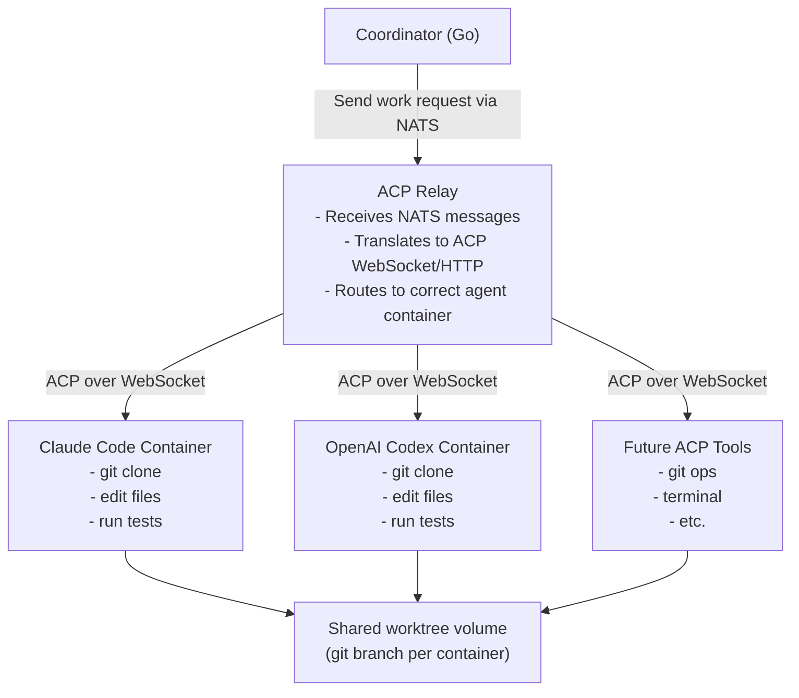

# ACP (Agent Client Protocol) Integration

**Note:** ACP is the "Agent Client Protocol" by Zed Industries/Google, not Anthropic. Anthropic has MCP (Model Context Protocol). We use ACP because Claude Code supports it.

---

## Phase 1 vs Long-term

**Phase 1 (Current Implementation):**

```text
PWA → WebSocket → Relay → stdio → N× claude-code-acp processes
```

- Direct stdio communication with ACP processes (pkg/acp/client.go)
- No NATS, no Coordinator, no containers
- Relay spawns processes directly
- User drives all agent interactions manually via WebSocket

**Long-term (Described Below):**

This document primarily describes the **long-term architecture** with:
- Coordinator (workflow automation)
- NATS message bus (decoupled communication)
- Containers (isolation and orchestration)
- WebSocket ACP relay (container communication)

For Phase 1 implementation details, see pkg/acp/client.go and pkg/relay/session/

---

## Current Implementation (Phase 1)

### Architecture Overview

Phase 1 uses **direct stdio communication** with ACP processes. The relay spawns `claude-code-acp` processes and communicates via stdin/stdout.

```
PWA (WebSocket) ←→ Relay ←→ Session Manager ←→ ACP Client Factory ←→ ProcessLauncher ←→ ACP Process
```

### Transport Abstraction

The system uses a pluggable transport architecture (pkg/acp/transport.go):

```go
// Transport represents bidirectional communication to an ACP runtime
type Transport interface {
    io.Reader
    io.Writer
    io.Closer
    Stderr() io.Reader
}

// ProcessLauncher starts ACP runtimes and returns transports
type ProcessLauncher interface {
    Start(ctx context.Context, cfg ProcessLaunchConfig) (Transport, error)
}
```

**Two launcher implementations:**

1. **HostProcessLauncher** (default) - Spawns ACP as host process via `os/exec`
2. **ContainerExecProcessLauncher** (opt-in) - Runs ACP inside existing agent containers via `docker exec`

### Launcher Selection Flow

The launcher is selected at runtime based on configuration:

```
main.go
  └─> NewSessionManager(containerManager)
       └─> NewACPClientFactory(containerManager, logger)
            └─> factory.NewClient(runtime)
                 └─> selectLauncher(runtime)
                      ├─> getRuntimeMode() // Reads OUROCODUS_ACP_RUNTIME
                      ├─> validateContainerPrerequisites()
                      └─> createHostLauncher() OR createContainerLauncher()
```

**Key functions (pkg/relay/session/client_factory.go):**

- `getRuntimeMode()` - Validates `OUROCODUS_ACP_RUNTIME` env var (defaults to "host")
- `validateContainerPrerequisites()` - Checks container ID and manager availability
- `selectLauncher()` - Orchestrates launcher selection based on runtime context

### Configuration

#### Environment Variables

**OUROCODUS_ACP_RUNTIME** (optional, default: "host")
- Controls where `claude-code-acp` process runs
- Values: `"host"` (default) | `"container"`
- Set to `"container"` to run ACP inside agent containers

**OUROCODUS_ACP_BINARY** (optional, default: "claude-code-acp")
- Override the default ACP binary location
- Useful for testing with echo-agent or custom implementations
- Example: `/path/to/echo-agent`

**ANTHROPIC_API_KEY** (required)
- API key for Claude Code integration
- Read by ACPClientFactory on initialization

#### Host Mode (Default)

```bash
# .envrc
export ANTHROPIC_API_KEY=your-key-here
# OUROCODUS_ACP_RUNTIME defaults to "host"
```

```
Relay → Session Manager → ACP Client Factory → HostProcessLauncher
                                                    └─> os/exec: claude-code-acp
```

#### Container Mode

```bash
# .envrc
export ANTHROPIC_API_KEY=your-key-here
export OUROCODUS_ACP_RUNTIME=container
```

```
Relay → Session Manager → ACP Client Factory → ContainerExecProcessLauncher
                                                    └─> docker exec: /workspace/claude-code-acp
```

**Prerequisites for container mode:**
- Agent container must be running (spawned by relay)
- Workspace mounted at `/workspace` inside container
- ContainerSessionManager available (initialized in main.go)

### Runtime Context

Each ACP client receives runtime context with session/agent metadata:

```go
type AgentRuntimeContext struct {
    SessionID   string  // User session identifier
    AgentID     string  // Agent role (e.g., "coder", "reviewer")
    Workspace   string  // Absolute path to workspace on host
    ContainerID string  // Docker container ID (empty for host mode)
}

func (c *AgentRuntimeContext) HasContainer() bool {
    return c != nil && c.ContainerID != ""
}
```

### Error Handling

The launcher selection validates prerequisites before creating clients:

**Host mode errors:**
- Missing API key → `ErrMissingAnthropicAPIKey`
- Missing workspace → `"workspace is required"`
- Invalid workspace path → `"failed to create ACP client"`

**Container mode errors:**
- Invalid runtime mode → `"invalid OUROCODUS_ACP_RUNTIME value"`
- Missing container ID → `"no container ID in runtime context"`
- Missing container manager → `"container session manager not available"`

### Component Wiring

The container session manager flows through the system:

**main.go:**
```go
dockerClient, launcherFactory, containerManager := initializeAgentInfrastructure(...)
sessionManager, err := relay.NewSessionManager(..., containerManager)
```

**session_adapter.go:**
```go
func NewSessionManager(..., containerManager session.ContainerExecService) {
    clientFactory, err := session.NewACPClientFactory(containerManager, logger)
    // ...
}
```

**client_factory.go:**
```go
type ACPClientFactory struct {
    apiKey              string
    acpBinaryPath       string
    containerSessionMgr ContainerExecService // Enables container exec mode
    logger              Logger
}
```

### Testing

**Unit Tests (pkg/relay/session/client_factory_test.go):**
- `TestGetRuntimeMode_*` - Runtime mode validation
- `TestValidateContainerPrerequisites_*` - Prerequisite checks
- `TestSelectLauncher_*` - Launcher selection logic
- `TestNewClient_Integration_*` - Full client creation flow

**Smoke Tests (tests/e2e/acp_container_exec_test.go):**
- `TestContainerExecProcessLauncher_SmokeTest` - Commands execute in containers
- `TestContainerExecProcessLauncher_WithEchoAgent` - Echo-agent runs in containers

Run integration tests with Docker:
```bash
go test -tags=integration ./tests/e2e/...
```

### Migration Path to Long-term Architecture

Current Phase 1 implementation provides foundation for future enhancements:

1. ✅ **Transport abstraction** - Supports pluggable launchers
2. ✅ **Container execution** - ACP already runs inside containers via docker exec
3. 🚧 **NATS integration** - Event publishing exists, not yet used for ACP routing
4. 🚧 **WebSocket ACP relay** - Future: containers connect to relay, not exec'd
5. 🚧 **Coordinator** - Future: workflow automation layer

**Phase 1 → Phase 2 transition:**
- Keep transport abstraction
- Add WebSocket server to relay (listen for ACP connections from containers)
- Containers run `claude-code-acp` on startup (not via docker exec)
- Route messages via NATS instead of direct WebSocket

---

## Overview (Long-term Vision)

Ourocodus does NOT implement custom AI agents. Instead, it orchestrates **existing ACP-compatible servers** (Claude Code, OpenAI Codex, etc.). The relay routes ACP messages between the PWA/coordinator and these agent processes/containers.

## Core Principle

**We are ACP clients, not ACP servers.**

The "agents" are Claude Code, OpenAI Codex, or other tools that:

- Speak ACP protocol
- Have access to git, code editing, terminal
- Can be run in containers

Ourocodus provides:

1. Container orchestration (launch, stop, monitor)
2. Message routing (NATS → ACP containers)
3. Workflow coordination (sequential execution, approval gates)
4. Observability (logging, status, events)

## Architecture



## ACP Protocol Basics

**Note on Terminology:** In ACP, "sampling" means "generate a response from the model" - it's the technical term for making an inference request. We use "work request" throughout this doc for clarity, but the actual ACP protocol method is `sampling.request`.

### Message Flow

1. **Coordinator → Agent (Work Request)**

_Sends task to agent with available tools_

```json
{
  "id": "msg_123",
  "method": "sampling.request",
  "params": {
    "messages": [
      {
        "role": "user",
        "content": "Implement user authentication using bcrypt"
      }
    ],
    "model": "claude-sonnet-4",
    "max_tokens": 4096,
    "tools": [
      {
        "name": "bash",
        "description": "Execute bash commands",
        "input_schema": {...}
      },
      {
        "name": "edit_file",
        "description": "Edit file contents",
        "input_schema": {...}
      }
    ]
  }
}
```

1. **Agent → Coordinator (Tool Use)**

```json
{
  "id": "msg_123",
  "result": {
    "type": "tool_use",
    "name": "bash",
    "input": {
      "command": "git checkout -b auth-feature"
    }
  }
}
```

1. **Coordinator → Agent (Tool Result)**

```json
{
  "id": "msg_124",
  "method": "tool_result",
  "params": {
    "tool_use_id": "tool_123",
    "result": "Switched to a new branch 'auth-feature'"
  }
}
```

1. **Agent → Coordinator (Final Response)**

```json
{
  "id": "msg_125",
  "result": {
    "type": "text",
    "content": "I've implemented user authentication in src/auth.go with bcrypt password hashing."
  }
}
```

## Container Requirements

Each agent container must:

1. **Run an ACP server** (Claude Code, Codex, etc.)
2. **Expose ACP endpoint** (WebSocket or HTTP/SSE)
3. **Have git access** (clone repo, create branches, commit)
4. **Mount worktree** (isolated git branch per agent)
5. **Connect to relay** (via env var: `ACP_RELAY_URL`)

### Example: Claude Code Container

```dockerfile
FROM ubuntu:22.04

# Install Claude Code
RUN curl -fsSL https://install.claude.com | bash

# Install git, build tools
RUN apt-get update && apt-get install -y \
    git \
    build-essential \
    curl

# Worktree will be mounted at /workspace
VOLUME /workspace

# Relay URL passed as env var
ENV ACP_RELAY_URL=ws://relay:8080/acp

# Start Claude Code in server mode
CMD ["claude-code", "--server", "--workspace", "/workspace"]
```

### Example: Agent Config

```yaml
# config/agent-config.yaml
agents:
  - name: coding
    image: ourocodus/claude-code:latest
    capabilities:
      - code_editing
      - git_operations
      - terminal_access
    tools:
      - bash
      - edit_file
      - read_file
      - write_file
      - search_files

  - name: testing
    image: ourocodus/claude-code:latest
    capabilities:
      - code_editing
      - test_execution
    tools:
      - bash
      - edit_file
      - read_file
      - pytest
```

## Relay Implementation

The ACP relay bridges NATS (internal) and ACP (containers):

### Relay Responsibilities

1. **Session management** - Track which agent belongs to which session
2. **Protocol translation** - NATS JSON → ACP WebSocket
3. **Connection pooling** - Maintain WebSocket connections to agents
4. **Message routing** - Route based on userSessionID + agentID
5. **Error handling** - Reconnect on disconnection, report failures

### Relay API (Internal - NATS)

**Subscribe to:**

```text
sessions.{user_session_id}.work.{agent_id}   # Work for specific agent
```

**Publish to:**

```text
sessions.{user_session_id}.results.{agent_id}  # Results from agent
sessions.{user_session_id}.events               # Status events
```

### Relay API (External - ACP Containers)

**WebSocket endpoint:**

```text
ws://relay:8080/acp/{user_session_id}/{agent_id}
```

**Headers:**

```http
X-Agent-ID: agent_abc123
X-Session-ID: sess_xyz789
X-Agent-Role: coding
```

## Workflow Example

### Scenario: Implement authentication feature

1. **Coordinator reads graph:**

```yaml
# graph.yaml
chunks:
  - id: auth-implementation
    phases:
      - coding
      - testing
      - review
```

1. **Coordinator launches coding agent:**

```http
POST /api/agents
{
  "user_session_id": "sess_123",
  "agent_id": "coder-1",
  "worktree": "agent/auth-implementation"
}
```

1. **Relay connects to agent container:**

- Container starts with Claude Code
- Claude Code connects to relay WebSocket
- Relay registers: `sess_123` + `coder-1` → `ws://container_ip:5000`

1. **Coordinator sends work via NATS:**

```text
Topic: sessions.sess_123.work.coding
Message: {
  "type": "work.coding",
  "payload": {
    "task": "Implement user authentication with bcrypt",
    "requirements": [...]
  }
}
```

1. **Relay translates to ACP work request:**

```json
{
  "method": "sampling.request",
  "params": {
    "messages": [{
      "role": "user",
      "content": "Implement user authentication with bcrypt. Requirements: [...]"
    }],
    "tools": ["bash", "edit_file", "read_file"]
  }
}
```

1. **Claude Code executes:**

- Checkouts branch: `git checkout -b agent/auth-implementation`
- Creates files: `src/auth.go`
- Writes tests: `src/auth_test.go`
- Runs tests: `go test ./...`
- Commits: `git commit -m "Add authentication"`

1. **Relay receives result:**

```json
{
  "result": {
    "type": "text",
    "content": "Implemented authentication with bcrypt. Tests passing."
  }
}
```

1. **Relay publishes to NATS:**

```text
Topic: sessions.sess_123.results.coding
Message: {
  "type": "result.success",
  "payload": {
    "summary": "Implemented authentication with bcrypt. Tests passing.",
    "files_changed": ["src/auth.go", "src/auth_test.go"],
    "commit_sha": "abc123"
  }
}
```

1. **Coordinator receives result, requests approval:**

```text
Topic: sessions.sess_123.approvals
Message: {
  "type": "approval.request",
  "payload": {
    "phase": "post-coding",
    "summary": "Review changes before proceeding to testing?"
  }
}
```

1. **Human approves → Coordinator continues to testing phase**

## Tool Availability

Different agents may have different tools available:

**Claude Code tools:**

- `bash` - Execute shell commands
- `edit_file` - Edit file with search/replace
- `write_file` - Write new file
- `read_file` - Read file contents
- `search_files` - Grep/find files

**Custom tools (future):**

- `run_tests` - Run test suite
- `lint` - Run linter
- `format` - Format code
- `git_commit` - Atomic git operations

## Error Handling

### Agent Container Crashes

**Detection:** WebSocket disconnect or container exit

**Response:**

1. Relay publishes event: `event.agent.crashed`
2. Coordinator marks chunk as failed
3. Manual intervention required (POC)
4. Future: Auto-restart with state recovery

### ACP Protocol Errors

**Scenario:** Malformed ACP message

**Response:**

1. Log error with full message
2. Send error response to coordinator
3. Continue processing (don't crash relay)

### Tool Execution Failures

**Scenario:** `bash` tool returns non-zero exit

**Response:**

- Agent decides how to handle (ACP server responsibility)
- Coordinator treats as normal result
- Agent may retry, ask for help, or fail gracefully

## Security Considerations

### POC Assumptions

- Containers run on localhost
- No authentication between components
- Agents have full filesystem access to worktree
- No rate limiting or resource constraints

### Post-POC Requirements

1. **Sandboxing** - Restrict agent filesystem/network access
2. **Authentication** - Verify coordinator identity
3. **Encryption** - TLS for relay ↔ agent communication
4. **Resource limits** - CPU/memory/token limits per agent
5. **Audit logging** - All agent actions logged

## Implementation Checklist

- [ ] ACP protocol parser (Go pkg)
- [ ] WebSocket server (relay → agents)
- [ ] NATS ↔ ACP translation layer
- [ ] Claude Code Dockerfile
- [ ] Agent launcher (start container with volume mounts)
- [ ] Session → Agent mapping (relay state)
- [ ] Error handling (reconnection, timeouts)
- [ ] Event logging (all ACP messages)

## Testing Strategy

### Unit Tests

- ACP message parsing/formatting
- Protocol translation (NATS ↔ ACP)

### Integration Tests

- Real Claude Code container
- Send work, receive results
- Tool execution (bash, edit_file)
- Multi-turn conversations

### E2E Tests

- Full workflow: coding → approval → testing
- Multiple agents sequentially
- Error scenarios (crash, timeout)

## References

- [Claude Code Documentation](https://docs.claude.com/claude-code)
- [ACP Protocol](https://github.com/zed-industries/acp) - Agent Client Protocol by Zed Industries/Google
- [NATS Documentation](https://docs.nats.io/)
- [Docker SDK for Go](https://pkg.go.dev/github.com/docker/docker)
