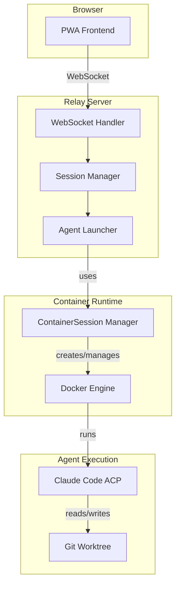
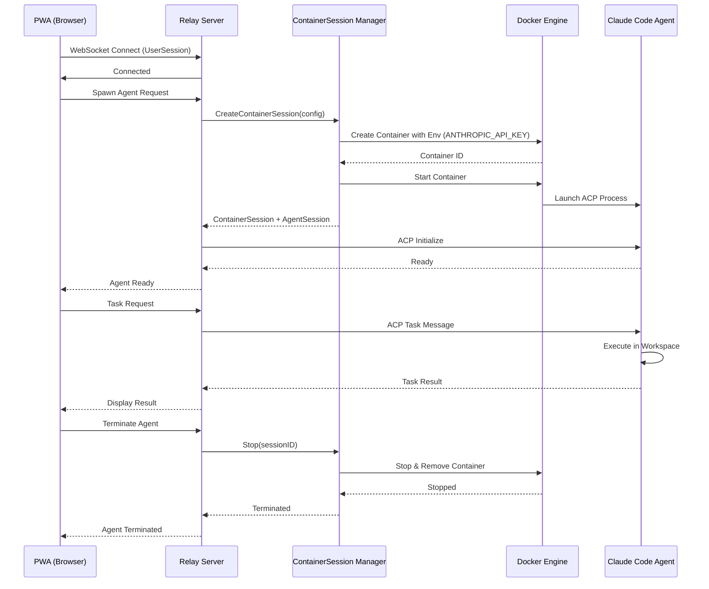

# Agent Runtime Architecture

## Overview

The agent runtime layer manages the lifecycle and execution environment for AI coding agents. This layer provides isolation, resource management, and workspace coordination through Docker containers.

**Key Components:**
- Session Manager: Tracks UserSessions and spawns AgentSessions
- ContainerSession Manager: Creates and manages Docker containers for agent execution
- Agent Launcher: Coordinates agent spawning and ACP protocol initialization

## Session Type Definitions

These are the authoritative definitions for session types in Ourocodus:

### UserSession

**Definition:** A WebSocket connection from the PWA (browser) to the Relay server.

**Characteristics:**
- Represents a single user's connection to the system
- Contains 0 to N AgentSessions
- Lifecycle: Established on WebSocket connect, terminated on disconnect
- Tracked by: `pkg/relay/session.Store`

**Example:**
- User opens PWA in browser → UserSession created
- User spawns 3 agents → UserSession contains 3 AgentSessions
- User closes browser → UserSession terminated, all AgentSessions cleaned up

### AgentSession

**Definition:** An individual AI agent process with its own workspace and execution state.

**Characteristics:**
- One per agent spawned by the user
- Has dedicated workspace directory (git worktree)
- Communicates via ACP (Agent Client Protocol)
- Runs inside a ContainerSession for isolation
- Tracked by: `pkg/relay/session.Manager`

**Lifecycle:**
1. User requests agent spawn
2. AgentSession created with unique ID
3. ContainerSession created for execution environment
4. Agent process launched inside container
5. Agent processes tasks via ACP messages
6. User terminates agent → AgentSession and ContainerSession cleaned up

### ContainerSession

**Definition:** A Docker container managed by `pkg/containersession` that provides the runtime environment for an AgentSession.

**Characteristics:**
- **Lifecycle Policy:** One ContainerSession per AgentSession (1:1 mapping)
- Provides process isolation and resource management
- Mounts workspace directory from host
- Receives credentials via environment variables
- Automatically cleaned up when AgentSession terminates
- Managed by: `pkg/containersession.Manager`

**Container Configuration:**
- Image: Configurable (typically contains Claude Code ACP binary)
- Workspace: Bind-mounted from host filesystem
- Network: Default Docker bridge network
- Credentials: Injected via environment variables
- Lifecycle: Created on agent spawn, destroyed on agent termination

## Component Architecture

The following diagram shows the runtime layer components and their relationships:

**Components Explained:**

- **PWA Frontend:** Browser-based user interface for interacting with agents
- **WebSocket Handler:** Manages UserSession connections and message routing
- **Session Manager:** Tracks active UserSessions and their AgentSessions
- **Agent Launcher:** Coordinates agent spawning and initialization
- **ContainerSession Manager:** Creates and manages Docker containers (`pkg/containersession`)
- **Docker Engine:** Provides container runtime and isolation
- **Claude Code ACP:** AI agent process running inside container
- **Git Worktree:** Isolated workspace directory for agent operations

**Key Interactions:**

1. PWA establishes WebSocket connection → UserSession created
2. User requests agent spawn → Session Manager coordinates with Agent Launcher
3. Agent Launcher uses ContainerSession Manager to create container
4. Container runs Claude Code ACP process with mounted workspace
5. Agent communicates back through Relay to PWA

## Execution Flow

The following sequence diagram shows the complete lifecycle of an agent session from spawn to termination:

**Flow Phases:**

### 1. Connection Phase
- User opens PWA → WebSocket connection established
- UserSession created and tracked by Relay

### 2. Agent Spawn Phase
- User requests agent → Relay creates AgentSession
- ContainerSession Manager creates Docker container with configuration
- Container receives ANTHROPIC_API_KEY via environment variables
- Claude Code ACP process launches inside container
- ACP initialization completes → Agent reports ready

### 3. Task Execution Phase
- User sends task via PWA
- Relay routes ACP message to agent
- Agent executes task in mounted workspace
- Results returned through Relay to PWA

### 4. Termination Phase
- User terminates agent (or UserSession disconnects)
- ContainerSession Manager stops and removes container
- AgentSession cleaned up from Session Manager
- Workspace persists on host filesystem
