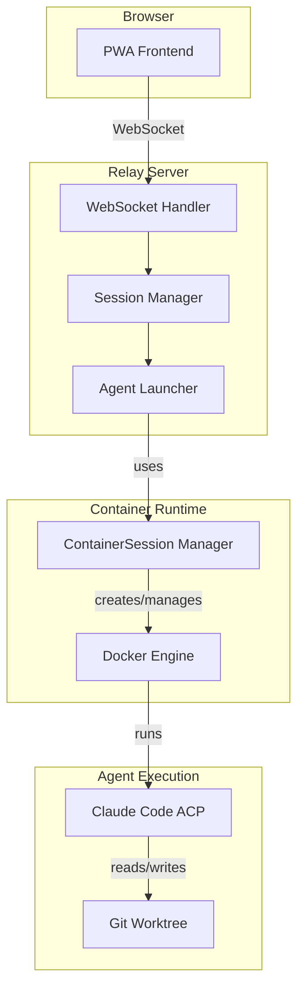
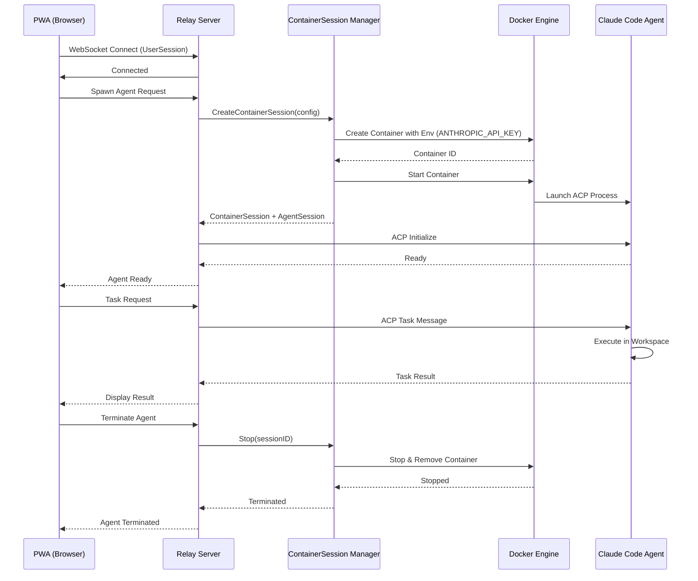

# Agent Runtime Architecture

## Overview

The agent runtime layer manages the lifecycle and execution environment for AI coding agents. This layer provides isolation, resource management, and workspace coordination through Docker containers.

**Key Components:**
- Session Manager: Tracks UserSessions and spawns AgentSessions
- ContainerSession Manager: Creates and manages Docker containers for agent execution
- Agent Launcher: Coordinates agent spawning and ACP protocol initialization

## Session Type Definitions

These are the authoritative definitions for session types in Ourocodus:

### UserSession

**Definition:** A WebSocket connection from the PWA (browser) to the Relay server.

**Characteristics:**
- Represents a single user's connection to the system
- Contains 0 to N AgentSessions
- Lifecycle: Established on WebSocket connect, terminated on disconnect
- Tracked by: `pkg/relay/session.Store`

**Example:**
- User opens PWA in browser → UserSession created
- User spawns 3 agents → UserSession contains 3 AgentSessions
- User closes browser → UserSession terminated, all AgentSessions cleaned up

### AgentSession

**Definition:** An individual AI agent process with its own workspace and execution state.

**Characteristics:**
- One per agent spawned by the user
- Has dedicated workspace directory (git worktree)
- Communicates via ACP (Agent Client Protocol)
- Runs inside a ContainerSession for isolation
- Tracked by: `pkg/relay/session.Manager`

**Lifecycle:**
1. User requests agent spawn
2. AgentSession created with unique ID
3. ContainerSession created for execution environment
4. Agent process launched inside container
5. Agent processes tasks via ACP messages
6. User terminates agent → AgentSession and ContainerSession cleaned up

### ContainerSession

**Definition:** A Docker container managed by `pkg/containersession` that provides the runtime environment for an AgentSession.

**Characteristics:**
- **Lifecycle Policy:** One ContainerSession per AgentSession (1:1 mapping)
- Provides process isolation and resource management
- Mounts workspace directory from host
- Receives credentials via environment variables
- Automatically cleaned up when AgentSession terminates
- Managed by: `pkg/containersession.Manager`

**Container Configuration:**
- Image: Configurable (typically contains Claude Code ACP binary)
- Workspace: Bind-mounted from host filesystem
- Network: Default Docker bridge network
- Credentials: Injected via environment variables
- Lifecycle: Created on agent spawn, destroyed on agent termination

## Component Architecture

The following diagram shows the runtime layer components and their relationships:



**Components Explained:**

- **PWA Frontend:** Browser-based user interface for interacting with agents
- **WebSocket Handler:** Manages UserSession connections and message routing
- **Session Manager:** Tracks active UserSessions and their AgentSessions
- **Agent Launcher:** Coordinates agent spawning and initialization
- **ContainerSession Manager:** Creates and manages Docker containers (`pkg/containersession`)
- **Docker Engine:** Provides container runtime and isolation
- **Claude Code ACP:** AI agent process running inside container
- **Git Worktree:** Isolated workspace directory for agent operations

**Key Interactions:**

1. PWA establishes WebSocket connection → UserSession created
2. User requests agent spawn → Session Manager coordinates with Agent Launcher
3. Agent Launcher uses ContainerSession Manager to create container
4. Container runs Claude Code ACP process with mounted workspace
5. Agent communicates back through Relay to PWA

## Execution Flow

The following sequence diagram shows the complete lifecycle of an agent session from spawn to termination:



**Flow Phases:**

### 1. Connection Phase
- User opens PWA → WebSocket connection established
- UserSession created and tracked by Relay

### 2. Agent Spawn Phase
- User requests agent → Relay creates AgentSession
- ContainerSession Manager creates Docker container with configuration
- Container receives ANTHROPIC_API_KEY via environment variables
- Claude Code ACP process launches inside container
- ACP initialization completes → Agent reports ready

### 3. Task Execution Phase
- User sends task via PWA
- Relay routes ACP message to agent
- Agent executes task in mounted workspace
- Results returned through Relay to PWA

### 4. Termination Phase
- User terminates agent (or UserSession disconnects)
- ContainerSession Manager stops and removes container
- AgentSession cleaned up from Session Manager
- Workspace persists on host filesystem

## Configuration & Credentials

### Environment Variables

The following environment variables control agent runtime behavior:

| Variable | Required | Purpose | Example |
|----------|----------|---------|---------|
| `ANTHROPIC_API_KEY` | Yes | API key for Claude Code agents | `sk-ant-api03-...` |
| `OUROCODUS_ACP_BINARY` | No | Custom ACP binary path (for testing) | `/path/to/echo-agent` |
| `DOCKER_HOST` | No | Docker daemon connection | `unix:///var/run/docker.sock` |

**Setting Environment Variables:**

```bash
# macOS/Linux
export ANTHROPIC_API_KEY="sk-ant-api03-..."
./cmd/relay/relay

# Or inline
ANTHROPIC_API_KEY="sk-ant-..." ./cmd/relay/relay
```

### Credential Injection Flow

Credentials are injected into containers through the following process:

1. **Host Environment:** Relay reads `ANTHROPIC_API_KEY` from its environment
   - Source: `pkg/relay/session/client_factory.go:NewACPClientFactory()`
   - Validation: Returns `ErrMissingAnthropicAPIKey` if not set

2. **Container Configuration:** ContainerSession Manager receives config with `Env` field
   - Source: `pkg/containersession/config.go:CreateConfig.Env`
   - Format: `[]string{"ANTHROPIC_API_KEY=sk-ant-..."}`

3. **Container Creation:** Docker creates container with environment variables
   - Source: `pkg/containersession/manager.go:CreateContainerSessionWithConfig()`
   - Container receives full environment including credentials

4. **Agent Access:** Agent process inside container accesses credentials via environment
   - Source: `pkg/acp/client.go:NewClient()` sets `cmd.Env`
   - Agent uses credentials to authenticate with Anthropic API

**Diagram:**

```text
Host Environment (ANTHROPIC_API_KEY)
    ↓
Relay reads on startup
    ↓
ContainerSession Manager receives in CreateConfig
    ↓
Docker container created with Env variables
    ↓
Agent process accesses via os.Getenv()
```

### Current Limitations

**Explicitly documented for MVP:**

- **Single Credential:** One `ANTHROPIC_API_KEY` per relay instance (global scope)
- **No Per-User Scoping:** All agents use the same credential
- **No Per-Project Scoping:** Cannot configure different keys for different projects
- **No Rotation Support:** Changing credentials requires relay restart
- **Single Provider:** Only Anthropic/Claude supported currently

**Future Enhancements:**

- Mount credential files via `CustomMounts` for multi-provider support
- Per-user credential scoping via UserSession metadata
- Credential rotation via hot-reload mechanism
- Support for OpenAI, Hugging Face, and other providers

### Container Configuration

**Image:**
- Configurable via `CreateConfig.ImageName`
- Must contain ACP-compatible agent binary
- Example: Custom image with Claude Code ACP pre-installed

**Workspace:**
- Bind-mounted from host via `CustomMounts`
- Typically a git worktree for isolated development
- Persists on host after container termination
- Agent has read/write access

**Network:**
- Default Docker bridge network
- Allows outbound connections to Anthropic API
- No inbound connections required (I/O via Relay)

**Resource Limits:**
- **Status:** Not enforced yet
- **Future:** CPU and memory limits via `CreateConfig`
- **Current:** Containers use host default limits

### Code References

- Session Factory: `pkg/relay/session/client_factory.go`
- ContainerSession Config: `pkg/containersession/config.go`
- Container Manager: `pkg/containersession/manager.go`
- ACP Client: `pkg/acp/client.go`

## Troubleshooting

Common issues when working with the agent runtime and their solutions.

### 1. Missing API Key

**Symptom:**
```bash
Error: ANTHROPIC_API_KEY environment variable not set
```

**Cause:** The relay server cannot find the required API key in its environment.

**Solution:**

```bash
# Set the environment variable before starting relay
export ANTHROPIC_API_KEY="sk-ant-api03-..."
./cmd/relay/relay

# Verify it's set
echo $ANTHROPIC_API_KEY
```

**Prevention:** Add to your shell profile (`.bashrc`, `.zshrc`) for persistence:
```bash
echo 'export ANTHROPIC_API_KEY="sk-ant-..."' >> ~/.zshrc
```

---

### 2. Docker Connection Failed

**Symptom:**
```bash
Error: Cannot connect to Docker daemon at unix:///var/run/docker.sock
```

**Cause:** Docker daemon is not running or not accessible.

**Solution by Platform:**

**macOS (Docker Desktop):**
```bash
# Check if Docker is running
docker ps

# If not running, start Docker Desktop application
open -a Docker

# Wait for Docker to start, then verify
docker ps
```

**macOS (Colima):**
```bash
# Check Colima status
colima status

# Start if not running
colima start

# Verify connection
docker ps
```

**Linux:**
```bash
# Check if Docker daemon is running
sudo systemctl status docker

# Start if not running
sudo systemctl start docker

# Ensure your user is in docker group
sudo usermod -aG docker $USER
# Log out and back in for group change to take effect

# Verify connection (no sudo needed after group membership)
docker ps
```

**Custom DOCKER_HOST:**
```bash
# If using custom Docker socket location
export DOCKER_HOST="unix:///path/to/custom/docker.sock"
```

---

### 3. Container Image Pull Failure

**Symptom:**
```bash
Error: failed to pull image "ourocodus/agent:latest": pull access denied
```

**Cause:** Cannot pull the Docker image from registry.

**Solutions:**

**Check Internet Connection:**
```bash
# Test connectivity
ping docker.io
```

**Verify Image Name:**
```bash
# Test manual pull
docker pull ourocodus/agent:latest

# Check available images
docker images
```

**Docker Hub Rate Limits:**
```bash
# If hitting rate limits, authenticate
docker login

# Or use a mirror registry
```

**Image Doesn't Exist:**
```bash
# Build image locally if not in registry
cd /path/to/ourocodus
make agent-image
# (equivalent to: docker build -t ourocodus/agent:latest -f Dockerfile.agent .)
```

**Firewall/Proxy Issues:**
```bash
# Configure Docker to use proxy if behind corporate firewall
# Edit /etc/docker/daemon.json or Docker Desktop settings
```

---

### 4. Permission Denied on Workspace

**Symptom:**
```bash
Error: permission denied: /workspace/file.txt
```

**Cause:** Container user lacks permissions to access mounted workspace.

**Solution:**

**Check Mount Permissions:**
```bash
# Verify workspace directory is accessible
ls -la /path/to/workspace

# Ensure directory is readable and writable
chmod 755 /path/to/workspace
```

**Linux SELinux:**
```bash
# If using SELinux, add :z or :Z to mount options
# This is handled in pkg/containersession mount configuration
```

---

### 5. Agent Timeout or Unresponsive

**Symptom:**
- Agent spawn request hangs
- No response from agent after several minutes

**Cause:** Container startup issues or network problems.

**Diagnosis:**

```bash
# List running containers
docker ps

# Check specific container logs
docker logs <container-id>

# Inspect container
docker inspect <container-id>

# Check container resource usage
docker stats <container-id>
```

**Common Causes:**

1. **Image pull taking too long:** Wait for pull to complete or pull manually first
2. **Container startup script hanging:** Check container logs for errors
3. **Network issues:** Verify container can reach Anthropic API
4. **Resource exhaustion:** Check host CPU/memory availability

**Solution:**

```bash
# Stop hanging container
docker stop <container-id>

# Remove and retry
docker rm <container-id>

# Try spawning agent again through PWA
```

---

### Additional Diagnostics

**View Relay Logs:**

```bash
# Relay logs show session and agent lifecycle events
./cmd/relay/relay 2>&1 | tee relay.log
```

**Inspect ContainerSession State:**

```bash
# List all containers (including stopped)
docker ps -a

# Filter by ourocodus session labels
docker ps -a --filter "label=ourocodus.session.id"
```

**Test ACP Communication:**

```bash
# Use echo-agent for testing without API key
export OUROCODUS_ACP_BINARY="./cmd/echo-agent/echo-agent"
./cmd/relay/relay
```

### Getting Help

If issues persist:

1. Check GitHub Issues: [github.com/2389-research/ourocodus/issues](https://github.com/2389-research/ourocodus/issues)
2. Review relevant documentation:
   - `docs/ARCHITECTURE.md` - System overview
   - `docs/SESSION_LIFECYCLE.md` - Session management
   - `pkg/containersession/doc.go` - Container session details
3. Include diagnostic information when reporting issues:
   - Relay logs
   - Docker logs for container
   - `docker info` output
   - Operating system and Docker version

## Future: Kubernetes Migration Path

### Current Architecture (Single Host)

- **Docker Engine:** Direct connection via Docker socket
- **Isolation:** Process isolation via Docker containers
- **Networking:** Docker bridge network
- **Storage:** Bind mounts from host filesystem
- **Lifecycle:** Managed by ContainerSession Manager

**Scaling Characteristics:**
- Scales to ~50-100 concurrent agents on single host (depending on resources)
- Simple deployment and debugging
- No distributed systems complexity
- Suitable for development and small-scale production

### Near-Term Scaling (Single Host)

The current architecture supports horizontal scaling on a single host:

- **More Containers:** Current design handles N containers efficiently
- **Resource Limits:** Add CPU/memory limits via `CreateConfig`
- **Container Pooling:** Reuse containers for sequential agent sessions (future)
- **Workspace Optimization:** Shared read-only base + per-agent overlay

**When to migrate:** When consistently running >50 concurrent agents or need multi-host.

### Long-Term: Kubernetes Migration

**Primitive Mappings:**

| Current | Kubernetes Equivalent | Notes |
|---------|----------------------|-------|
| ContainerSession | Job or Pod | Ephemeral workload for agent execution |
| Docker container | Container in Pod | Same isolation model |
| Environment variables (credentials) | Secrets | Native K8s secret management |
| Bind mount (workspace) | PersistentVolumeClaim | Durable storage across pod restarts |
| Docker bridge network | NetworkPolicy | Control traffic between pods |
| ContainerSession Manager | Kubernetes API | API-driven lifecycle management |

**Architecture Changes:**

```yaml
Current:
  Relay → ContainerSession Manager → Docker API → Container

Kubernetes:
  Relay → Kubernetes API → Job/Pod → Container
```

**What Stays Identical:**
- Agent code (Claude Code ACP binary)
- ACP protocol and message flow
- Workspace structure and git worktrees
- Session type abstractions (UserSession, AgentSession, ContainerSession)
- Relay WebSocket handling

**What Changes:**
- `pkg/containersession` replaced with K8s client library
- Container lifecycle managed by K8s instead of direct Docker API
- Workspaces stored in PVCs instead of host bind mounts
- Credentials managed via K8s Secrets API
- Load balancing and scheduling via K8s scheduler

**Migration Complexity:** Low-to-Medium

- Clean abstraction boundaries make swap straightforward
- ContainerSession interface remains conceptually the same
- Main effort: implementing K8s client wrapper matching ContainerSession API

**When to Migrate:**

- **Don't migrate yet:** Current architecture sufficient for M2-M4
- **Consider:** When running >100 concurrent agents consistently
- **Migrate:** When need multi-host distribution or K8s-native deployment

### Kubernetes Example (Future Reference)

**Minimal Job Spec:**

```yaml
apiVersion: batch/v1
kind: Job
metadata:
  name: agent-session-abc123
  labels:
    ourocodus.session.id: abc123
    ourocodus.user.id: user-xyz
spec:
  template:
    spec:
      containers:
      - name: agent
        image: ourocodus/agent:latest
        env:
        - name: ANTHROPIC_API_KEY
          valueFrom:
            secretKeyRef:
              name: anthropic-credentials
              key: api-key
        volumeMounts:
        - name: workspace
          mountPath: /workspace
      volumes:
      - name: workspace
        persistentVolumeClaim:
          claimName: agent-workspace-abc123
      restartPolicy: Never
```

**Benefits of K8s Migration:**

- Multi-host distribution for massive scale
- Native secret management and rotation
- Better resource utilization via scheduler
- High availability and fault tolerance
- Standard deployment tooling (Helm, Kustomize)

**Trade-offs:**

- Increased operational complexity
- Requires K8s cluster management
- More difficult local development setup
- Additional abstractions to understand

### Design Principle

The ContainerSession abstraction exists specifically to make this migration straightforward when needed. The current Docker-based implementation and future K8s implementation can share the same interface, minimizing changes to the relay and session management layers.
