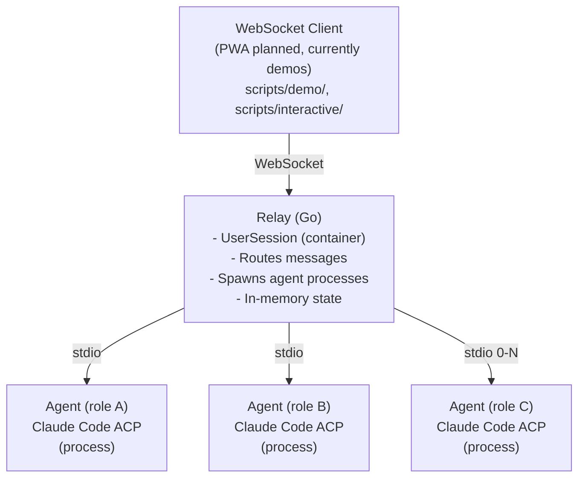
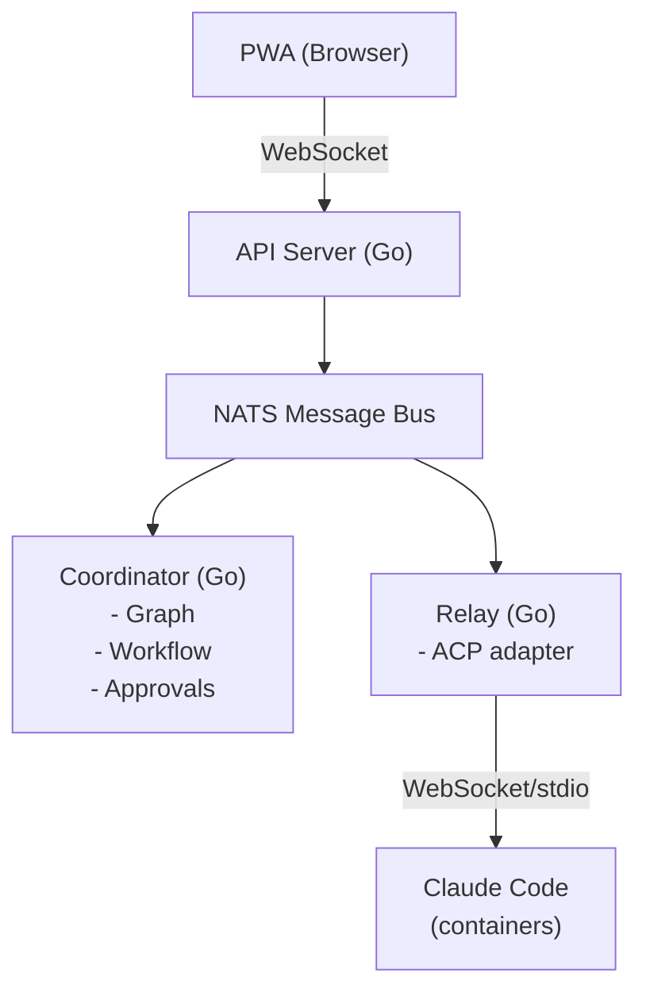

# Ourocodus Architecture: Phase 1 vs Long-term

## Phase 1: Proof of Concept (Current)

**Goal:** Validate multi-agent communication and concurrent work

**Example:** role A="auth", role B="db", role C="test"
_(System supports any user-specified roles dynamically)_

**Note:**
- Roles are dynamic, not hardcoded
- Agent failure doesn't terminate session
- Agents can be spawned/terminated independently

**Operational Requirements:**

- **Workspace Paths**: Each agent requires its own workspace directory path
  - Paths must be under the configured base workspace directory
  - Paths are constrained for security (no directory traversal attacks)
  - Example: `workspaces/session-123/auth`, `workspaces/session-123/db`

- **API Key**: `ANTHROPIC_API_KEY` environment variable must be set
  - Required for spawning Claude Code ACP processes
  - Shared across all agents in the relay process
  - Can be overridden via `OUROCODUS_ACP_BINARY` for testing (see `pkg/relay/session/client_factory.go`)

**Key Characteristics:**

- No NATS (direct WebSocket + stdio)
- No Coordinator (user drives manually)
- Processes not containers
- In-memory session state
- Variable agent count (0-N agents per session)
- Dynamic roles (user-specified, not hardcoded)
- Independent agent lifecycles (agents can fail without affecting session)

**Limitations:**

- Not fault-tolerant (process crash = lost state)
- Not scalable (in-memory only)
- No workflow automation
- Manual git operations
- No approval gates

---

## Long-term: Production Architecture

**Goal:** Autonomous multi-agent workflow system

**Key Characteristics:**

- NATS for all backend communication
- Coordinator drives workflow
- Relay is protocol adapter only
- Containers for isolation
- SQLite event store
- Sequential or parallel (graph-driven)
- Dynamic workflow generation

**Additions:**

- Fault tolerance (event sourcing)
- Horizontal scaling (NATS clustering)
- Workflow automation (coordinator)
- Approval gates
- Git merge automation
- PRD generation

---

## Migration Path

### Phase 1 → Phase 2: Add NATS

- Keep relay + ACP integration
- Add NATS between PWA and relay
- Relay subscribes to NATS topics
- Still no coordinator

### Phase 2 → Phase 3: Add Coordinator

- Coordinator reads graph
- Coordinator publishes work to NATS
- Relay stays as ACP adapter
- Add approval gate service

### Phase 3 → Phase 4: Production-ize

- SQLite event store
- Container isolation
- Error recovery
- Monitoring/observability

---

## Why This Phased Approach?

**Phase 1 validates the hard part:**

- Can we route messages to multiple ACP instances?
- Can agents work concurrently on same codebase?
- Does the UX model (PWA with multiple chats) work?

**Later phases add infrastructure:**

- Once routing works, add NATS for scalability
- Once manual works, add coordinator for automation
- Once POC works, add production features

**Don't build infrastructure before proving the concept.**
