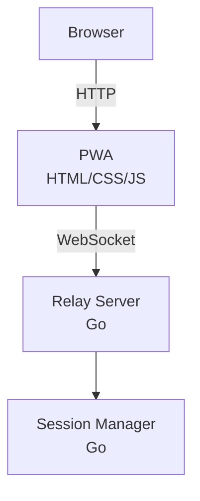
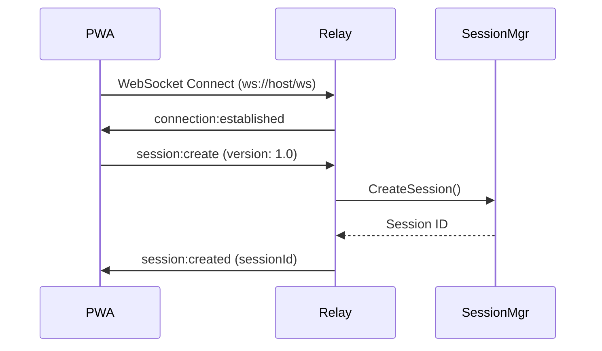

# Progressive Web App (PWA) - Phase 1 Implementation

## Overview

The Ourocodus PWA provides a browser-based interface for interacting with the relay server and managing multi-agent sessions. In Phase 1, it establishes a direct WebSocket connection to the relay server for session management.

## Architecture

### Component Structure



### File Structure

```
web/
├── index.html      # PWA entry point, semantic HTML structure
├── styles.css      # Dark theme, mobile-responsive styling
└── app.js          # WebSocket connection manager, UI logic
```

### Key Classes

#### `RelayConnection` (web/app.js)

Manages WebSocket connection lifecycle, error handling, and reconnection strategies.

**Responsibilities:**
- Establish and maintain WebSocket connection to relay
- Handle connection lifecycle (connect, disconnect, error, close)
- Implement exponential backoff reconnection (1s → 30s max)
- Parse and route incoming messages
- Send session management messages

**Configuration:**
```javascript
{
    maxReconnectAttempts: 10,
    reconnectDelay: 1000,        // Starting delay: 1 second
    maxReconnectDelay: 30000,    // Max delay: 30 seconds
}
```

**State Machine:**
```
disconnected → connecting → connected
       ↑            ↓           ↓
       └────── error ←─────────┘
       └────── reconnecting ────┘
```

#### `App` (web/app.js)

Application initialization and user interaction handling.

**Responsibilities:**
- Initialize RelayConnection
- Handle "New Project" button clicks
- Coordinate connection + session creation flow
- Manage UI state during async operations

## WebSocket Protocol (Phase 1)

### Connection Flow



### Message Types

All messages are JSON with required `version` and `type` fields.

#### 1. connection:established

**Direction:** Relay → PWA
**Sent:** When WebSocket connection is established

```json
{
    "version": "1.0",
    "type": "connection:established",
    "serverId": "uuid-v4",
    "timestamp": "2025-10-29T15:00:00Z"
}
```

**Fields:**
- `timestamp`: ISO 8601 format (RFC3339) in UTC timezone

#### 2. session:create

**Direction:** PWA → Relay
**Purpose:** Request creation of a new user session

```json
{
    "type": "session:create",
    "version": "1.0"
}
```

**Required Fields:**
- `type`: Must be "session:create"
- `version`: Must match relay's ProtocolVersion ("1.0")

**Error Cases:**
- Missing `version` field → INVALID_MESSAGE
- Version mismatch → VERSION_MISMATCH
- Session creation failed → SESSION_CREATE_FAILED

#### 3. session:created

**Direction:** Relay → PWA
**Sent:** After successful session creation

```json
{
    "version": "1.0",
    "type": "session:created",
    "sessionId": "uuid-v4",
    "timestamp": "2025-10-29T15:00:00Z"
}
```

**Fields:**
- `sessionId`: UUID v4 format session identifier
- `timestamp`: ISO 8601 format (RFC3339) in UTC timezone

#### 4. error

**Direction:** Relay → PWA
**Sent:** When an error occurs

```json
{
    "version": "1.0",
    "type": "error",
    "code": "INVALID_MESSAGE",
    "message": "Missing required field: version",
    "recoverable": true
}
```

**Error Codes:**

**Non-Recoverable** (client must reconnect or fix issue):
- `VERSION_MISMATCH`: Protocol version incompatible
- `SESSION_NOT_FOUND`: Session ID doesn't exist
- `AGENT_NOT_FOUND`: Agent role not found

**Recoverable** (client can retry):
- `INVALID_MESSAGE`: Malformed JSON or missing fields
- `SESSION_CREATE_FAILED`: Temporary failure creating session
- `AGENT_SPAWN_FAILED`: Temporary failure spawning agent
- `AGENT_NOT_READY`: Agent exists but not ACTIVE
- `AGENT_MESSAGE_FAILED`: Temporary failure sending to agent
- `INTERNAL_ERROR`: Unexpected server error

### Client Error Handling Guidance

**For Non-Recoverable Errors:**
- `VERSION_MISMATCH`: Display error message, do not attempt reconnection. User must upgrade/downgrade client.
- `SESSION_NOT_FOUND`: Session was terminated or never existed. Close WebSocket and reset UI to initial state. Allow user to create new session.
- `AGENT_NOT_FOUND`: Agent role doesn't exist in session. Display error, allow user to spawn agent first.

**For Recoverable Errors:**
- `INVALID_MESSAGE`: Log error details for debugging. Do not retry automatically (message is fundamentally malformed).
- `SESSION_CREATE_FAILED`: Display error, enable "retry" button. Use exponential backoff if user retries multiple times.
- `AGENT_SPAWN_FAILED`: Display error, enable "retry" button for spawning that specific agent role.
- `AGENT_NOT_READY`: Wait briefly (e.g., 2s) and retry automatically up to 3 times. Agent may still be initializing.
- `AGENT_MESSAGE_FAILED`: Retry once automatically after 1s. If fails again, display error and require user action.
- `INTERNAL_ERROR`: Display generic error message. Log full error details. Allow manual retry but do not auto-retry.

**General Guidelines:**
- Always update UI to reflect error state (disable buttons, show error message)
- Log all errors to console with full context for debugging
- Never silently swallow errors
- Provide actionable error messages to users ("Session creation failed. Please try again.")

### Protocol Rules

1. **Version field is required** on all client → relay messages
   - Omitting version will result in INVALID_MESSAGE error
   - Version mismatch will result in VERSION_MISMATCH error

2. **Message type is required** on all messages
   - Omitting type will result in INVALID_MESSAGE error

3. **Message sequence must be followed**
   - Client should wait for `connection:established` before sending first message
   - If client sends messages before handshake, relay may close connection
   - Recommended: Set a flag after receiving connection:established

4. **Session must be created before spawning agents** (future)
   - Attempting to spawn agent without session will result in SESSION_NOT_FOUND error
   - Attempting to send message to non-existent agent will result in AGENT_NOT_FOUND error

5. **Errors may occur at any time**
   - Client must handle errors gracefully
   - Non-recoverable errors require connection reset or user intervention
   - Recoverable errors may be retried with appropriate backoff
   - See "Client Error Handling Guidance" section for specific responses

6. **All timestamps use ISO 8601 (RFC3339) format in UTC**
   - Example: `2025-10-29T15:00:00Z`
   - Always include timezone (Z for UTC)

## Connection Management

### Reconnection Strategy

Exponential backoff with maximum delay:

```
Attempt 1: 1 second
Attempt 2: 2 seconds
Attempt 3: 4 seconds
Attempt 4: 8 seconds
Attempt 5: 16 seconds
Attempt 6+: 30 seconds (max)
```

**Maximum attempts:** 10
**After max attempts:** Connection status shows "Connection failed"

### Error Recovery

**Connection errors:**
- Log error, update UI status to "Connection error"
- Schedule reconnection attempt

**Close events:**
- Check close code and reason
- Update UI status to "Disconnected"
- Schedule reconnection if `shouldReconnect` flag is true

**WebSocket error event:**
- Log error details
- Update UI to show error state
- Reconnection handled by onclose event

## UI Components

### Connection Status Indicator

**Location:** Top-right header

**States:**
- **Disconnected** (red pulsing): No active connection
- **Connecting** (red pulsing): Connection in progress
- **Connected** (green solid): Active WebSocket connection
- **Error** (red pulsing): Connection error occurred
- **Reconnecting** (red pulsing): Attempting to reconnect
- **Failed** (red pulsing): Max reconnection attempts reached

### Session Information Card

**Visibility:** Hidden by default, shown after session creation

**Fields:**
- Session ID (UUID)
- Status (Active, Error, etc.)

### New Project Button

**Behavior:**
1. If disconnected → Initiate connection sequence
2. Wait for connection (with 10s timeout)
3. Once connected → Send session:create message
4. Update UI with session information

**Edge Cases:**
- Multiple clicks → Reentrancy guard prevents duplicate attempts
- Connection timeout → Reset button, allow retry
- Already connected → Immediately create session

## Error Handling

### DOM Safety

All DOM manipulation includes null checks:

```javascript
const element = document.getElementById('elementId');
if (!element) {
    console.error('Element not found');
    return;
}
// Safe to use element
```

**Rationale:** Prevents crashes if HTML structure changes or elements are renamed.

### Race Condition Prevention

**Problem:** Multiple button clicks create multiple interval/timeout timers

**Solution:**
- `isConnecting` flag prevents reentrancy
- Store interval/timeout IDs on App instance
- Clear timers in both success and timeout paths
- Reset flag when connection completes or times out

### Memory Leak Prevention

**Problem:** Orphaned setInterval/setTimeout references

**Solution:**
- Store timer IDs: `this.connectionCheckInterval`, `this.connectionCheckTimeout`
- Always clear timers before creating new ones
- Clear timers in all exit paths (success, timeout, error)

## Testing

### Manual Testing

1. **Start relay server:**
   ```bash
   ANTHROPIC_API_KEY=test-key ./bin/relay
   ```

2. **Open PWA:**
   ```
   http://localhost:8080/
   ```

3. **Test connection:**
   - Verify status shows "Disconnected"
   - Click "New Project"
   - Verify status changes to "Connecting" → "Connected"
   - Verify session info card appears with session ID

4. **Test reconnection:**
   - Stop relay server
   - Verify status changes to "Disconnected"
   - Verify reconnection attempts begin
   - Restart relay server
   - Verify connection re-establishes

### WebSocket Testing

**Using websocat:**
```bash
# Test session creation
echo '{"type":"session:create","version":"1.0"}' | websocat ws://localhost:8080/ws

# Expected response:
# {"version":"1.0","type":"connection:established",...}
# {"version":"1.0","type":"session:created","sessionId":"..."}
```

## Limitations (Phase 1)

1. **No offline support** - Requires active connection
2. **No agent spawning** - Only session creation implemented
3. **No message history** - Messages not persisted in PWA
4. **No authentication** - Anyone can connect
5. **Single session** - No session list or management UI
6. **Static files served from relay** - No CDN or separate static server

## Future Enhancements

See deferred issues for Phase 1 completion and Phase 3:

- **Issue #46:** Use go:embed for static file serving
- **Issue #47:** Accessibility improvements (ARIA labels, keyboard nav)
- **Issue #48:** PWA manifest and service worker (offline support)
- **Issue #49:** Scalability discussion (CDN, separate static server)
- **Issue #50:** Modern HTML scaffold best practices research

## References

- **Protocol implementation:** `pkg/relay/message.go`
- **Server code:** `pkg/relay/server.go`
- **Session management:** `pkg/relay/session/`
- **Future architecture:** `docs/PROTOCOLS.md` (NATS-based)
- **Relay PRD:** `docs/prd/relay.md` (future state)
