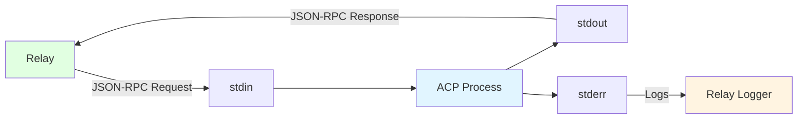
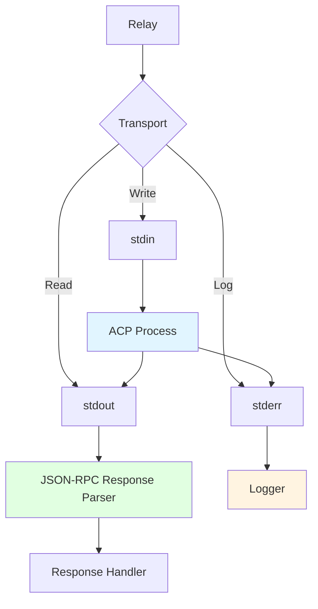
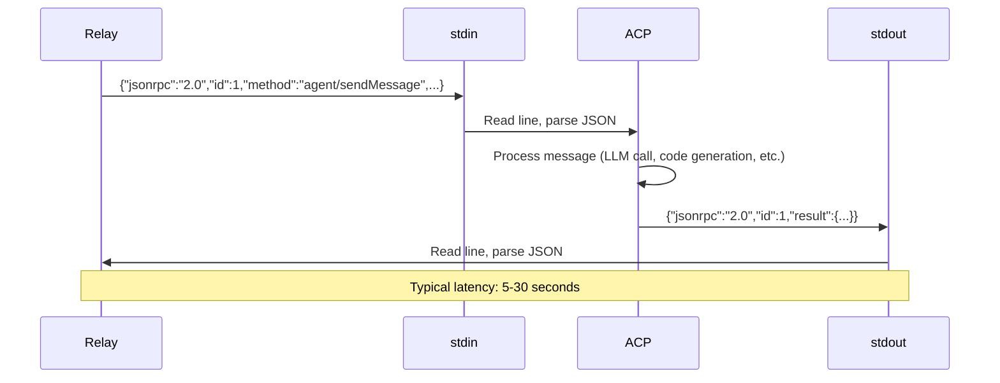
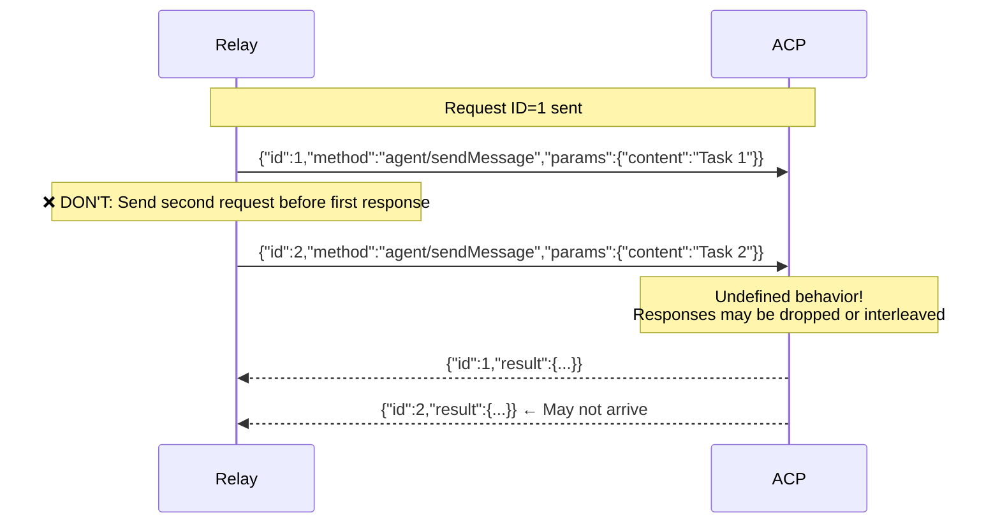
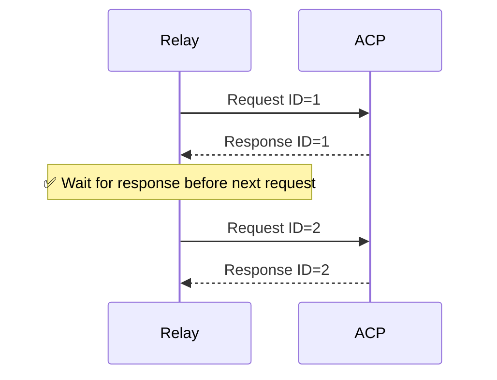

# ACP Protocol Specification

Agent Client Protocol (ACP) is a JSON-RPC 2.0 based protocol for bidirectional communication with AI coding agents over stdin/stdout.

## Overview

ACP enables the relay server to communicate with Claude Code agents and other ACP-compatible AI coding assistants. The protocol runs over standard I/O streams (stdin for requests, stdout for responses) using line-delimited JSON.

**Transport:** stdin/stdout (newline-delimited JSON)

**Protocol:** JSON-RPC 2.0

**Wire Format:** One JSON object per line



---

## JSON-RPC 2.0 Basics

All ACP communication follows [JSON-RPC 2.0](https://www.jsonrpc.org/specification) specification.

### Request Format

```typescript
interface Request {
  jsonrpc: "2.0";           // Protocol version (always "2.0")
  id: number | string;      // Request identifier (must be unique)
  method: string;           // Method name (e.g., "agent/sendMessage")
  params?: object;          // Method parameters (optional)
}
```

### Response Format (Success)

```typescript
interface Response {
  jsonrpc: "2.0";           // Protocol version
  id: number | string;      // Matches request ID
  result: any;              // Method result
}
```

### Response Format (Error)

```typescript
interface ErrorResponse {
  jsonrpc: "2.0";           // Protocol version
  id: number | string;      // Matches request ID
  error: {
    code: number;           // Error code (see Error Codes)
    message: string;        // Human-readable error
    data?: any;             // Additional error details (optional)
  };
}
```

---

## Wire Protocol

### Message Framing

Each message is a single line of JSON terminated by a newline character (`\n`).

```
{JSON}\n
{JSON}\n
{JSON}\n
```

**Example:**

```json
{"jsonrpc":"2.0","id":1,"method":"agent/sendMessage","params":{"content":"hello"}}\n
{"jsonrpc":"2.0","id":1,"result":{"type":"text","content":"Echo: hello"}}\n
```

### Stream Multiplexing



**stdin:** JSON-RPC requests (relay → agent)

**stdout:** JSON-RPC responses (agent → relay)

**stderr:** Diagnostic logs (agent → relay logger, not part of protocol)

---

## ACP Methods

### agent/sendMessage

Send a message/instruction to the agent and receive a response.

**Method:** `agent/sendMessage`

**Parameters:**

```typescript
interface SendMessageParams {
  content: string;      // Message content (user instruction)
  images?: string[];    // Optional base64-encoded images
}
```

**Result:**

```typescript
interface AgentMessage {
  type: "text" | "toolCall";  // Message type
  content?: string;            // Text response (if type="text")
  toolCall?: ToolCall;         // Tool call details (if type="toolCall")
}

interface ToolCall {
  name: string;                        // Tool name
  args: Record<string, any>;           // Tool arguments
}
```

**Example Request:**

```json
{
  "jsonrpc": "2.0",
  "id": 1,
  "method": "agent/sendMessage",
  "params": {
    "content": "Write a function to parse JSON in Go"
  }
}
```

**Example Response (Text):**

```json
{
  "jsonrpc": "2.0",
  "id": 1,
  "result": {
    "type": "text",
    "content": "Here's a JSON parsing function:\n\nfunc ParseJSON(data []byte) (map[string]interface{}, error) {\n  var result map[string]interface{}\n  err := json.Unmarshal(data, &result)\n  return result, err\n}"
  }
}
```

**Example Response (Tool Call):**

```json
{
  "jsonrpc": "2.0",
  "id": 1,
  "result": {
    "type": "toolCall",
    "toolCall": {
      "name": "write_file",
      "args": {
        "path": "parser.go",
        "content": "package main\n\nfunc ParseJSON..."
      }
    }
  }
}
```

**Typical Latency:**
- Simple echo: 50-200ms
- Code generation: 5-30 seconds
- Complex analysis: 30-60 seconds

---

### agent/getContext

**Status:** Defined but not yet implemented

Retrieve current agent context (workspace state, conversation history, etc.).

**Method:** `agent/getContext`

**Parameters:** None

**Result:**

```typescript
interface AgentContext {
  workspace: string;       // Current workspace path
  sessionId?: string;      // Session identifier
  conversationLength: number; // Number of messages in conversation
}
```

---

### agent/toolCall

**Status:** Defined but not yet implemented

Execute a tool call and return the result.

**Method:** `agent/toolCall`

**Parameters:**

```typescript
interface ToolCallParams {
  name: string;                  // Tool name
  args: Record<string, any>;     // Tool arguments
}
```

**Result:** Tool-specific response

---

## Message Flow

### Single Message Exchange



### Concurrent Requests (Not Supported)

**⚠️ IMPORTANT:** ACP processes messages sequentially. Concurrent requests are NOT supported in the current protocol.



**Correct Pattern:**



**Implementation Note:**

The `pkg/acp/client.go` uses a request mutex (`reqMu`) to serialize requests at the client level:

```go
func (c *Client) SendMessage(content string) (*AgentMessage, error) {
	// Lock for entire request/response cycle to prevent interleaving
	c.reqMu.Lock()
	defer c.reqMu.Unlock()

	// Generate message ID
	id := c.nextID
	c.nextID++

	// Send request and wait for response
	req := Request{JSONRPC: "2.0", ID: id, Method: MethodSendMessage, ...}
	// ... marshal, send, read response ...
	return response, nil
}
```

---

## Error Codes

ACP uses standard JSON-RPC 2.0 error codes plus application-specific codes.

### Standard JSON-RPC 2.0 Errors

| Code | Name | Meaning |
|------|------|---------|
| -32700 | Parse error | Invalid JSON received |
| -32600 | Invalid Request | JSON is not a valid Request object |
| -32601 | Method not found | Method does not exist |
| -32602 | Invalid params | Invalid method parameter(s) |
| -32603 | Internal error | Internal JSON-RPC error |

### ACP-Specific Errors

| Code | Name | Meaning |
|------|------|---------|
| -32000 | Server error | Generic server-side error |
| -32001 | Workspace error | Workspace path invalid or inaccessible |
| -32002 | API error | External API call failed (e.g., Anthropic API) |
| -32003 | Tool error | Tool execution failed |
| -32004 | Context error | Failed to retrieve context |

**Example Error Response:**

```json
{
  "jsonrpc": "2.0",
  "id": 1,
  "error": {
    "code": -32602,
    "message": "Invalid params: content field is required",
    "data": {
      "field": "content",
      "reason": "missing required field"
    }
  }
}
```

---

## Implementation Details

### Go Client (pkg/acp/client.go)

**Request Serialization:**

```go
// Construct JSON-RPC request
req := Request{
	JSONRPC: "2.0",
	ID:      id,
	Method:  MethodSendMessage,
	Params: SendMessageParams{
		Content: content,
	},
}

// Marshal to JSON
data, err := json.Marshal(req)
if err != nil {
	return nil, fmt.Errorf("failed to marshal request: %w", err)
}

// Write to stdin with newline
_, err = c.transport.Write(append(data, '\n'))
if err != nil {
	return nil, fmt.Errorf("failed to write request: %w", err)
}
```

**Response Parsing:**

```go
// Read line from stdout
if !c.scanner.Scan() {
	if err := c.scanner.Err(); err != nil {
		return nil, fmt.Errorf("failed to read response: %w", err)
	}
	return nil, fmt.Errorf("unexpected EOF")
}

// Parse JSON
var resp Response
if err := json.Unmarshal(c.scanner.Bytes(), &resp); err != nil {
	return nil, fmt.Errorf("failed to unmarshal response: %w", err)
}

// Check for errors
if resp.Error != nil {
	return nil, fmt.Errorf("ACP error (code %d): %s", resp.Error.Code, resp.Error.Message)
}

// Extract result
var agentMsg AgentMessage
resultBytes, _ := json.Marshal(resp.Result)
json.Unmarshal(resultBytes, &agentMsg)
return &agentMsg, nil
```

### Buffer Configuration

The client uses a buffered scanner with generous limits to handle large responses:

```go
client.scanner.Buffer(make([]byte, 64*1024), 5*1024*1024)
//                     Initial buffer: 64 KB  ↑
//                     Max buffer: 5 MB       ↑
```

**Why large buffers:**
- Code generation responses can be 100KB+ (entire files)
- Conversation context includes full message history
- Tool call arguments may contain large data structures

---

## Security Considerations

### API Key Handling

**Environment Variable:**

```bash
export ANTHROPIC_API_KEY=sk-ant-...
```

**Process Launch:**

The API key is passed to the ACP process via environment variable:

```go
launchCfg := ProcessLaunchConfig{
	Workspace:   workspace,
	APIKey:      apiKey,                    // Passed securely
	CommandPath: "claude-code-acp",
	CommandArgs: []string{"--workspace", workspace},
	Env:         map[string]string{
		"ANTHROPIC_API_KEY": apiKey,       // Set in process environment
	},
}
```

**⚠️ NEVER transmit API keys over stdin/stdout in JSON messages.**

### Workspace Isolation

Each agent runs with a restricted workspace:

```bash
claude-code-acp --workspace /workspaces/agent-123
```

The ACP process cannot access files outside this workspace directory.

**Container Mode Enhancement:**

In container execution mode, additional isolation is enforced:

```go
// Container with read-only root filesystem
containerConfig := &container.Config{
	Image: "ourocodus/agent:latest",
	// ... other config ...
}

hostConfig := &container.HostConfig{
	Binds: []string{
		fmt.Sprintf("%s:/workspace:rw", hostWorkspace),  // Only this directory writable
	},
	ReadonlyRootfs: true,  // Root filesystem is read-only
}
```

### Input Validation

**Client-side validation:**

```go
if workspace == "" {
	return nil, fmt.Errorf("workspace path is required")
}
if apiKey == "" {
	return nil, fmt.Errorf("API key is required")
}
```

**ACP-side validation:**
- Content length limits (prevent DoS)
- Workspace path validation (prevent directory traversal)
- Method whitelisting (only allowed methods)

---

## Performance Optimization

### Scanner Buffer Tuning

**Trade-offs:**

| Buffer Size | Memory Usage | Max Message Size | Performance |
|-------------|--------------|------------------|-------------|
| 4 KB (default) | Low | 4 KB | ❌ Fails on large responses |
| 64 KB (initial) | Moderate | 5 MB | ✅ Good for most cases |
| 5 MB (max) | High | 5 MB | ✅ Handles large code generation |

**Current Configuration:**

```go
scanner.Buffer(make([]byte, 64*1024), 5*1024*1024)
```

- Allocates 64 KB initially (low memory overhead)
- Grows up to 5 MB if needed (handles large responses)
- Prevents unbounded memory growth

### Request/Response Latency

```mermaid
gantt
    title ACP Message Latency (Typical)
    dateFormat X
    axisFormat %Ls

    section Request Path
    JSON marshal          :0, 1
    Write to stdin        :1, 5
    ACP parse             :5, 10

    section Agent Processing
    LLM API call          :10, 5010
    Code generation       :5010, 10010
    Response formatting   :10010, 10050

    section Response Path
    JSON marshal          :10050, 10055
    Write to stdout       :10055, 10060
    Relay parse           :10060, 10065

    section Total
    End-to-end latency    :10065, 10070
```



**Typical Latencies:**

- Echo response: 50-200ms
- Simple code generation: 5-10 seconds
- Complex code generation: 15-30 seconds
- Full file generation: 30-60 seconds

---

## Testing

### Mock ACP Process (Echo Agent)

For testing without Claude API, use the echo agent:

**File:** `cmd/echo-agent/main.go`

```go
func main() {
	scanner := bufio.NewScanner(os.Stdin)
	for scanner.Scan() {
		var req Request
		json.Unmarshal(scanner.Bytes(), &req)

		resp := Response{
			JSONRPC: "2.0",
			ID:      req.ID,
			Result: AgentMessage{
				Type:    "text",
				Content: fmt.Sprintf("Echo: %s", req.Params.Content),
			},
		}

		data, _ := json.Marshal(resp)
		fmt.Fprintf(os.Stdout, "%s\n", data)
	}
}
```

**Usage:**

```bash
export OUROCODUS_ACP_BINARY=./bin/echo-agent
./bin/relay
```

### Unit Testing

**Mock Transport:**

```go
type mockTransport struct {
	stdin  io.Reader
	stdout io.Writer
	stderr io.Reader
}

func (m *mockTransport) Read(p []byte) (int, error)  { return m.stdout.Read(p) }
func (m *mockTransport) Write(p []byte) (int, error) { return m.stdin.Write(p) }
func (m *mockTransport) Close() error                { return nil }
func (m *mockTransport) Stderr() io.Reader           { return m.stderr }

// Test usage
transport := &mockTransport{
	stdin:  inPipe,
	stdout: outPipe,
}
client, _ := acp.NewClientFromTransport(transport)
```

**E2E Tests:**

- `tests/e2e/e2e_test.go` - Full relay → ACP → agent flow
- `tests/e2e/acp_container_exec_test.go` - Container execution mode

---

## Debugging

### Enable ACP Stderr Logging

```go
client, err := acp.NewClient(workspace, apiKey,
	acp.WithLogger(&stderrLogger{}),  // Enable stderr logging
)
```

**Logger Implementation:**

```go
type stderrLogger struct{}

func (l *stderrLogger) Printf(format string, v ...interface{}) {
	log.Printf("[ACP] "+format, v...)
}
```

**Output:**

```
[ACP stderr] Initializing Claude Code ACP v1.0.0
[ACP stderr] Workspace: /workspaces/agent-123
[ACP stderr] Connecting to Anthropic API...
[ACP stderr] Ready to receive messages
```

### Request/Response Tracing

```go
// Before sending
fmt.Printf("→ Request: %s\n", string(requestJSON))

// After receiving
fmt.Printf("← Response: %s\n", string(responseJSON))
```

**Example Output:**

```
→ Request: {"jsonrpc":"2.0","id":1,"method":"agent/sendMessage","params":{"content":"hello"}}
← Response: {"jsonrpc":"2.0","id":1,"result":{"type":"text","content":"Echo: hello"}}
```

### Common Issues

**Issue: "unexpected EOF"**

**Cause:** ACP process exited or crashed

**Debugging:**
```bash
# Check ACP stderr logs
./bin/relay 2>&1 | grep "ACP stderr"

# Verify ACP binary works standalone
claude-code-acp --workspace /tmp/test <<< '{"jsonrpc":"2.0","id":1,"method":"agent/sendMessage","params":{"content":"test"}}'
```

**Issue: "scanner buffer overflow"**

**Cause:** Response exceeds max buffer size (5 MB)

**Solution:**
```go
// Increase buffer size (use cautiously!)
client.scanner.Buffer(make([]byte, 64*1024), 10*1024*1024)
```

**Issue: "request timeout"**

**Cause:** ACP processing took too long

**Solution:**
```go
ctx, cancel := context.WithTimeout(context.Background(), 60*time.Second)
defer cancel()

client, err := acp.NewClient(workspace, apiKey,
	acp.WithLaunchContext(ctx),  // Enable timeout
)
```

---

## Protocol Evolution

### Version History

| Version | Date | Changes |
|---------|------|---------|
| 1.0 | 2025-11-12 | Initial JSON-RPC 2.0 implementation |

### Future Enhancements

**v2.0 (Planned):**

- Streaming responses (chunked output via JSON-RPC notifications)
- Async tool calls (non-blocking tool execution)
- Context persistence (resume conversations)
- Multi-turn conversations (maintain state across requests)
- Binary attachments (file uploads/downloads)

**v3.0 (Exploratory):**

- Bidirectional notifications (server-initiated messages)
- Multiplexed requests (concurrent message processing)
- Protocol negotiation (client/server capability discovery)

### Compatibility

**Backwards Compatibility Strategy:**

- `jsonrpc` field determines protocol version
- Clients must check `jsonrpc: "2.0"` in responses
- Unknown methods return `-32601` (Method not found)
- Unknown params fields are ignored (forward compatibility)

---

## Related Documentation

- [Message Flow](MESSAGE_FLOW.md) - End-to-end routing through system layers
- [Container Modes](CONTAINER_MODES.md) - Container vs host process execution
- [WebSocket API](WEBSOCKET_API.md) - PWA ↔ Relay protocol
- [Error Handling](../development/ERROR_HANDLING.md) - Error codes and recovery

---

## Source Code References

**Implementation:**
- `pkg/acp/client.go` - Client implementation with request/response handling
- `pkg/acp/types.go` - Message type definitions
- `pkg/acp/transport.go` - Transport abstraction (stdin/stdout)
- `pkg/acp/host_launcher.go` - Host process launcher
- `pkg/relay/session/container_attach_process_launcher.go` - Container stdio attachment

**Tests:**
- `pkg/acp/client_test.go` - Unit tests for client
- `tests/e2e/e2e_test.go` - Integration tests with real ACP
- `cmd/echo-agent/main.go` - Mock ACP implementation for testing

**Specification:**
- [JSON-RPC 2.0 Specification](https://www.jsonrpc.org/specification)
- [ACP Design (internal)](../../PRD.md) - Original protocol design
