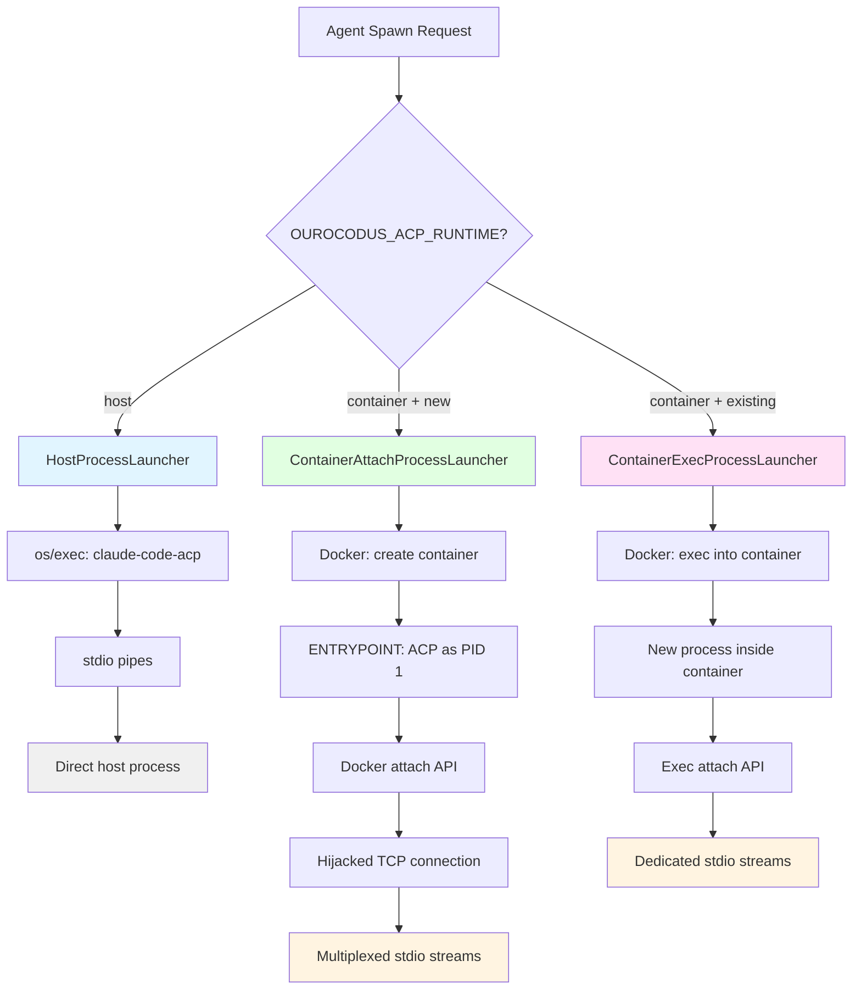
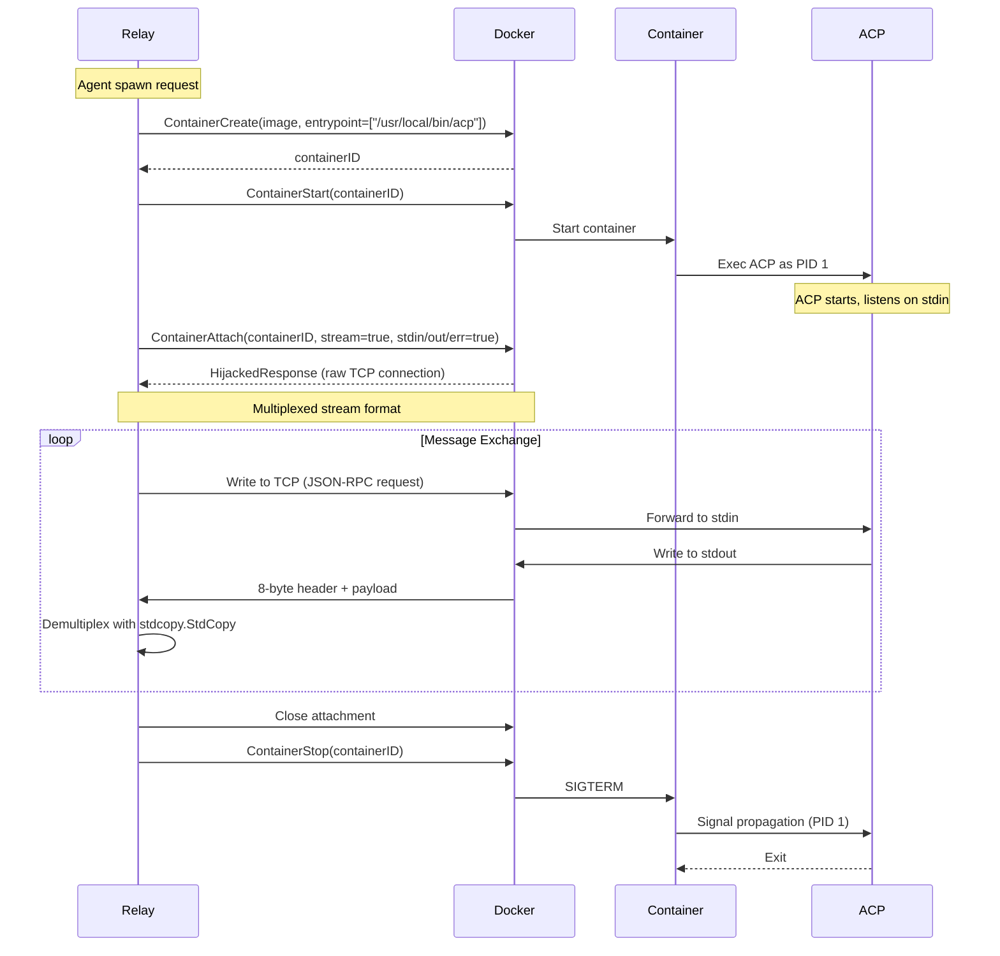
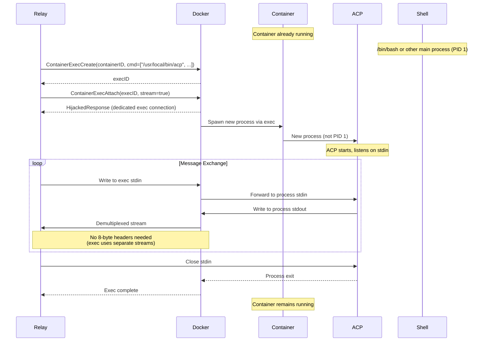
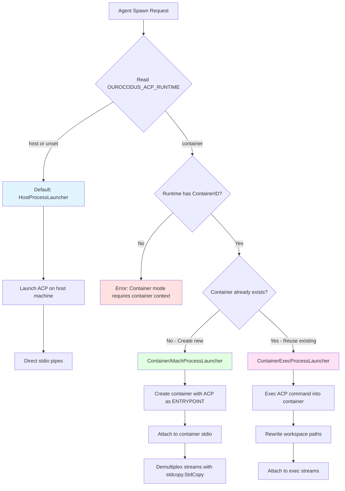
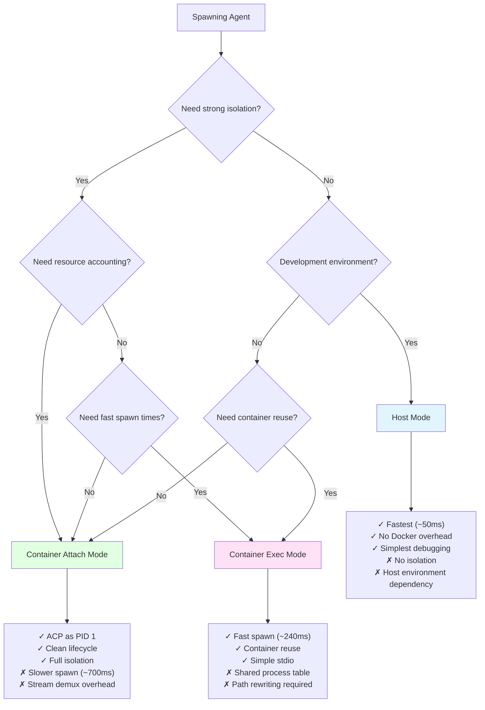

# Container Execution Modes

Two distinct strategies for running ACP (Agent Client Protocol) processes inside Docker containers, each with specific trade-offs and use cases.

## Overview

Ourocodus supports two container execution modes controlled by the `OUROCODUS_ACP_RUNTIME` environment variable:

| Mode | Value | ACP Lifecycle | Container Lifecycle | Use Case |
|------|-------|---------------|---------------------|----------|
| **Host** (default) | `host` | Process on host machine | N/A (no container) | Development, simple setups |
| **Container Attach** | `container` | Main process (PID 1) | Created per agent, attached stdio | Production, strong isolation |
| **Container Exec** | `container` + exec API | Spawned via docker exec | Pre-existing container, exec into it | Testing, reuse containers |



## Container Attach Mode (Main Process)

ACP runs as the container's **main process (PID 1)**, with the relay attaching to the container's stdio streams.

### Architecture



### Implementation

**File:** `pkg/relay/session/container_attach_process_launcher.go`

```go
// ContainerAttachProcessLauncher runs ACP by attaching to a container's main process stdio.
// This is the simpler, more Docker-native approach where ACP runs as the container's ENTRYPOINT.
type ContainerAttachProcessLauncher struct {
	dockerClient containersession.DockerClient
	containerID  string
	logger       Logger
}

func (l *ContainerAttachProcessLauncher) Start(ctx context.Context, cfg acp.ProcessLaunchConfig) (acp.Transport, error) {
	// Attach to the container's stdin/stdout/stderr
	// The container should already be running with ACP as its main process
	attachResp, err := l.dockerClient.ContainerAttach(ctx, l.containerID, container.AttachOptions{
		Stream: true,
		Stdin:  true,
		Stdout: true,
		Stderr: true,
	})
	if err != nil {
		return nil, fmt.Errorf("failed to attach to container %s: %w", l.containerID, err)
	}

	// Create pipes for demultiplexed stdout/stderr
	stdoutReader, stdoutWriter := io.Pipe()
	stderrWriter := createStderrLogger(l.logger, shortID)

	// Start demultiplexing goroutine
	// Docker uses a special stream format when Tty=false that needs to be demultiplexed
	go func() {
		_, err := stdcopy.StdCopy(stdoutWriter, stderrWriter, attachResp.Reader)
		stdoutWriter.CloseWithError(err)
		attachResp.Close()
	}()

	return &containerAttachTransport{
		hijackedResp: attachResp,
		stdout:       stdoutReader,
	}, nil
}
```

**Docker Stream Multiplexing:**

```
+--------+--------+--------+--------+--------+--------+--------+--------+
| Stream | 0x00   | 0x00   | 0x00   |          Size (uint32)           |
| Type   |        |        |        |                                  |
+--------+--------+--------+--------+--------+--------+--------+--------+
|                     Payload (Size bytes)                             |
+----------------------------------------------------------------------+

Stream Types:
  0x01 = stdout
  0x02 = stderr
  0x03 = custom (reserved)
```

**Why demultiplexing is required:**
- Docker attach API sends both stdout and stderr on the same TCP connection
- Uses 8-byte header to distinguish streams
- `stdcopy.StdCopy` from Docker SDK handles demultiplexing
- Relay splits stdout (JSON-RPC) from stderr (logs)

### Container Configuration

**Dockerfile.agent excerpt:**

```dockerfile
FROM ubuntu:22.04

# Install ACP binary
COPY bin/claude-code-acp /usr/local/bin/acp
RUN chmod +x /usr/local/bin/acp

# Set ACP as the main process
ENTRYPOINT ["/usr/local/bin/acp"]

# Default arguments (can be overridden at container creation)
CMD ["--workspace", "/workspace"]

WORKDIR /workspace
```

**Container creation:**

```go
// From pkg/relay/session/manager.go
containerConfig := &container.Config{
	Image:        "ourocodus/agent:latest",
	WorkingDir:   "/workspace",
	Cmd:          []string{"--workspace", "/workspace"},  // Args for ACP
	AttachStdin:  true,
	AttachStdout: true,
	AttachStderr: true,
	OpenStdin:    true,
	StdinOnce:    false,
	Tty:          false,  // CRITICAL: false enables stream multiplexing
}
```

### Characteristics

**Advantages:**

- ✅ **Lifecycle simplicity**: Container lifecycle === ACP lifecycle
- ✅ **Clean shutdown**: SIGTERM to container goes directly to ACP (PID 1)
- ✅ **Resource accounting**: All ACP CPU/memory usage tracked by container
- ✅ **Docker-native**: Uses standard Docker patterns (ENTRYPOINT, attach)
- ✅ **Process isolation**: ACP is the only process, no shared process table

**Disadvantages:**

- ❌ **Container overhead**: Must create new container per agent (slower spawn)
- ❌ **Image dependency**: Requires image with ACP binary baked in
- ❌ **Stdio complexity**: Stream demultiplexing required (8-byte headers)
- ❌ **Debugging harder**: Can't easily exec into container to inspect

**Performance:**



```mermaid
gantt
    title Container Attach Mode Latency (Typical)
    dateFormat X
    axisFormat %Ls

    section Container Lifecycle
    Create container      :0, 300
    Start container       :300, 500
    Attach stdio          :500, 550

    section ACP Initialization
    Process start         :550, 650
    JSON-RPC handshake    :650, 700

    section Ready
    First message ready   :700, 710
```

**Total spawn latency**: ~700ms (container creation dominates)

---

## Container Exec Mode (Spawned Process)

ACP is spawned **inside a running container** via `docker exec`, as a child process alongside other potential processes.

### Architecture



### Implementation

**File:** `pkg/relay/session/container_exec_process_launcher.go`

```go
// ContainerExecProcessLauncher runs ACP inside an existing agent container via docker exec.
type ContainerExecProcessLauncher struct {
	execService   ContainerExecService
	containerID   string
	workspacePath string
	logger        Logger
}

func (l *ContainerExecProcessLauncher) Start(ctx context.Context, cfg acp.ProcessLaunchConfig) (acp.Transport, error) {
	// CRITICAL: Rewrite workspace arguments from host paths to container paths
	// ACP receives host workspace path (e.g. /Users/dev/workspaces/session-123)
	// but inside the container the workspace is mounted at a different location (e.g. /workspace)
	rewrittenArgs := rewriteWorkspaceArg(cfg.CommandArgs, l.workspacePath)

	command := buildExecCommand(cfg.CommandPath, rewrittenArgs)
	env := mergeEnvMaps(cfg.Env, map[string]string{
		"ANTHROPIC_API_KEY": cfg.APIKey,
	})

	execCfg := containersession.ExecConfig{
		Command:    command,               // ["/usr/local/bin/acp", "--workspace", "/workspace"]
		Env:        env,                   // ["ANTHROPIC_API_KEY=sk-..."]
		WorkingDir: l.workspacePath,       // "/workspace"
	}

	attachment, err := l.execService.ExecInContainer(ctx, l.containerID, execCfg)
	if err != nil {
		return nil, fmt.Errorf("failed to exec ACP command %q in container %s: %w",
			cfg.CommandPath, l.containerID, err)
	}

	return &containerExecTransport{attachment: attachment}, nil
}
```

**Workspace Path Rewriting:**

```go
// rewriteWorkspaceArg rewrites --workspace arguments to use the container mount path.
// This is critical for container mode: ACP receives host workspace paths
// but these paths don't exist inside the container where the workspace is mounted.
//
// Handles both formats:
//   - "--workspace /host/path" → "--workspace /workspace"
//   - "--workspace=/host/path" → "--workspace=/workspace"
func rewriteWorkspaceArg(args []string, containerPath string) []string {
	result := make([]string, 0, len(args))
	i := 0
	for i < len(args) {
		arg := args[i]

		// Handle "--workspace=/path" format
		if strings.HasPrefix(arg, "--workspace=") {
			result = append(result, "--workspace="+containerPath)
			i++
			continue
		}

		// Handle "--workspace /path" format (two separate args)
		if arg == "--workspace" && i+1 < len(args) {
			result = append(result, "--workspace", containerPath)
			i += 2 // Skip both --workspace and the path
			continue
		}

		// Pass through all other args unchanged
		result = append(result, arg)
		i++
	}

	return result
}
```

**Why path rewriting is critical:**
- Relay knows workspace path on **host**: `/Users/dev/workspaces/agent-coder-123`
- Container mounts workspace at **fixed path**: `/workspace`
- Without rewriting, ACP would try to access non-existent host paths inside container
- Rewriting happens before exec, transparent to ACP

### Container Configuration

**Pre-existing container:**

```go
// Container can be created with any main process
containerConfig := &container.Config{
	Image:      "ourocodus/agent:latest",
	WorkingDir: "/workspace",
	Cmd:        []string{"/bin/bash"},  // Shell as PID 1, or anything else
	Tty:        false,
}

// Container is created once, reused for multiple exec calls
containerID := createContainer(containerConfig)
```

**Exec call:**

```go
// Each agent spawns a new exec session
execConfig := containersession.ExecConfig{
	Command:    []string{"/usr/local/bin/acp", "--workspace", "/workspace"},
	Env:        []string{"ANTHROPIC_API_KEY=sk-..."},
	WorkingDir: "/workspace",
}

attachment, err := manager.ExecInContainer(ctx, containerID, execConfig)
```

### Characteristics

**Advantages:**

- ✅ **Container reuse**: Can run multiple ACP instances in same container
- ✅ **Faster spawn**: No container creation overhead (~50ms vs ~300ms)
- ✅ **Simpler stdio**: Exec API provides dedicated streams (no multiplexing)
- ✅ **Debugging easier**: Can exec into container with shell to inspect
- ✅ **Flexible image**: Any image with ACP binary works (no ENTRYPOINT required)

**Disadvantages:**

- ❌ **Lifecycle coupling**: Container lifecycle != ACP lifecycle
- ❌ **Orphan risk**: If relay crashes, exec processes may become orphaned
- ❌ **Resource accounting**: ACP CPU/memory not directly attributed to container
- ❌ **Process isolation**: Shared process table with other processes in container
- ❌ **Path complexity**: Requires workspace path rewriting logic

**Performance:**



```mermaid
gantt
    title Container Exec Mode Latency (Typical)
    dateFormat X
    axisFormat %Ls

    section Docker Exec
    Create exec           :0, 50
    Attach exec streams   :50, 80

    section ACP Initialization
    Process start         :80, 180
    JSON-RPC handshake    :180, 230

    section Ready
    First message ready   :230, 240
```

**Total spawn latency**: ~240ms (3x faster than attach mode)

---

## Launcher Selection Logic

The relay automatically selects the appropriate launcher based on runtime context and environment configuration.



### Implementation

**File:** `pkg/relay/session/client_factory.go:154-185`

```go
// selectLauncher chooses between host and container execution based on runtime context and environment.
func (f *ACPClientFactory) selectLauncher(runtime *AgentRuntimeContext) (acp.ProcessLauncher, error) {
	runtimeMode, err := getRuntimeMode()
	if err != nil {
		return nil, err
	}

	// If not container mode, always use host launcher
	if runtimeMode != "container" {
		return f.createHostLauncher(runtime), nil
	}

	// Container mode requested: validate prerequisites
	if err := validateContainerPrerequisites(runtime, f.containerSessionMgr); err != nil {
		f.logger.Printf("[ACP] Container prerequisites not met, falling back to host: %v", err)
		return f.createHostLauncher(runtime), nil
	}

	// All prerequisites met: use container attach launcher
	return f.createContainerLauncher(runtime)
}

func validateContainerPrerequisites(runtime *AgentRuntimeContext, containerSessionMgr ContainerExecService) error {
	if runtime == nil {
		return fmt.Errorf("container runtime requested but runtime context is nil")
	}
	if !runtime.HasContainer() {
		return fmt.Errorf("container runtime requested but no container ID in runtime context")
	}
	if containerSessionMgr == nil {
		return fmt.Errorf("container runtime requested but container session manager not available")
	}
	return nil
}
```

**Runtime context:**

```go
// AgentRuntimeContext provides execution context for ACP processes
type AgentRuntimeContext struct {
	SessionID   string  // User session ID
	AgentID     string  // Unique agent identifier
	Workspace   string  // Host workspace path (e.g., /Users/dev/workspaces/agent-123)
	ContainerID string  // Docker container ID (if container mode)
}

func (r *AgentRuntimeContext) HasContainer() bool {
	return r.ContainerID != ""
}
```

---

## Decision Tree: When to Use Each Mode



### Use Case Matrix

| Scenario | Recommended Mode | Reason |
|----------|-----------------|---------|
| **Production deployment** | Container Attach | Strong isolation, clean lifecycle, resource limits |
| **Development/Testing** | Host | Fastest iteration, no Docker dependency |
| **E2E test suite** | Container Exec | Fast spawn for many agents, container reuse |
| **Multi-tenant SaaS** | Container Attach | Security isolation between tenants |
| **CI/CD pipeline** | Container Attach | Reproducible environment, resource control |
| **Local demo** | Host | Simplest setup, no prerequisites |
| **Debugging agent issues** | Container Exec | Easy to exec shell into container, inspect state |

---

## Comparison Table

| Aspect | Host Mode | Container Attach | Container Exec |
|--------|-----------|------------------|----------------|
| **Spawn Latency** | ~50ms | ~700ms | ~240ms |
| **Process Isolation** | None (host) | Full (only process) | Partial (shared container) |
| **Resource Accounting** | Host-level | Container-level | Process-level (in container) |
| **Lifecycle Management** | Process-based | Container-based | Exec-based |
| **Stdio Complexity** | Direct pipes | Multiplexed (8-byte headers) | Direct streams |
| **Workspace Handling** | Direct path | Host path → container mount | Path rewriting required |
| **Debugging** | Easy (native tools) | Harder (attach only) | Easy (can exec shell) |
| **Container Reuse** | N/A | No (one per agent) | Yes (many agents per container) |
| **Prerequisites** | None | Docker + image | Docker + running container |
| **Security** | Host security | Container isolation | Container isolation |

---

## Configuration Examples

### 1. Host Mode (Default)

```bash
# No configuration needed - this is the default
# Or explicitly set:
export OUROCODUS_ACP_RUNTIME=host

# Start relay
./bin/relay
```

**What happens:**
- Agents spawn as host processes via `os/exec`
- ACP binary runs directly on host machine
- Fastest spawn times, simplest setup

### 2. Container Attach Mode

```bash
# Build agent image with ACP as ENTRYPOINT
make agent-image

# Set container runtime mode
export OUROCODUS_ACP_RUNTIME=container

# Optional: Custom ACP binary path (if not using default)
export OUROCODUS_ACP_BINARY=/usr/local/bin/claude-code-acp

# Start relay
./bin/relay
```

**What happens:**
- Each agent spawn creates a new Docker container
- ACP runs as PID 1 inside container
- Relay attaches to container stdio
- Workspace mounted at `/workspace`

### 3. Container Exec Mode (Testing/Reuse)

```bash
# Create a long-lived agent container manually
docker run -d \
  --name agent-container \
  -v $(pwd)/workspaces:/workspaces \
  -w /workspace \
  ourocodus/agent:latest \
  /bin/bash -c "sleep infinity"

# Set container runtime mode
export OUROCODUS_ACP_RUNTIME=container

# Modify relay to reuse existing container (requires code changes)
# This mode is primarily used in tests, see tests/e2e/acp_container_exec_test.go

./bin/relay
```

**What happens:**
- Agents exec into pre-existing container
- Multiple ACP processes can run concurrently
- Each has dedicated stdio streams
- Workspace paths rewritten from host to container

---

## Performance Benchmarks

### Spawn Latency Breakdown

```mermaid
gantt
    title Agent Spawn Latency by Mode (Milliseconds)
    dateFormat X
    axisFormat %Ls

    section Host Mode
    Launcher setup        :0, 10
    Process fork          :10, 30
    ACP initialization    :30, 80
    JSON-RPC handshake    :80, 100

    section Container Exec
    Exec create           :0, 50
    Exec attach           :50, 80
    Process start         :80, 180
    ACP initialization    :180, 230
    JSON-RPC handshake    :230, 280

    section Container Attach
    Container create      :0, 300
    Container start       :300, 500
    Stdio attach          :500, 550
    Process start         :550, 650
    ACP initialization    :650, 700
    JSON-RPC handshake    :700, 750
```



### Message Latency (End-to-End)

| Mode | User → ACP | ACP → User | Round Trip |
|------|-----------|-----------|-----------|
| Host | ~5ms | ~5ms | ~10ms |
| Container Exec | ~8ms | ~8ms | ~16ms |
| Container Attach | ~12ms | ~12ms | ~24ms |

**Why Container Attach is slower:**
- Stream demultiplexing overhead (8-byte headers)
- Additional TCP connection (hijacked response)
- Kernel context switches (container boundary)

---

## Error Handling

### Container Attach Errors

```go
// Common errors when attaching to containers
attachment, err := dockerClient.ContainerAttach(ctx, containerID, opts)
if err != nil {
	// Error types:
	switch {
	case errors.Is(err, context.Canceled):
		// Relay shutdown or timeout
		return fmt.Errorf("attach canceled: %w", err)

	case strings.Contains(err.Error(), "No such container"):
		// Container doesn't exist or was removed
		return fmt.Errorf("container not found: %w", err)

	case strings.Contains(err.Error(), "is not running"):
		// Container exists but not running
		return fmt.Errorf("container not running: %w", err)

	default:
		// Other Docker API errors
		return fmt.Errorf("attach failed: %w", err)
	}
}
```

### Container Exec Errors

```go
// Common errors when exec'ing into containers
attachment, err := execService.ExecInContainer(ctx, containerID, execCfg)
if err != nil {
	// Error types:
	switch {
	case errors.Is(err, context.Canceled):
		// Relay shutdown or timeout
		return fmt.Errorf("exec canceled: %w", err)

	case strings.Contains(err.Error(), "executable file not found"):
		// ACP binary not in container PATH
		return fmt.Errorf("ACP binary not found in container: %w", err)

	case strings.Contains(err.Error(), "working directory"):
		// Workspace path doesn't exist in container
		return fmt.Errorf("workspace path invalid: %w", err)

	default:
		// Other exec errors
		return fmt.Errorf("exec failed: %w", err)
	}
}
```

---

## Troubleshooting

### Issue: "Container mode requested but no container ID"

**Symptom:** Error during agent spawn when `OUROCODUS_ACP_RUNTIME=container`

**Cause:** Runtime context missing `ContainerID` field

**Solution:**
```go
// Ensure container is created before spawning agent
containerID, err := containerManager.CreateSession(ctx, sessionID, workspace)
if err != nil {
	return err
}

// Pass container ID in runtime context
runtime := &AgentRuntimeContext{
	SessionID:   sessionID,
	AgentID:     agentID,
	Workspace:   workspace,
	ContainerID: containerID,  // ← Must be set
}
```

### Issue: Demultiplexing errors in attach mode

**Symptom:** `stdcopy.StdCopy` returns unexpected EOF or invalid headers

**Cause:** Container created with `Tty: true` (disables stream multiplexing)

**Solution:**
```go
containerConfig := &container.Config{
	Image: "ourocodus/agent:latest",
	Tty:   false,  // ← MUST be false for attach mode
	// ... other config
}
```

### Issue: Workspace path errors in exec mode

**Symptom:** ACP reports "workspace does not exist: /Users/dev/workspaces/..."

**Cause:** Path rewriting not applied (host path sent to container)

**Solution:**
```go
// Always use rewriteWorkspaceArg before exec
rewrittenArgs := rewriteWorkspaceArg(cfg.CommandArgs, "/workspace")

execCfg := containersession.ExecConfig{
	Command:    buildExecCommand(cfg.CommandPath, rewrittenArgs),
	WorkingDir: "/workspace",  // ← Must match rewritten path
}
```

---

## Related Documentation

- [Message Flow](MESSAGE_FLOW.md) - End-to-end message routing through all layers
- [ACP Protocol](ACP_PROTOCOL.md) - JSON-RPC wire format specification
- [Container Session Management](../operations/CONTAINER_SESSIONS.md) - Container lifecycle
- [Testing Guide](../development/TESTING.md) - E2E tests for both modes

---

## References

**Source Code:**
- `pkg/relay/session/container_attach_process_launcher.go` - Attach mode implementation
- `pkg/relay/session/container_exec_process_launcher.go` - Exec mode implementation
- `pkg/relay/session/client_factory.go` - Launcher selection logic
- `pkg/runtime/mode.go` - Environment variable handling

**Tests:**
- `tests/e2e/acp_container_exec_test.go` - Exec mode E2E tests
- `pkg/relay/session/container_exec_process_launcher_test.go` - Unit tests

**Docker SDK:**
- [ContainerAttach API](https://pkg.go.dev/github.com/docker/docker/client#Client.ContainerAttach)
- [ContainerExecCreate API](https://pkg.go.dev/github.com/docker/docker/client#Client.ContainerExecCreate)
- [stdcopy.StdCopy](https://pkg.go.dev/github.com/docker/docker/pkg/stdcopy#StdCopy) - Stream demultiplexing
