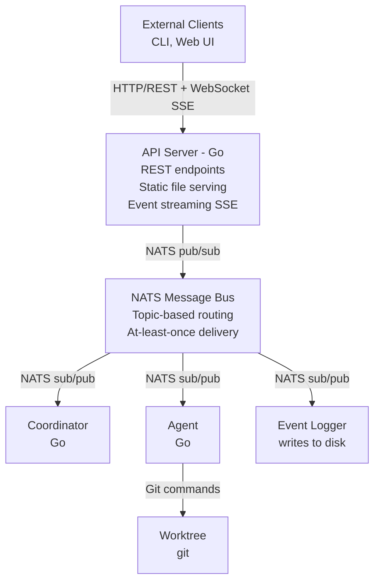

# Future Architecture (Speculative)

> **⚠️ IMPORTANT: This document describes a POSSIBLE future architecture that does NOT currently exist.**
>
> **Current Reality (Phase 1):**
> ```
> PWA → WebSocket → Relay → stdio → ACP (Claude Code)
> ```
>
> - Direct stdio communication with agents
> - No Coordinator, no multi-agent orchestration
> - NATS is optional (event logging only, disabled by default)
> - Container mode is optional (host mode is default)
>
> **See:** [WEBSOCKET_API.md](WEBSOCKET_API.md), [ACP.md](ACP.md), [ACP_PROTOCOL.md](ACP_PROTOCOL.md)
>
> ---
>
> This document explores potential evolution paths for when/if we need:
> - Automated workflow coordination
> - Multi-agent orchestration
> - Distributed deployment
> - Complex approval gates
>
> These are design ideas, not commitments. The current stdio-based architecture works well
> for single-user, local-first use cases and may remain the primary architecture indefinitely.

---

# Multi-Service Architecture (Speculative)

## Overview

This document explores potential communication boundaries, message formats, and interaction patterns if Ourocodus evolves into a multi-service distributed system.

## Design Goals

1. **Clean boundaries** - Components interact through well-defined interfaces
2. **Version tolerance** - Messages can evolve without breaking old clients
3. **Observable** - All interactions are loggable and debuggable
4. **Simple** - JSON over standard protocols, no custom binary formats
5. **Generic infrastructure** - Message bus knows nothing about domain logic

## System Boundaries



## Communication Channels

### 1. HTTP/REST (Clients ↔ API Server)

**Purpose:** Control plane operations, queries, static content

**Protocol:** HTTP/1.1, JSON request/response

**Characteristics:**

- Synchronous request/response
- Stateless
- Human-readable
- Well-understood tooling

**Use Cases:**

- Create/list/stop sessions
- Query agent status
- Access event log
- Serve web UI

### 2. Server-Sent Events (API Server → Clients)

**Purpose:** Real-time event streaming to web UI

**Protocol:** SSE (text/event-stream)

**Characteristics:**

- Unidirectional (server → client)
- Long-lived connection
- Automatic reconnection
- Simple browser support

**Use Cases:**

- Live event log updates
- Agent status changes
- Session progress updates

**Format:**

```
event: message
data: {"type":"work.started","userSessionId":"sess_123"}

event: message
data: {"type":"work.completed","userSessionId":"sess_123"}
```

### 3. NATS Pub/Sub (All Backend Components)

**Purpose:** Asynchronous message routing between services

**Protocol:** NATS (proprietary but open)

**Characteristics:**

- Topic-based routing
- At-least-once delivery
- Low latency (~1ms)
- Automatic failover

**Use Cases:**

- Work distribution (Coordinator → Agent)
- Result reporting (Agent → Coordinator)
- Approval requests (Coordinator → Approval Service)
- Event broadcasting (All → Event Logger)

### 4. Docker API (API Server ↔ Docker)

**Purpose:** Container lifecycle management

**Protocol:** Docker REST API over Unix socket

**Characteristics:**

- Synchronous
- Well-defined SDK
- Local only

**Use Cases:**

- Launch agent containers
- Query container status
- Stop containers
- Stream container logs

## Topic Structure

NATS topics follow a hierarchical naming convention:

```
<domain>.<entity>.<action>

Examples:
  sessions.sess_123.work           # Work messages for session
  sessions.sess_123.results        # Results from agents
  sessions.sess_123.approvals      # Approval requests
  sessions.sess_123.events         # Event broadcast
  system.health                    # System health messages
```

### Topic Patterns

| Pattern | Publisher | Subscriber(s) | Purpose |
|---------|-----------|---------------|---------|
| `sessions.{id}.work` | Coordinator | Agent | Send work to agent |
| `sessions.{id}.results` | Agent | Coordinator | Agent reports results |
| `sessions.{id}.approvals` | Coordinator | Approval Service, UI | Request human approval |
| `sessions.{id}.events` | All | Event Logger, UI | Broadcast events |
| `system.health` | All | API Server | Health checks |

### Subscription Strategy

**Coordinator:**

- Publishes to: `sessions.{id}.work`, `sessions.{id}.approvals`
- Subscribes to: `sessions.{id}.results`

**Agent:**

- Publishes to: `sessions.{id}.results`, `sessions.{id}.events`
- Subscribes to: `sessions.{id}.work`

**Event Logger:**

- Publishes to: (nothing)
- Subscribes to: `sessions.*.events`, `sessions.*.work`, `sessions.*.results` (wildcard)

**API Server:**

- Publishes to: (nothing, uses HTTP)
- Subscribes to: `sessions.*.events` (for SSE streaming)

## Message Envelope

All NATS messages use a standard envelope format:

```json
{
  "version": "1",
  "id": "msg_abc123",
  "timestamp": "2025-10-22T10:00:00Z",
  "userSessionId": "sess_123",
  "type": "work.coding",
  "payload": {
    // Type-specific data
  }
}
```

**Fields:**

- `version` (string, required) - Envelope format version (currently "1")
- `id` (string, required) - Unique message ID (for deduplication)
- `timestamp` (RFC3339, required) - Message creation time
- `userSessionId` (string, required) - UserSession this message belongs to
- `type` (string, required) - Message type (see [Message Types](#message-types))
- `payload` (object, required) - Type-specific data

## Message Types

### Work Messages

#### `work.coding`

Coordinator → Agent: Write implementation code

```json
{
  "type": "work.coding",
  "payload": {
    "chunk_id": "chunk_1",
    "description": "Implement user authentication",
    "requirements": [
      "Use bcrypt for password hashing",
      "JWT tokens with 24h expiry"
    ],
    "context": {
      "repo_path": "/workspace",
      "branch": "agent/chunk_1"
    }
  }
}
```

#### `work.testing`

Coordinator → Agent: Write tests

```json
{
  "type": "work.testing",
  "payload": {
    "chunk_id": "chunk_1",
    "target_code": "src/auth.go",
    "test_requirements": [
      "Unit tests for password hashing",
      "Integration tests for login flow"
    ],
    "context": {
      "repo_path": "/workspace",
      "branch": "agent/chunk_1"
    }
  }
}
```

#### `work.review`

Coordinator → Agent: Review code quality

```json
{
  "type": "work.review",
  "payload": {
    "chunk_id": "chunk_1",
    "files": ["src/auth.go", "src/auth_test.go"],
    "criteria": ["code quality", "test coverage", "security"],
    "context": {
      "repo_path": "/workspace",
      "branch": "agent/chunk_1"
    }
  }
}
```

### Result Messages

#### `result.success`

Agent → Coordinator: Work completed successfully

```json
{
  "type": "result.success",
  "payload": {
    "chunk_id": "chunk_1",
    "work_type": "coding",
    "files_changed": ["src/auth.go"],
    "summary": "Implemented bcrypt password hashing and JWT token generation",
    "commit_sha": "abc123",
    "context": {
      "agent_id": "agent_xyz"
    }
  }
}
```

#### `result.failure`

Agent → Coordinator: Work failed

```json
{
  "type": "result.failure",
  "payload": {
    "chunk_id": "chunk_1",
    "work_type": "coding",
    "error": "Compilation failed",
    "details": "src/auth.go:42: undefined: bcrypt",
    "context": {
      "agent_id": "agent_xyz"
    }
  }
}
```

### Approval Messages

#### `approval.request`

Coordinator → Approval Service: Request human approval

```json
{
  "type": "approval.request",
  "payload": {
    "gate_id": "gate_1",
    "chunk_id": "chunk_1",
    "phase": "post-coding",
    "summary": "Coding complete. Review changes before proceeding to testing?",
    "changes": {
      "files_added": ["src/auth.go"],
      "files_modified": [],
      "files_deleted": []
    }
  }
}
```

#### `approval.granted`

Approval Service → Coordinator: Approval granted

```json
{
  "type": "approval.granted",
  "payload": {
    "gate_id": "gate_1",
    "approved_by": "user@example.com",
    "approved_at": "2025-10-22T10:15:00Z",
    "notes": "Looks good"
  }
}
```

#### `approval.rejected`

Approval Service → Coordinator: Approval rejected

```json
{
  "type": "approval.rejected",
  "payload": {
    "gate_id": "gate_1",
    "rejected_by": "user@example.com",
    "rejected_at": "2025-10-22T10:15:00Z",
    "reason": "Missing error handling in auth.go:42"
  }
}
```

### Event Messages

#### `event.agent.started`

System → Event Logger: Agent started

```json
{
  "type": "event.agent.started",
  "payload": {
    "agent_id": "agent_xyz",
    "role": "coding",
    "container_id": "docker_abc"
  }
}
```

#### `event.agent.stopped`

System → Event Logger: Agent stopped

```json
{
  "type": "event.agent.stopped",
  "payload": {
    "agent_id": "agent_xyz",
    "reason": "work_complete"
  }
}
```

## Message Ordering

**Guarantee:** NATS provides at-least-once delivery with topic ordering

**Implications:**

- Messages on the same topic arrive in order
- Messages on different topics may be reordered
- Consumers must handle duplicate messages (idempotency)

**Strategy:**

- Use message IDs for deduplication
- Coordinator maintains state machine per chunk
- Ignore out-of-order messages for completed work

## Error Handling

### NATS Connection Failures

**Scenario:** NATS server unavailable

**Behavior:**

- Publishers buffer messages (up to limit)
- Subscribers reconnect automatically
- Coordinator pauses workflow until reconnected

### Message Delivery Failures

**Scenario:** No subscriber for topic

**Behavior:**

- NATS silently drops (no error)
- Consider: add request-reply pattern for critical messages

### Malformed Messages

**Scenario:** JSON parsing fails or missing required fields

**Behavior:**

- Log error with full message content
- Send `event.error` to event log
- Continue processing other messages

## Versioning Strategy

### Envelope Version

`version` field in envelope allows breaking changes:

- Current: `"1"`
- Future: `"2"` with backward compatibility layer

### Message Type Versioning

Embed version in type name when needed:

```
"work.coding" → "work.coding.v2"
```

**Rules:**

1. Add new fields freely (consumers ignore unknown fields)
2. Never remove required fields
3. Deprecate old types with 2-release grace period
4. Document all changes in CHANGELOG

### Compatibility

**Producer:** Always sends current version
**Consumer:** Must handle current + previous version

**Example:**

```go
switch msg.Type {
case "work.coding", "work.coding.v1":
    // Handle both old and new
}
```

## Schema Validation

Consider JSON Schema for validation in production deployment.

## Observability

### Logging

Every message sent/received is logged:

```json
{
  "timestamp": "2025-10-22T10:00:00Z",
  "level": "info",
  "component": "coordinator",
  "action": "message_sent",
  "topic": "sessions.sess_123.work",
  "message_id": "msg_abc123",
  "message_type": "work.coding"
}
```

### Tracing

Add `trace_id` to envelope for distributed tracing

### Metrics

Track message counts, latencies, error rates

## Security

- TLS for NATS connections
- Message signing for authenticity
- Topic ACLs for authorization

## Testing

### Unit Tests

Mock NATS connections, verify message formatting

### Integration Tests

Real NATS server, verify end-to-end delivery

### Contract Tests

Verify producer/consumer compatibility

## Open Questions

1. **Do we actually need a Coordinator?** Current manual control via PWA works well
2. **Is NATS overkill for local single-user?** stdio is simpler and more debuggable
3. **What workflows need automation?** TBD based on user feedback
4. **Multi-agent coordination use cases?** Unclear if agents need to communicate

## References

- [NATS Documentation](https://docs.nats.io/)
- [Current Implementation: WEBSOCKET_API.md](WEBSOCKET_API.md)
- [Current Implementation: ACP.md](ACP.md)
