# End-to-End Message Flow

Complete journey of messages through the Ourocodus system, from browser to containerized ACP process and back.

## Overview

This document traces messages through all layers of the system, explaining protocols, multiplexing, and transformations at each boundary.

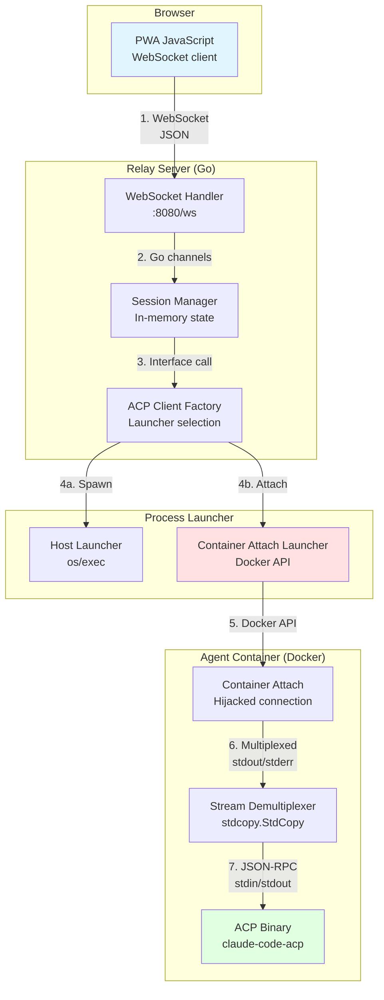

## Layer 1: Browser → Relay (WebSocket)

### Protocol: WebSocket + JSON

Messages flow over WebSocket connection on port 8080.

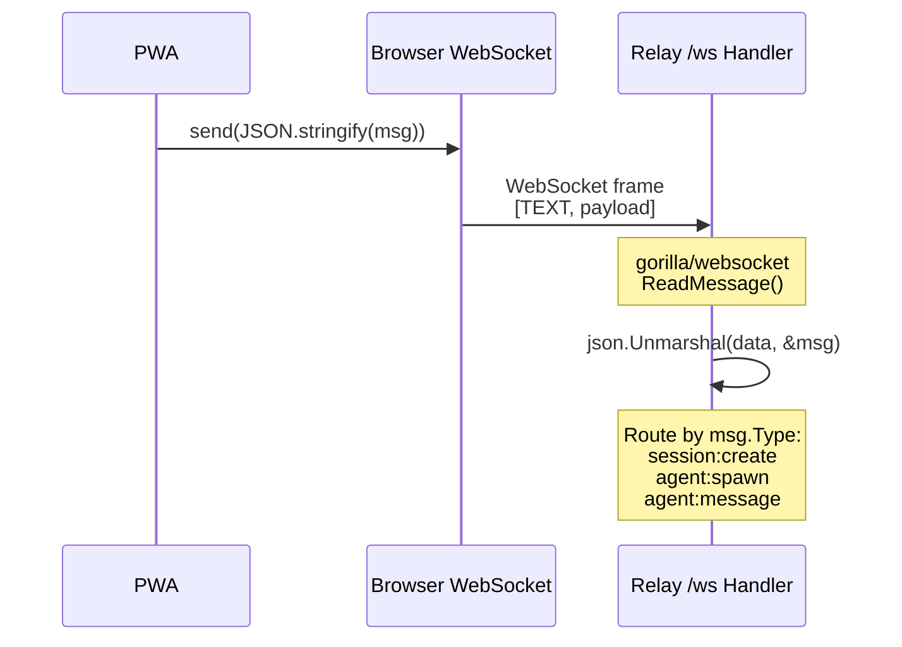

### Example: Session Creation

**PWA sends:**

```javascript
// Browser JavaScript
const ws = new WebSocket('ws://localhost:8080/ws');

ws.onopen = () => {
    ws.send(JSON.stringify({
        type: 'session:create'
    }));
};
```

**Wire format (WebSocket frame):**

```
Opcode: TEXT (0x1)
Payload: {"type":"session:create"}
```

**Relay receives:**

```go
// pkg/relay/server.go
func (s *Server) HandleWebSocket(w http.ResponseWriter, r *http.Request) {
    conn, _ := s.upgrader.Upgrade(w, r, nil)

    for {
        messageType, data, err := conn.ReadMessage()
        // messageType = websocket.TextMessage
        // data = []byte(`{"type":"session:create"}`)

        var msg relay.Message
        json.Unmarshal(data, &msg)
        // msg.Type = "session:create"
    }
}
```

### Complete Session Lifecycle Flow

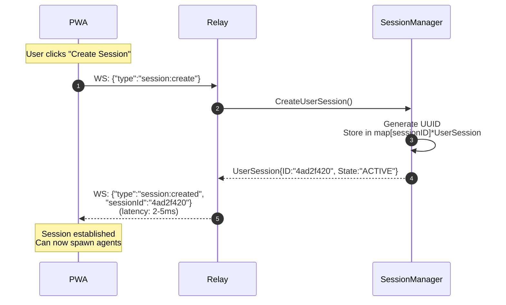

## Layer 2: Relay → Session Manager (Go Channels)

### Protocol: In-Process Go

Within the relay process, components communicate via Go channels and interface calls.

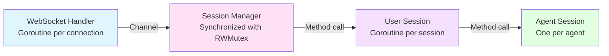

### Example: Agent Spawn Request

```go
// WebSocket handler goroutine
type Message struct {
    Type      string `json:"type"`
    Role      string `json:"role,omitempty"`
    Workspace string `json:"workspace,omitempty"`
}

msg := Message{
    Type:      "agent:spawn",
    Role:      "coder",
    Workspace: "./workspaces/coder",
}

// Call session manager synchronously
agentSession, err := sessionMgr.SpawnAgent(
    ctx,
    userSessionID,
    msg.Role,
    msg.Workspace,
)
```

### State Management

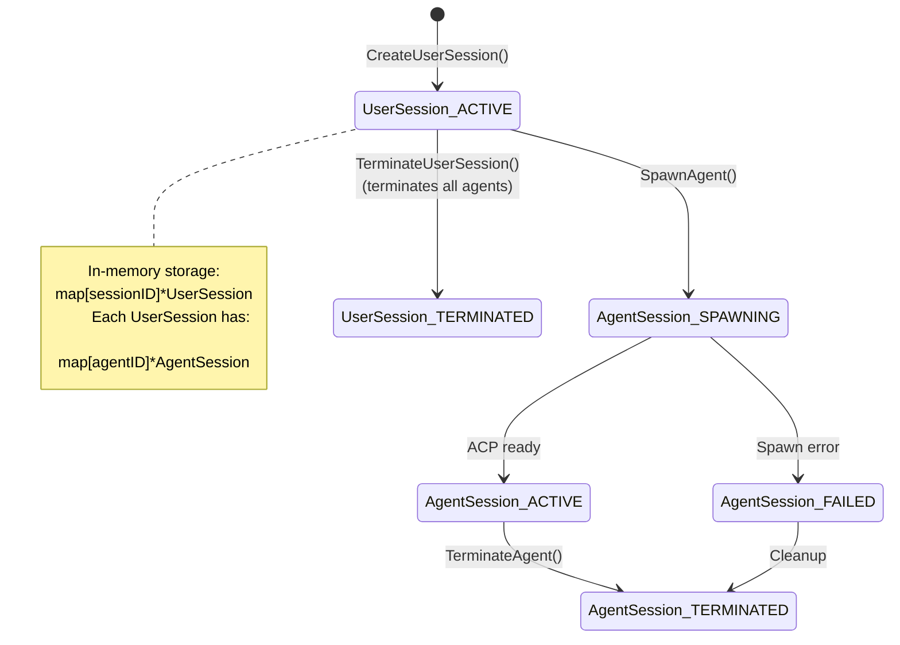

## Layer 3: Agent Spawn → Container + ACP Launch

### Protocol: Docker API + Process Spawning

When spawning an agent, three layers initialize in sequence:

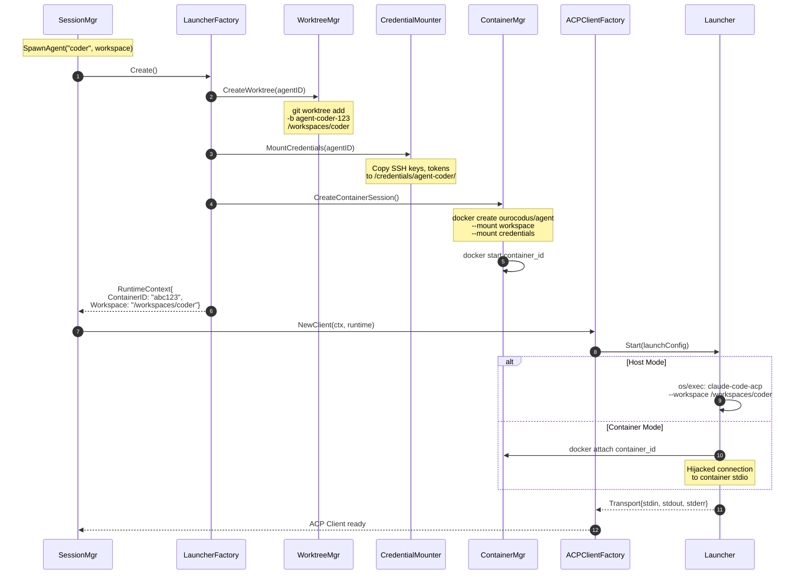

### Container Creation

```go
// pkg/containersession/manager.go
func (m *Manager) CreateContainerSession(
    ctx context.Context,
    imageName string,
    cmd []string,
) (*ContainerSession, error) {
    // 1. Generate session ID
    sessionID := m.idGen.Generate()

    // 2. Create workspace directory
    workspace := filepath.Join(m.baseWorkspaceDir, sessionID)
    os.MkdirAll(workspace, 0700)

    // 3. Create Docker container
    resp, err := m.dockerClient.ContainerCreate(ctx, &container.Config{
        Image: imageName,  // "ourocodus/agent:latest"
        Cmd:   cmd,        // ["/usr/local/bin/acp", "--workspace", "/workspace"]
        Labels: map[string]string{
            "com.ourocodus.containersession.id": sessionID,
            "com.ourocodus.containersession.managed-by": "ourocodus",
        },
    }, &container.HostConfig{
        Mounts: []mount.Mount{
            {
                Type:   mount.TypeBind,
                Source: workspace,  // Host path
                Target: "/workspace", // Container path
            },
        },
    }, nil, nil, "")

    return &ContainerSession{
        sessionID:   sessionID,
        containerID: resp.ID,
        workspace:   workspace,
        state:       StatePending,
    }, nil
}
```

### Workspace Isolation Architecture

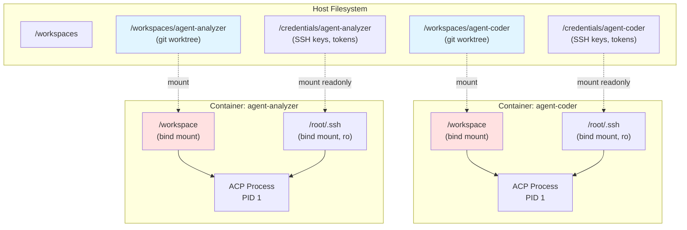

## Layer 4: Container Attach (Docker API)

### Protocol: Docker Attach API + Multiplexed Streams

For container mode, ACP runs as the container's main process (PID 1). The relay attaches to the container's stdio streams.

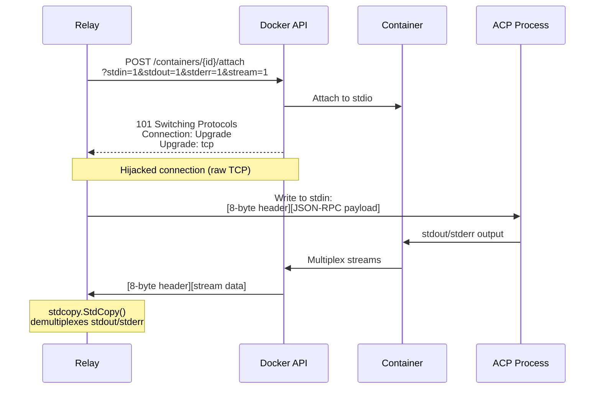

### Docker Stream Multiplexing Format

Docker multiplexes stdout and stderr into a single stream with 8-byte headers:

```
+--------+--------+--------+--------+--------+--------+--------+--------+
| Stream | 0x00   | 0x00   | 0x00   |          Size (uint32)           |
| Type   |        |        |        |                                  |
+--------+--------+--------+--------+--------+--------+--------+--------+
|                          Payload                                     |
|                          (Size bytes)                                |
+----------------------------------------------------------------------+
```

**Stream Types:**
- `0x01` = stdout
- `0x02` = stderr
- `0x00` = stdin (not used in attach response)

**Example stdout packet:**

```
01 00 00 00  00 00 00 2A  7B 22 6A 73 6F 6E 72 70 63 ...
│           │           │
│           │           └─ Payload: {"jsonrpc":"2.0", ...}
│           └─ Size: 42 bytes (0x0000002A)
└─ Stream: stdout (0x01)
```

### Implementation: Stream Demultiplexing

```go
// pkg/relay/session/container_attach_process_launcher.go
func (l *ContainerAttachProcessLauncher) Start(
    ctx context.Context,
    cfg acp.ProcessLaunchConfig,
) (acp.Transport, error) {
    // Attach to container
    resp, err := l.dockerClient.ContainerAttach(ctx, l.containerID, dockertypes.ContainerAttachOptions{
        Stream: true,
        Stdin:  true,
        Stdout: true,
        Stderr: true,
    })
    if err != nil {
        return nil, fmt.Errorf("failed to attach to container: %w", err)
    }

    // Create pipes for demultiplexed streams
    stdinPipe, stdinWriter := io.Pipe()
    stdoutReader, stdoutPipe := io.Pipe()

    // Capture stderr separately for logging
    stderrBuf := &bytes.Buffer{}

    // Spawn goroutine to demultiplex Docker's multiplexed stream
    go func() {
        defer stdoutPipe.Close()

        // stdcopy.StdCopy demultiplexes the 8-byte header format
        // Writes stdout to stdoutPipe, stderr to stderrBuf
        _, _, err := stdcopy.StdCopy(stdoutPipe, stderrBuf, resp.Reader)

        if err != nil {
            l.logger.Printf("[ACP] Stream demux error: %v", err)
        }

        // Log stderr line-by-line
        scanner := bufio.NewScanner(stderrBuf)
        for scanner.Scan() {
            l.logger.Printf("[ACP stderr container=%s] %s",
                l.containerID[:12], scanner.Text())
        }
    }()

    return &containerAttachTransport{
        stdin:  stdinWriter,
        stdout: stdoutReader,
        stderr: stderrBuf,
        conn:   resp.Conn,
    }, nil
}
```

### Stream Flow Visualization

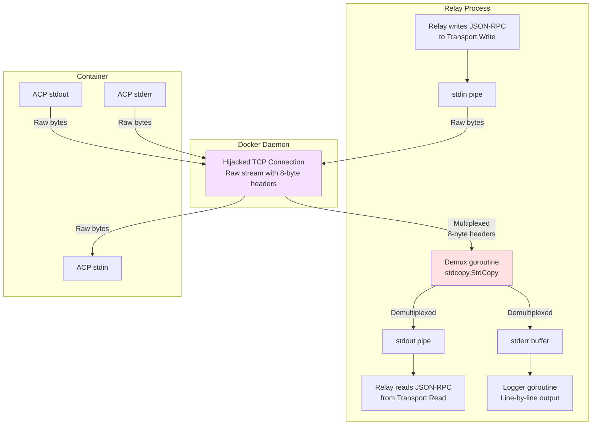

## Layer 5: JSON-RPC over stdio (ACP Protocol)

### Protocol: JSON-RPC 2.0

ACP (Agent Client Protocol) uses JSON-RPC 2.0 over stdin/stdout.

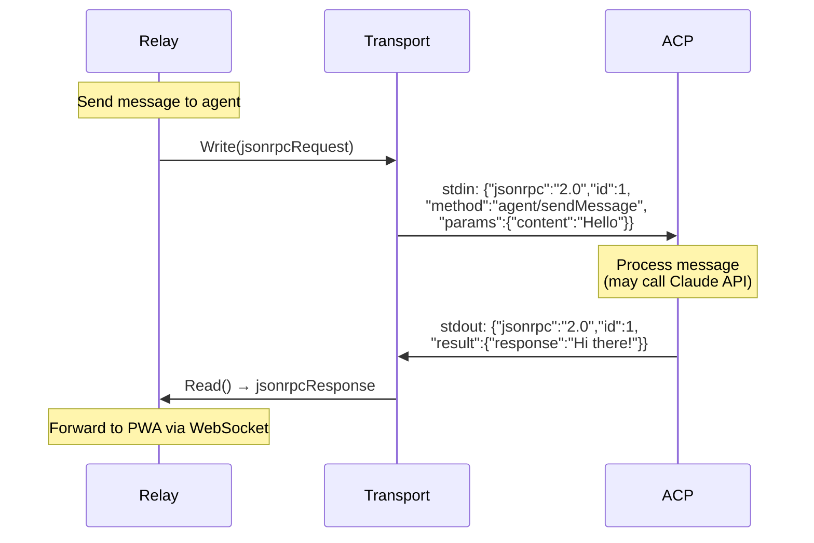

### JSON-RPC Request Format

```json
{
  "jsonrpc": "2.0",
  "id": 42,
  "method": "agent/sendMessage",
  "params": {
    "content": "Write a function to parse JSON",
    "role": "user"
  }
}
```

**Field definitions:**
- `jsonrpc`: Always `"2.0"` (protocol version)
- `id`: Request ID for correlation (integer or string)
- `method`: RPC method name (e.g., `"agent/sendMessage"`)
- `params`: Method-specific parameters (object)

### JSON-RPC Response Format

**Success:**

```json
{
  "jsonrpc": "2.0",
  "id": 42,
  "result": {
    "response": "Here's a JSON parsing function:\n\nfunc ParseJSON(data []byte) (map[string]interface{}, error) {\n    var result map[string]interface{}\n    err := json.Unmarshal(data, &result)\n    return result, err\n}",
    "messageId": "msg-abc123"
  }
}
```

**Error:**

```json
{
  "jsonrpc": "2.0",
  "id": 42,
  "error": {
    "code": -32600,
    "message": "Invalid Request",
    "data": {
      "detail": "Missing required parameter: content"
    }
  }
}
```

### Available RPC Methods

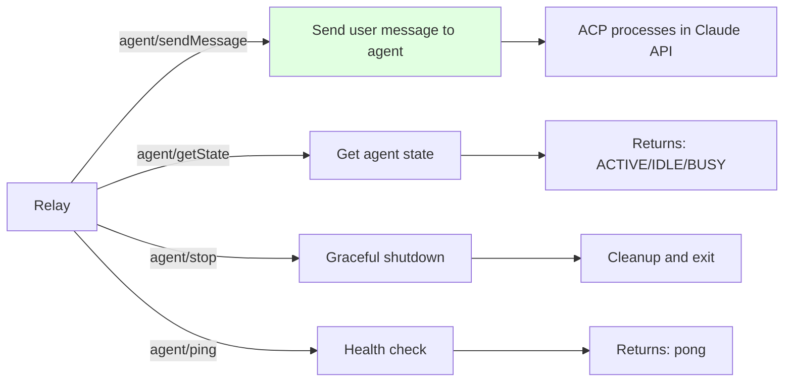

### Implementation: Send Message to ACP

```go
// pkg/acp/client.go
func (c *Client) SendMessage(content string) (interface{}, error) {
    // Build JSON-RPC request
    request := map[string]interface{}{
        "jsonrpc": "2.0",
        "id":      c.nextID(),
        "method":  "agent/sendMessage",
        "params": map[string]interface{}{
            "content": content,
        },
    }

    // Encode to JSON
    reqBytes, _ := json.Marshal(request)

    // Write to ACP stdin (via transport)
    _, err := c.transport.Write(reqBytes)
    if err != nil {
        return nil, fmt.Errorf("failed to write request: %w", err)
    }
    _, err = c.transport.Write([]byte("\n")) // Newline delimiter
    if err != nil {
        return nil, fmt.Errorf("failed to write delimiter: %w", err)
    }

    // Read JSON-RPC response from ACP stdout
    respBytes := make([]byte, 65536)
    n, err := c.transport.Read(respBytes)
    if err != nil {
        return nil, fmt.Errorf("failed to read response: %w", err)
    }

    // Parse response
    var response map[string]interface{}
    err = json.Unmarshal(respBytes[:n], &response)
    if err != nil {
        return nil, fmt.Errorf("failed to parse response: %w", err)
    }

    // Check for errors
    if errObj, ok := response["error"]; ok {
        return nil, fmt.Errorf("RPC error: %v", errObj)
    }

    return response["result"], nil
}
```

## Complete End-to-End Flow

Putting it all together: User sends message from PWA to agent running in container.

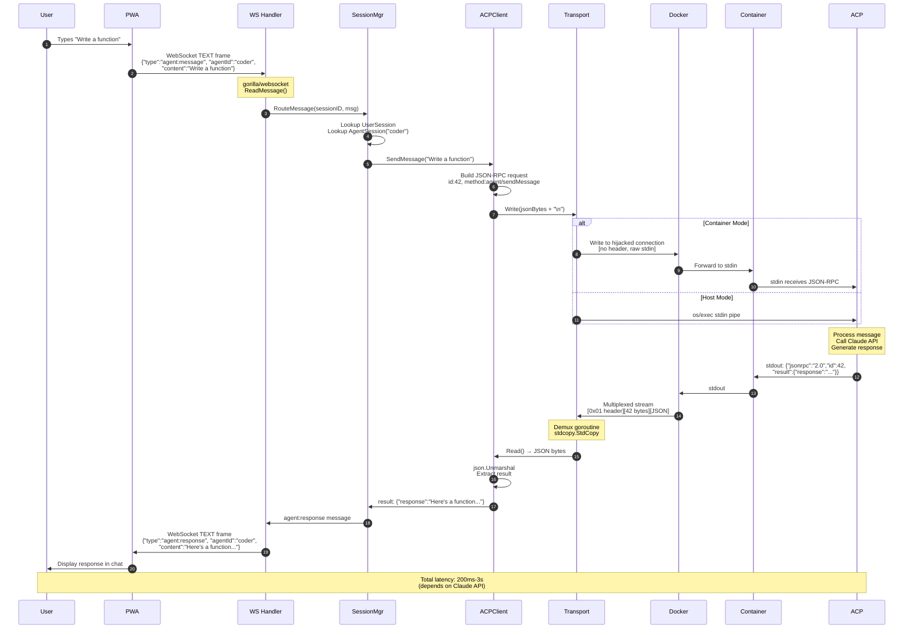

### Timing Breakdown

Typical latency for a message round-trip:

```mermaid
gantt
    title Message Latency Breakdown
    dateFormat X
    axisFormat %L ms

    section Browser
    PWA send           :0, 1
    section Network
    WebSocket          :1, 3
    section Relay
    Unmarshal          :3, 4
    Route to session   :4, 5
    section ACP Client
    Build JSON-RPC     :5, 6
    Write to transport :6, 7
    section Docker
    Stream multiplex   :7, 8
    section Container
    ACP receives       :8, 9
    section Claude API
    API call           :9, 2500
    section Return Path
    Response parsing   :2500, 2502
    WebSocket send     :2502, 2505

    section Total
    Round trip         :crit, 0, 2505
```

**Breakdown:**
- Browser → Relay: 2-5ms (WebSocket)
- Relay routing: 1-2ms (in-process)
- Transport write: <1ms (pipe/connection)
- Docker multiplex: 1-2ms
- **Claude API call: 500ms-3s** (95% of latency)
- Response path: 5-10ms

## Error Handling Across Layers

Errors can occur at any layer. Here's how they propagate:

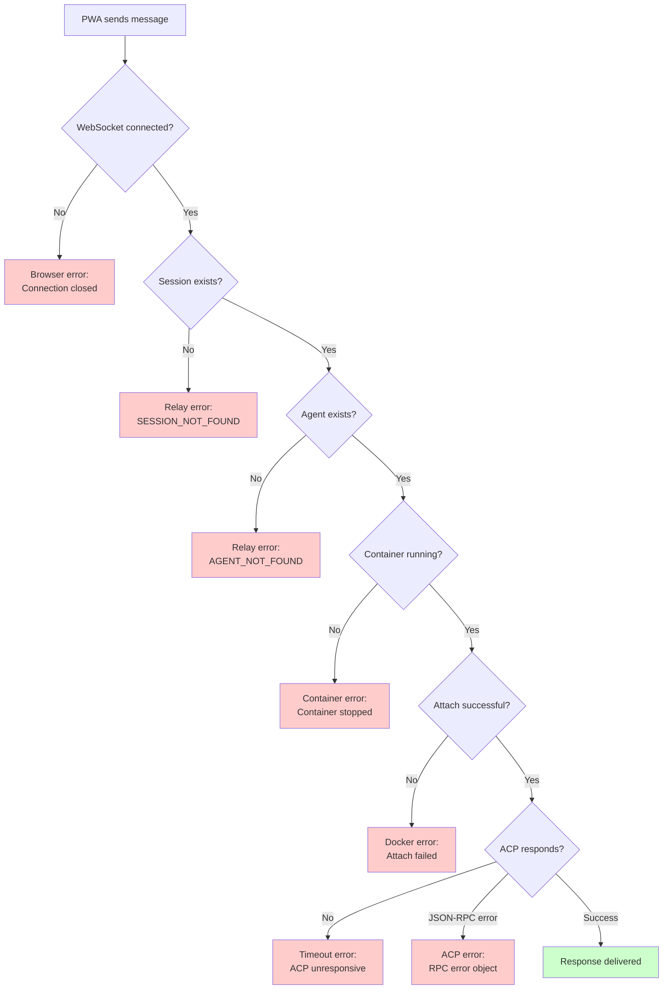

### Error Response Examples

**Layer 1 (WebSocket):**

```json
{
  "type": "error",
  "error": {
    "code": "WEBSOCKET_CLOSED",
    "message": "WebSocket connection closed unexpectedly",
    "recoverable": false
  }
}
```

**Layer 2 (Session Manager):**

```json
{
  "type": "error",
  "error": {
    "code": "SESSION_NOT_FOUND",
    "message": "Session not found: abc123",
    "recoverable": false
  }
}
```

**Layer 4 (Docker):**

```json
{
  "type": "error",
  "error": {
    "code": "CONTAINER_STOPPED",
    "message": "Container exited with code 137 (OOMKilled)",
    "recoverable": true,
    "details": {
      "containerID": "a1b2c3d4",
      "exitCode": 137
    }
  }
}
```

**Layer 5 (JSON-RPC):**

```json
{
  "jsonrpc": "2.0",
  "id": 42,
  "error": {
    "code": -32603,
    "message": "Internal error",
    "data": {
      "detail": "Claude API rate limit exceeded"
    }
  }
}
```

## Observability

### Message Tracing

Each message gets a unique trace ID that flows through all layers:

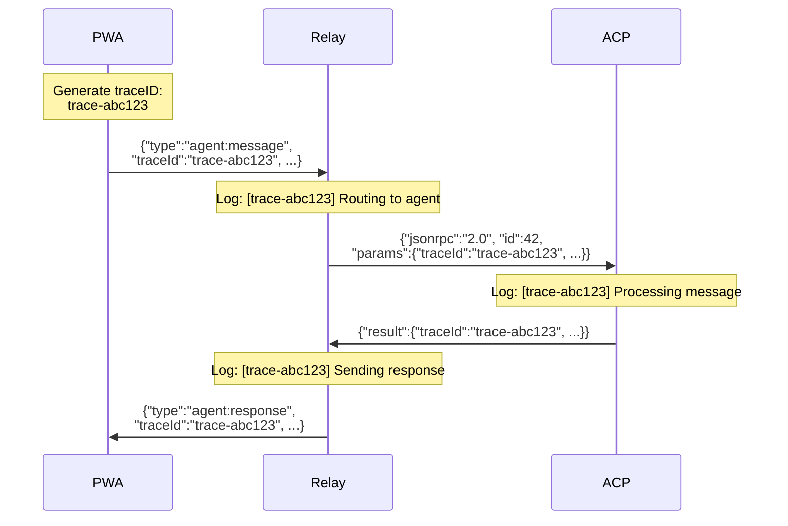

### Logging at Each Layer

```go
// Layer 1: WebSocket
log.Printf("[WS] [trace=%s] Received message type=%s", traceID, msg.Type)

// Layer 2: Session Manager
log.Printf("[SESSION] [trace=%s] Routing to agent=%s session=%s", traceID, agentID, sessionID)

// Layer 3: ACP Client
log.Printf("[ACP] [trace=%s] Sending JSON-RPC method=%s", traceID, method)

// Layer 4: Container
log.Printf("[DOCKER] [trace=%s] Writing to container=%s", traceID, containerID[:12])

// Layer 5: ACP stderr
log.Printf("[ACP stderr container=%s] [trace=%s] Processing request", containerID[:12], traceID)
```

## Performance Optimization

### Batching Messages

For high-throughput scenarios, batch multiple messages:

```javascript
// PWA batches messages
const batch = [
    {type: "agent:message", agentId: "coder", content: "Task 1"},
    {type: "agent:message", agentId: "coder", content: "Task 2"},
    {type: "agent:message", agentId: "coder", content: "Task 3"}
];

ws.send(JSON.stringify({type: "batch", messages: batch}));
```

### Connection Pooling

Relay maintains persistent connections to containers:

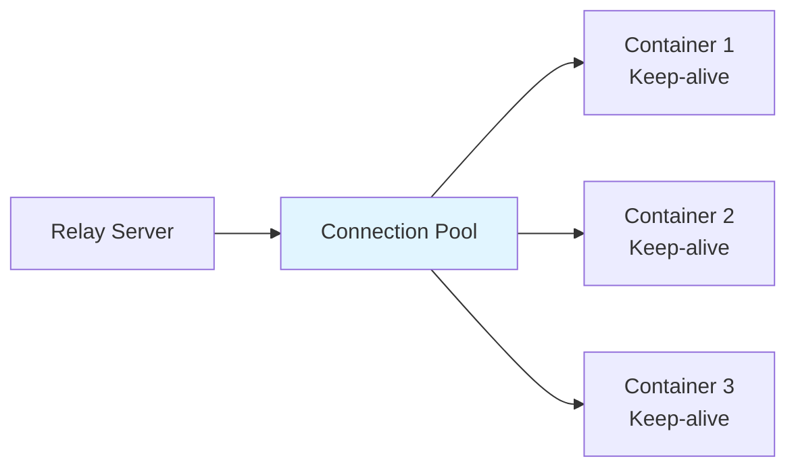

### Stream Buffering

Transport layer uses buffered I/O:

```go
// Buffered writer for better throughput
writer := bufio.NewWriter(transport)
writer.Write(jsonBytes)
writer.Flush() // Explicit flush for request/response
```

## Related Documentation

- [WebSocket API Reference](WEBSOCKET_API.md) - Complete message schemas
- [ACP Protocol Specification](ACP_PROTOCOL.md) - JSON-RPC details
- [Container Modes](CONTAINER_MODES.md) - Host vs Container execution
- [Protocol Inspector](../operations/PROTOCOL_INSPECTOR.md) - Live debugging tool
