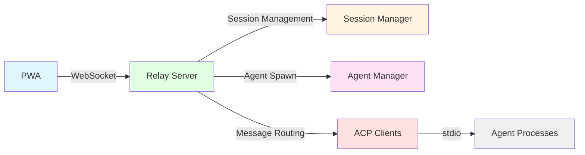
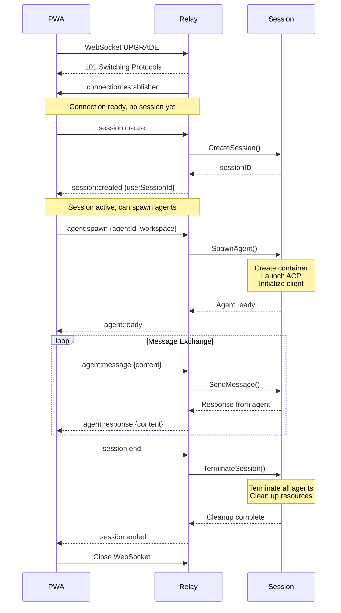
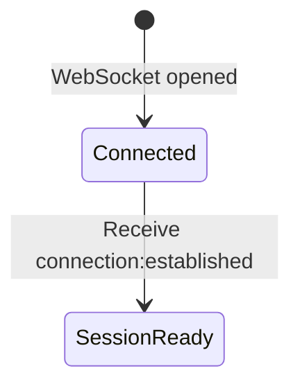
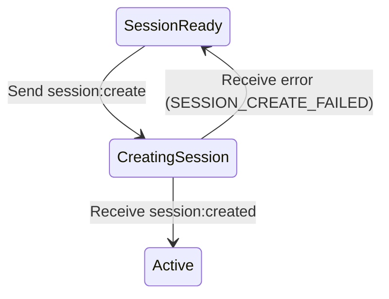
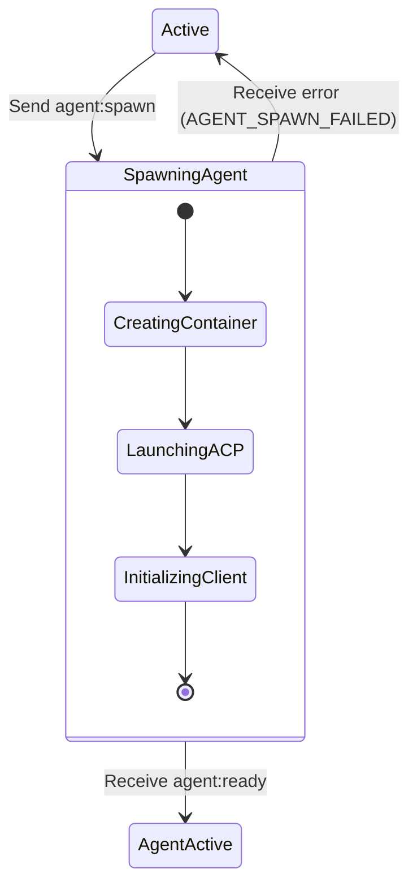
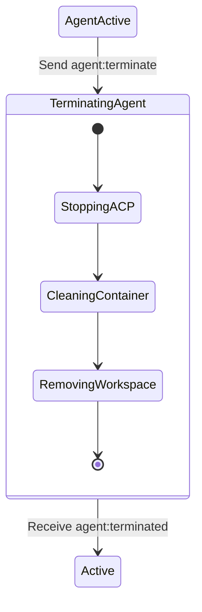
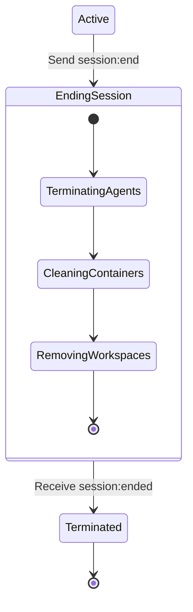
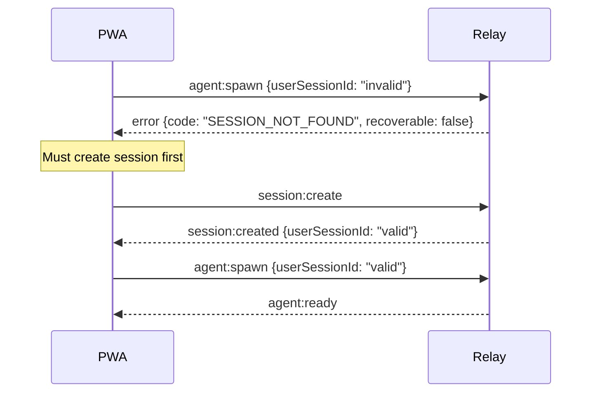
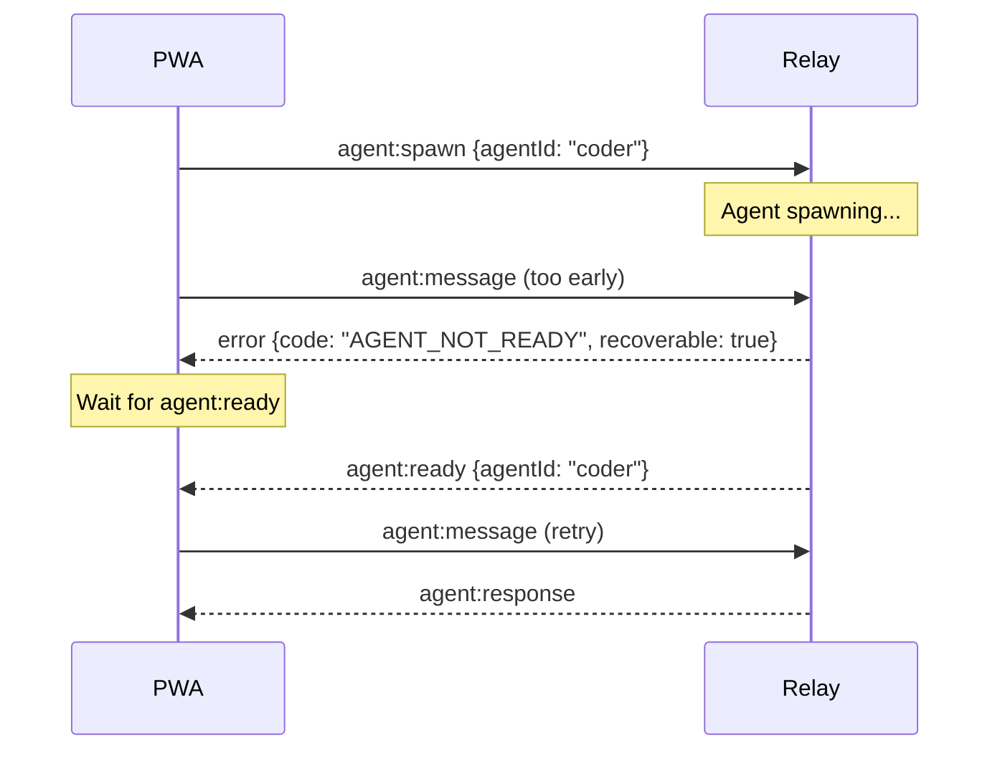
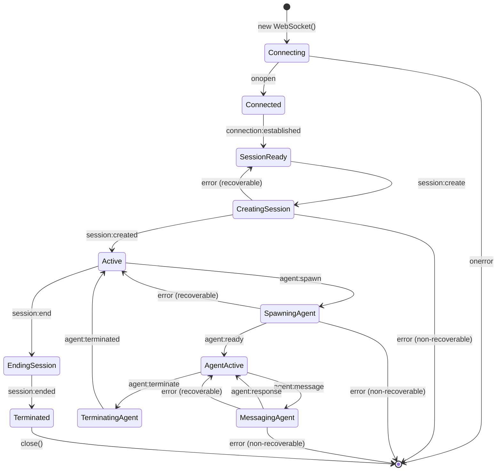

# WebSocket API Reference

Complete reference for the Ourocodus WebSocket protocol that enables real-time bidirectional communication between the PWA and relay server.

## Overview

The WebSocket API provides a JSON-based protocol for managing user sessions, spawning agents, and exchanging messages. All communication flows through a single persistent WebSocket connection per user.

**Endpoint:** `ws://localhost:8080/ws`

**Protocol Version:** `1.0`



---

## Message Structure

All messages share a common base structure:

```typescript
interface BaseMessage {
  version: string;  // Protocol version (currently "1.0")
  type: string;     // Message type (e.g., "session:create", "agent:ready")
}
```

### Message Types

| Direction | Type | Description |
|-----------|------|-------------|
| → Server | `session:create` | Create a new user session |
| ← Client | `session:created` | Session created successfully |
| → Server | `agent:spawn` | Spawn an agent in the session |
| ← Client | `agent:ready` | Agent spawned and ready |
| → Server | `agent:message` | Send message to agent |
| ← Client | `agent:response` | Agent's response to message |
| → Server | `agent:terminate` | Terminate specific agent |
| ← Client | `agent:terminated` | Agent terminated successfully |
| → Server | `session:end` | End session and terminate all agents |
| ← Client | `session:ended` | Session ended successfully |
| ← Client | `error` | Error occurred |
| ← Client | `connection:established` | Connection established |

---

## Connection Lifecycle



---

## Message Reference

### connection:established

**Direction:** Server → Client

**Description:** Sent immediately after WebSocket connection is established. No action required from client.

**Schema:**

```typescript
interface ConnectionEstablishedMessage {
  version: "1.0";
  type: "connection:established";
  serverId: string;    // Relay server identifier (UUID)
  timestamp: string;   // ISO 8601 timestamp
}
```

**Example:**

```json
{
  "version": "1.0",
  "type": "connection:established",
  "serverId": "relay-7f8d2a4e",
  "timestamp": "2025-11-12T14:32:01Z"
}
```

**State Transition:**



---

### session:create

**Direction:** Client → Server

**Description:** Create a new user session. Must be the first message after connection establishment (except for the initial `connection:established` from server).

**Schema:**

```typescript
interface SessionCreateMessage {
  version: "1.0";
  type: "session:create";
}
```

**Example:**

```json
{
  "version": "1.0",
  "type": "session:create"
}
```

**Validation:**
- ✅ `version` must be `"1.0"`
- ✅ `type` must be `"session:create"`

**Possible Responses:**
- `session:created` (success)
- `error` with code `SESSION_CREATE_FAILED` (recoverable)
- `error` with code `VERSION_MISMATCH` (non-recoverable)

**State Transition:**



---

### session:created

**Direction:** Server → Client

**Description:** Confirms session creation. Client must store `userSessionId` for subsequent operations.

**Schema:**

```typescript
interface SessionCreatedMessage {
  version: "1.0";
  type: "session:created";
  userSessionId: string;  // Unique session identifier (UUID)
  timestamp: string;      // Session creation time (ISO 8601)
}
```

**Example:**

```json
{
  "version": "1.0",
  "type": "session:created",
  "userSessionId": "4ad2f420-73d5-4b98-9517-f7e78ebd7e11",
  "timestamp": "2025-11-12T14:32:01Z"
}
```

**Client Actions:**
1. Store `userSessionId` for all future requests
2. Update UI to "Session Active" state
3. Enable agent spawn controls

---

### agent:spawn

**Direction:** Client → Server

**Description:** Spawn a new agent in the current session. Each agent gets an isolated workspace (git worktree) and dedicated ACP process.

**Schema:**

```typescript
interface AgentSpawnMessage {
  version: "1.0";
  type: "agent:spawn";
  userSessionId: string;  // Session ID from session:created
  agentId: string;        // Unique agent identifier (e.g., "coder", "tester")
  workspace: string;      // Absolute path to agent workspace
}
```

**Example:**

```json
{
  "version": "1.0",
  "type": "agent:spawn",
  "userSessionId": "4ad2f420-73d5-4b98-9517-f7e78ebd7e11",
  "agentId": "coder",
  "workspace": "/Users/dev/workspaces/ourocodus-coder"
}
```

**Validation:**
- ✅ `userSessionId` must exist (session must be created first)
- ✅ `agentId` must be unique within session
- ✅ `workspace` must be absolute path

**Possible Responses:**
- `agent:ready` (success, agent is ready)
- `error` with code `SESSION_NOT_FOUND` (non-recoverable, create session first)
- `error` with code `AGENT_SPAWN_FAILED` (recoverable, retry with backoff)
- `error` with code `INVALID_MESSAGE` (recoverable, fix validation errors)

**State Transition:**



**Performance:**
- Host mode: ~100ms
- Container attach mode: ~700ms
- Container exec mode: ~240ms

---

### agent:ready

**Direction:** Server → Client

**Description:** Confirms agent spawn is complete and agent is ready to receive messages.

**Schema:**

```typescript
interface AgentReadyMessage {
  version: "1.0";
  type: "agent:ready";
  userSessionId: string;  // Session ID
  agentId: string;        // Agent identifier
}
```

**Example:**

```json
{
  "version": "1.0",
  "type": "agent:ready",
  "userSessionId": "4ad2f420-73d5-4b98-9517-f7e78ebd7e11",
  "agentId": "coder"
}
```

**Client Actions:**
1. Update UI to show agent as "Active"
2. Enable message input for this agent
3. Can now send `agent:message` requests

---

### agent:message

**Direction:** Client → Server

**Description:** Send a message/instruction to an agent. The agent processes the message and returns a response.

**Schema:**

```typescript
interface AgentMessageRequest {
  version: "1.0";
  type: "agent:message";
  userSessionId: string;  // Session ID
  agentId: string;        // Target agent identifier
  content: string;        // Message content (user instruction)
}
```

**Example:**

```json
{
  "version": "1.0",
  "type": "agent:message",
  "userSessionId": "4ad2f420-73d5-4b98-9517-f7e78ebd7e11",
  "agentId": "coder",
  "content": "Write a function to parse JSON"
}
```

**Validation:**
- ✅ `userSessionId` must exist
- ✅ `agentId` must exist in session
- ✅ `content` must be non-empty string

**Possible Responses:**
- `agent:response` (success, contains agent's reply)
- `error` with code `SESSION_NOT_FOUND` (non-recoverable)
- `error` with code `AGENT_NOT_FOUND` (non-recoverable, spawn agent first)
- `error` with code `AGENT_NOT_READY` (recoverable, agent still spawning)
- `error` with code `AGENT_MESSAGE_FAILED` (recoverable, retry)

---

### agent:response

**Direction:** Server → Client

**Description:** Agent's response to a message. Contains the agent's output/reply.

**Schema:**

```typescript
interface AgentMessageResponse {
  version: "1.0";
  type: "agent:response";
  userSessionId: string;  // Session ID
  agentId: string;        // Responding agent identifier
  content: string;        // Agent's response text
  timestamp: string;      // Response time (ISO 8601)
}
```

**Example:**

```json
{
  "version": "1.0",
  "type": "agent:response",
  "userSessionId": "4ad2f420-73d5-4b98-9517-f7e78ebd7e11",
  "agentId": "coder",
  "content": "Here's a JSON parsing function:\n\nfunc ParseJSON(data []byte) (map[string]interface{}, error) {\n  var result map[string]interface{}\n  err := json.Unmarshal(data, &result)\n  return result, err\n}",
  "timestamp": "2025-11-12T14:35:25Z"
}
```

**Client Actions:**
1. Display agent response in chat UI
2. Optionally parse and render code blocks
3. Enable sending next message

**Typical Latency:**
- Simple responses: 1-5 seconds
- Complex code generation: 10-30 seconds
- Depends on ACP processing time

---

### agent:terminate

**Direction:** Client → Server

**Description:** Terminate a specific agent, cleaning up its resources while keeping the session active.

**Schema:**

```typescript
interface AgentTerminateMessage {
  version: "1.0";
  type: "agent:terminate";
  userSessionId: string;  // Session ID
  agentId: string;        // Agent to terminate
}
```

**Example:**

```json
{
  "version": "1.0",
  "type": "agent:terminate",
  "userSessionId": "4ad2f420-73d5-4b98-9517-f7e78ebd7e11",
  "agentId": "coder"
}
```

**Validation:**
- ✅ `userSessionId` must exist
- ✅ `agentId` must exist in session

**Possible Responses:**
- `agent:terminated` (success)
- `error` with code `SESSION_NOT_FOUND` (non-recoverable)
- `error` with code `AGENT_NOT_FOUND` (non-recoverable)

**State Transition:**



---

### agent:terminated

**Direction:** Server → Client

**Description:** Confirms agent termination and resource cleanup status.

**Schema:**

```typescript
interface AgentTerminatedMessage {
  version: "1.0";
  type: "agent:terminated";
  userSessionId: string;     // Session ID
  agentId: string;           // Terminated agent identifier
  workspaceCleaned: boolean; // Whether workspace was removed
}
```

**Example:**

```json
{
  "version": "1.0",
  "type": "agent:terminated",
  "userSessionId": "4ad2f420-73d5-4b98-9517-f7e78ebd7e11",
  "agentId": "coder",
  "workspaceCleaned": true
}
```

**Client Actions:**
1. Remove agent from UI
2. Disable message input for this agent
3. Optionally show "Agent terminated" notification

---

### session:end

**Direction:** Client → Server

**Description:** End the current session, terminating all agents and cleaning up all resources.

**Schema:**

```typescript
interface SessionEndMessage {
  version: "1.0";
  type: "session:end";
  userSessionId: string;  // Session to end
}
```

**Example:**

```json
{
  "version": "1.0",
  "type": "session:end",
  "userSessionId": "4ad2f420-73d5-4b98-9517-f7e78ebd7e11"
}
```

**Validation:**
- ✅ `userSessionId` must exist

**Possible Responses:**
- `session:ended` (success)
- `error` with code `SESSION_NOT_FOUND` (non-recoverable)

**State Transition:**



---

### session:ended

**Direction:** Server → Client

**Description:** Confirms session termination, all agents stopped, and cleanup completed.

**Schema:**

```typescript
interface SessionEndedMessage {
  version: "1.0";
  type: "session:ended";
  userSessionId: string;      // Ended session ID
  agentsTerminated: number;   // Count of agents that were terminated
  cleanupStatus: string;      // "complete" | "partial" | "failed"
}
```

**Example:**

```json
{
  "version": "1.0",
  "type": "session:ended",
  "userSessionId": "4ad2f420-73d5-4b98-9517-f7e78ebd7e11",
  "agentsTerminated": 3,
  "cleanupStatus": "complete"
}
```

**Cleanup Status Values:**

| Status | Meaning |
|--------|---------|
| `complete` | All agents terminated, all resources cleaned |
| `partial` | Some agents terminated, partial cleanup (check logs) |
| `failed` | Termination failed, manual cleanup may be required |

**Client Actions:**
1. Clear session ID from state
2. Reset UI to "No Session" state
3. Optionally close WebSocket connection
4. Show summary notification

---

### error

**Direction:** Server → Client

**Description:** Sent when any operation fails. Contains error code, message, and recoverability information.

**Schema:**

```typescript
interface ErrorMessage {
  version: "1.0";
  type: "error";
  error: {
    code: string;        // Error code (see Error Codes table)
    message: string;     // Human-readable error description
    recoverable: boolean; // Whether client can retry
  };
}
```

**Example:**

```json
{
  "version": "1.0",
  "type": "error",
  "error": {
    "code": "SESSION_NOT_FOUND",
    "message": "session not found: 4ad2f420-73d5-4b98-9517-f7e78ebd7e11",
    "recoverable": false
  }
}
```

---

## Error Codes

### Non-Recoverable Errors

Client must create missing resources or close connection.

| Code | Description | Action |
|------|-------------|--------|
| `VERSION_MISMATCH` | Client protocol version incompatible | Upgrade/downgrade client |
| `SESSION_NOT_FOUND` | Session ID does not exist | Create session with `session:create` |
| `AGENT_NOT_FOUND` | Agent role not found in session | Spawn agent with `agent:spawn` |

**Example Flow (SESSION_NOT_FOUND):**



### Recoverable Errors

Client may retry with backoff or handle gracefully.

| Code | Description | Action |
|------|-------------|--------|
| `INVALID_MESSAGE` | Malformed JSON or missing fields | Fix validation errors and retry |
| `SESSION_CREATE_FAILED` | Temporary failure creating session | Retry with exponential backoff |
| `AGENT_SPAWN_FAILED` | Temporary failure spawning agent | Retry with exponential backoff |
| `AGENT_NOT_READY` | Agent exists but not ACTIVE state | Wait and retry (agent still spawning) |
| `AGENT_MESSAGE_FAILED` | Temporary failure sending message | Retry message |
| `INTERNAL_ERROR` | Unexpected server error | Retry with backoff, report if persistent |

**Example Flow (AGENT_NOT_READY):**



---

## Usage Examples

### Example 1: Complete Session Flow

```javascript
// 1. Connect to WebSocket
const ws = new WebSocket('ws://localhost:8080/ws');

// 2. Wait for connection established
ws.onmessage = (event) => {
  const msg = JSON.parse(event.data);

  if (msg.type === 'connection:established') {
    console.log('Connected to relay:', msg.serverId);

    // 3. Create session
    ws.send(JSON.stringify({
      version: '1.0',
      type: 'session:create'
    }));
  }

  if (msg.type === 'session:created') {
    console.log('Session created:', msg.userSessionId);
    const sessionId = msg.userSessionId;

    // 4. Spawn agent
    ws.send(JSON.stringify({
      version: '1.0',
      type: 'agent:spawn',
      userSessionId: sessionId,
      agentId: 'coder',
      workspace: '/workspaces/ourocodus-coder'
    }));
  }

  if (msg.type === 'agent:ready') {
    console.log('Agent ready:', msg.agentId);

    // 5. Send message to agent
    ws.send(JSON.stringify({
      version: '1.0',
      type: 'agent:message',
      userSessionId: msg.userSessionId,
      agentId: msg.agentId,
      content: 'Write a hello world function'
    }));
  }

  if (msg.type === 'agent:response') {
    console.log('Agent response:', msg.content);
  }

  if (msg.type === 'error') {
    console.error('Error:', msg.error.code, msg.error.message);
  }
};
```

### Example 2: Error Handling with Retry

```javascript
async function sendMessageWithRetry(ws, sessionId, agentId, content, maxRetries = 3) {
  let attempt = 0;

  while (attempt < maxRetries) {
    // Send message
    ws.send(JSON.stringify({
      version: '1.0',
      type: 'agent:message',
      userSessionId: sessionId,
      agentId: agentId,
      content: content
    }));

    // Wait for response
    const response = await waitForResponse(ws);

    if (response.type === 'agent:response') {
      return response.content;  // Success
    }

    if (response.type === 'error') {
      if (!response.error.recoverable) {
        throw new Error(`Non-recoverable error: ${response.error.code}`);
      }

      // Recoverable error: retry with backoff
      attempt++;
      const backoff = Math.pow(2, attempt) * 1000; // Exponential backoff
      console.log(`Retry ${attempt}/${maxRetries} after ${backoff}ms`);
      await sleep(backoff);
    }
  }

  throw new Error('Max retries exceeded');
}

function waitForResponse(ws) {
  return new Promise((resolve) => {
    ws.onmessage = (event) => {
      resolve(JSON.parse(event.data));
    };
  });
}
```

### Example 3: Multiple Agents

```javascript
// Spawn multiple agents concurrently
async function spawnMultipleAgents(ws, sessionId, agents) {
  const promises = agents.map(agent => {
    return new Promise((resolve) => {
      ws.send(JSON.stringify({
        version: '1.0',
        type: 'agent:spawn',
        userSessionId: sessionId,
        agentId: agent.id,
        workspace: agent.workspace
      }));

      // Wait for agent:ready
      const handler = (event) => {
        const msg = JSON.parse(event.data);
        if (msg.type === 'agent:ready' && msg.agentId === agent.id) {
          ws.removeEventListener('message', handler);
          resolve(msg);
        }
      };
      ws.addEventListener('message', handler);
    });
  });

  return Promise.all(promises);
}

// Usage
await spawnMultipleAgents(ws, sessionId, [
  { id: 'coder', workspace: '/workspaces/coder' },
  { id: 'tester', workspace: '/workspaces/tester' },
  { id: 'reviewer', workspace: '/workspaces/reviewer' }
]);

console.log('All agents ready!');
```

---

## State Machine

Complete state diagram for client WebSocket connection:



---

## Performance Characteristics

### Message Latency (Typical)

| Operation | Latency | Notes |
|-----------|---------|-------|
| Connection establishment | ~10ms | WebSocket handshake |
| Session creation | ~50ms | UUID generation + state setup |
| Agent spawn (host) | ~100ms | Process fork + ACP init |
| Agent spawn (container) | ~700ms | Container creation + ACP init |
| Agent message (echo) | ~50ms | Round-trip through ACP |
| Agent message (code gen) | ~5-30s | Depends on LLM processing |
| Agent termination | ~200ms | Process cleanup + workspace removal |
| Session end | ~500ms | Multiple agents + full cleanup |

### Throughput

| Metric | Value | Notes |
|--------|-------|-------|
| Max concurrent connections | 1000 | Per relay instance |
| Max sessions per connection | 1 | Current protocol limitation |
| Max agents per session | Unlimited | Limited by system resources |
| Max message size | 1 MB | WebSocket frame limit |
| Max message rate | 100/sec | Per agent, throttled by ACP |

---

## Protocol Evolution

### Version History

| Version | Date | Changes |
|---------|------|---------|
| 1.0 | 2025-11-12 | Initial protocol release |

### Future Considerations

**Version 2.0 (Planned):**

- Multiple sessions per connection
- Streaming responses (chunked agent output)
- Binary message support (file attachments)
- Session persistence (reconnect with existing sessionId)
- Agent-to-agent messaging (inter-agent coordination)

**Backwards Compatibility:**

- Server supports multiple protocol versions
- Client specifies version in every message
- `VERSION_MISMATCH` error if incompatible
- Version negotiation during connection handshake

---

## Troubleshooting

### Issue: "SESSION_NOT_FOUND" immediately after creation

**Symptom:** Error when trying to spawn agent with valid session ID

**Cause:** Race condition - using session ID before `session:created` received

**Solution:**
```javascript
// Wrong: Don't store and use sessionId immediately
const sessionId = generateUUID();  // ❌
spawnAgent(ws, sessionId, ...);    // ❌ Too early

// Correct: Wait for session:created
ws.send({ type: 'session:create' });
ws.onmessage = (event) => {
  const msg = JSON.parse(event.data);
  if (msg.type === 'session:created') {
    const sessionId = msg.userSessionId;  // ✅ Use server-provided ID
    spawnAgent(ws, sessionId, ...);       // ✅ After confirmation
  }
};
```

### Issue: "AGENT_NOT_READY" errors

**Symptom:** Error when sending message to freshly spawned agent

**Cause:** Trying to send message before `agent:ready` received

**Solution:**
```javascript
// Track agent states
const agentStates = new Map();

ws.onmessage = (event) => {
  const msg = JSON.parse(event.data);

  if (msg.type === 'agent:ready') {
    agentStates.set(msg.agentId, 'ACTIVE');
  }

  // Only send messages to ACTIVE agents
  if (agentStates.get(targetAgentId) === 'ACTIVE') {
    ws.send({ type: 'agent:message', ... });
  }
};
```

### Issue: Connection drops during long operations

**Symptom:** WebSocket closes while agent processing long task

**Cause:** No heartbeat/keepalive mechanism in v1.0

**Solution:**
```javascript
// Implement application-level ping
const pingInterval = setInterval(() => {
  if (ws.readyState === WebSocket.OPEN) {
    // Send low-cost message to keep connection alive
    ws.send(JSON.stringify({
      version: '1.0',
      type: 'ping'  // Not in spec, but keeps TCP alive
    }));
  }
}, 30000);  // Every 30 seconds

ws.onclose = () => {
  clearInterval(pingInterval);
};
```

---

## Related Documentation

- [Message Flow](MESSAGE_FLOW.md) - End-to-end routing from browser to ACP
- [Protocol Inspector](../operations/PROTOCOL_INSPECTOR.md) - Real-time debugging tool
- [Session Lifecycle](../development/SESSION_LIFECYCLE.md) - Session and agent state management
- [Error Handling](../development/ERROR_HANDLING.md) - Error codes and recovery strategies

---

## Source Code References

**Implementation:**
- `pkg/relay/message.go` - Message type definitions and validation
- `pkg/relay/server.go` - WebSocket handler and message routing
- `pkg/relay/session/manager.go` - Session and agent lifecycle

**Tests:**
- `pkg/relay/message_test.go` - Message parsing and validation tests
- `pkg/relay/integration_test.go` - WebSocket integration tests
- `tests/e2e/e2e_test.go` - End-to-end protocol tests

**Examples:**
- `examples/basic-demo/main.go` - Simple client implementation
- `examples/interactive-repl/main.go` - Interactive REPL client
- `examples/smoke-tests/relay/main.go` - Protocol validation suite
