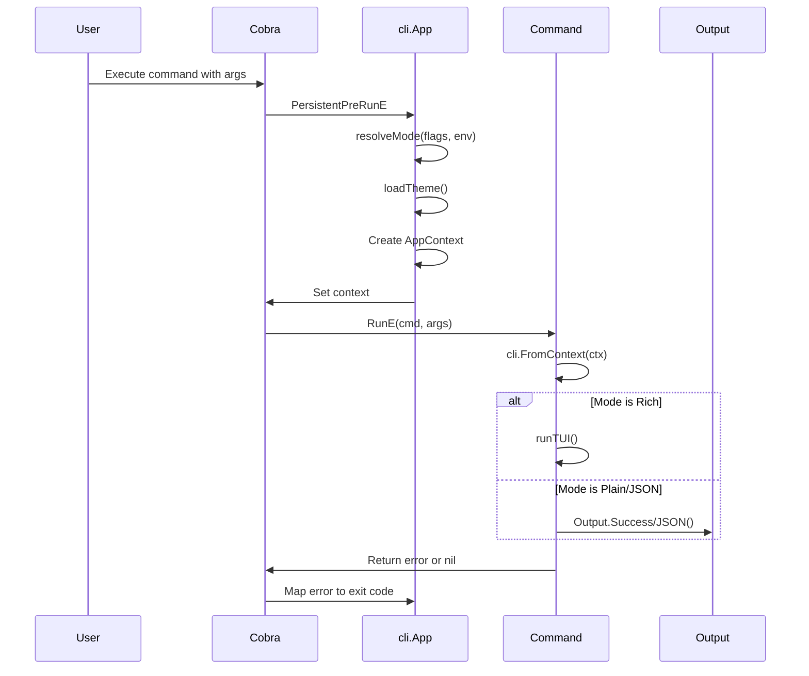

# CLI/TUI Framework

This document describes the CLI/TUI framework used across all ourocodus tools (agentd, relay). The framework provides consistent user experience, error handling, and theming across all commands.

> **Related Documentation**: See the [CLI/TUI Standards Framework Design](../plans/2025-12-01-cli-tui-standards-framework.md) for architecture decisions, standard flags, and migration plan.

## Quick Start

Here's a minimal example of a command using the framework:

```go
package main

import (
    "context"
    "github.com/2389-research/ourocodus/pkg/cli"
    "github.com/2389-research/ourocodus/pkg/tui/theme"
    "github.com/spf13/cobra"
)

func main() {
    app := cli.NewApp(rootCmd)
    os.Exit(app.Execute())
}

var rootCmd = &cobra.Command{Use: "myapp"}

var helloCmd = &cobra.Command{
    Use:   "hello <name>",
    Short: "Greet someone",
    Args:  cobra.ExactArgs(1),
    RunE: func(cmd *cobra.Command, args []string) error {
        ctx := cli.FromContext(cmd.Context())
        if ctx == nil {
            return cli.ContextError()
        }

        name := args[0]

        // Branch by output mode
        if ctx.Mode.IsJSON() {
            return ctx.Output.JSON(map[string]string{"greeting": "Hello, " + name})
        }

        ctx.Output.Success("Hello, " + name + "!")
        return nil
    },
}

func init() {
    rootCmd.AddCommand(helloCmd)
}
```

## Prerequisites

- **Go**: 1.22 or later
- **Cobra**: v1.8.0 or later
- **Bubble Tea**: v0.25.0 or later (for TUI components)

## Overview

The framework consists of three layers:

1. **pkg/cli** - Core CLI infrastructure (mode detection, error types, context propagation)
2. **pkg/tui/theme** - Theming system with retro palettes
3. **cmd/*/internal/tui** - Tool-specific TUI components built on Bubble Tea

## Framework Components

### pkg/cli

Location: `pkg/cli/`

#### Mode System

Three output modes are supported:

```go
const (
    ModeRich  Mode = iota  // Interactive terminal with colors and TUI
    ModePlain              // Plain text, no colors (for pipes/logs)
    ModeJSON               // Structured JSON output for scripting
)
```

Mode is auto-detected based on:
- `--json` flag → ModeJSON
- `--plain` flag or non-TTY → ModePlain
- TTY detected → ModeRich

#### AppContext

The `AppContext` struct propagates CLI state through command handlers:

```go
type AppContext struct {
    Mode    Mode              // Resolved output mode
    Theme   *theme.Theme      // Theme (nil in JSON mode)
    Output  output.Output     // Mode-aware output methods
    Quiet   bool              // Suppress informational output
    Verbose bool              // Increase verbosity
    Cancel  context.CancelFunc
}
```

**Usage pattern:**
```go
func runMyCommand(cmd *cobra.Command, args []string) error {
    ctx := cmd.Context()

    // Get context (returns typed error if missing)
    appCtx := cli.FromContext(ctx)
    if appCtx == nil {
        return cli.ContextError()
    }

    // Use mode for branching
    if appCtx.Mode.IsRich() {
        return runTUI(ctx, appCtx)
    }
    return runLegacy(ctx, appCtx.Mode, appCtx.Theme)
}
```

#### Typed Errors

Use typed errors for proper exit codes:

| Error Type | Exit Code | When to Use |
|------------|-----------|-------------|
| `cli.UsageError(msg)` | 2 | Invalid args, user input errors |
| `cli.ConfigError(msg)` | 78 | Missing config, bad settings |
| `cli.IOError(msg)` | 4 | Network, file system, Docker errors |
| `cli.ContextError()` | 70 | CLI context missing (programming error) |

**Example:**
```go
if agentID == "" {
    return cli.UsageError("agent ID required")
}

if existingID != "" {
    return cli.UsageError(fmt.Sprintf("agent '%s' already exists", agentID))
}

handle, err := launcher.Spawn(ctx, config)
if err != nil {
    return cli.IOError("spawn failed: " + err.Error())
}
```

### pkg/tui/theme

Location: `pkg/tui/theme/`

#### Available Palettes

```go
const (
    PaletteCGA   PaletteName = "cga"    // Default - cyan/magenta/yellow
    PaletteAmber PaletteName = "amber"  // Retro amber monitor
    PaletteGreen PaletteName = "green"  // Matrix/green phosphor
    PaletteC64   PaletteName = "c64"    // Commodore 64 colors
)
```

#### Theme Colors

Each theme provides semantic colors:
- `Primary` - Main accent color
- `Secondary` - Secondary elements
- `Success` - Positive states (green check marks)
- `Warning` - Caution states (amber)
- `Error` - Failure states (red)
- `Muted` - De-emphasized text

#### Using Themes

**Always get theme from AppContext:**
```go
appCtx := cli.FromContext(ctx)
th := appCtx.Theme  // May be nil in JSON mode
```

**Use `theme.Ensure()` for nil-safety:**
```go
// If th is nil, returns default theme
th = theme.Ensure(th)
```

**Never create themes directly in commands:**
```go
// BAD - violates DRY, ignores user's theme preference
th := theme.NewRetroTheme(theme.PaletteCGA)

// GOOD - use context or Ensure
th := theme.Ensure(appCtx.Theme)
```

### TUI Components

Location: `cmd/*/internal/tui/`

#### Component Pattern

TUI components should:
1. Accept theme as parameter
2. Use `theme.Ensure()` for nil-safety
3. Return Model for Bubble Tea

```go
// Component constructor - accepts theme from caller
func New(agentID string, th *theme.Theme) Model {
    th = theme.Ensure(th)  // Safe nil handling

    s := spinner.New()
    s.Style = lipgloss.NewStyle().Foreground(th.Primary)

    return Model{
        th:      th,
        spinner: s,
        // ...
    }
}
```

#### Run Functions

For components that manage their own lifecycle:

```go
func Run(ctx context.Context, th *theme.Theme, data []Data) error {
    th = theme.Ensure(th)

    m := newModel(ctx, th, data)
    _, err := tea.NewProgram(m, tea.WithAltScreen()).Run()
    return err
}
```

## Command Pattern

### Command Execution Flow



### Standard Command Structure

```go
func runMyCommand(cmd *cobra.Command, args []string) error {
    ctx := cmd.Context()

    // 1. Get AppContext
    appCtx := cli.FromContext(ctx)
    if appCtx == nil {
        return cli.ContextError()
    }

    // 2. Validate args (return UsageError for invalid input)
    if len(args) == 0 {
        return cli.UsageError("agent ID required")
    }
    agentID := args[0]

    // 3. Branch by mode
    if appCtx.Mode.IsRich() {
        return runMyCommandTUI(ctx, agentID, appCtx)
    }

    return runMyCommandLegacy(ctx, agentID, appCtx.Mode, appCtx.Theme)
}
```

### TUI Path

```go
func runMyCommandTUI(ctx context.Context, agentID string, appCtx *cli.AppContext) error {
    m := mytui.New(agentID, appCtx.Theme)
    p := tea.NewProgram(m)

    // Background goroutine sends messages
    go runOperations(p, ctx)

    if _, err := p.Run(); err != nil {
        return err
    }
    return nil
}
```

### Legacy Path (Plain/JSON)

```go
func runMyCommandLegacy(ctx context.Context, agentID string, mode cli.Mode, th *theme.Theme) error {
    result := doOperation(ctx, agentID)

    if mode.IsJSON() {
        return json.NewEncoder(os.Stdout).Encode(result)
    }

    // Plain mode - use themed output
    printResult(result, th)
    return nil
}
```

## Adding New Commands

### 1. Create Command File

```go
// cmd/agentd/cmd_mycommand.go
package main

import (
    "github.com/2389-research/ourocodus/pkg/cli"
    "github.com/spf13/cobra"
)

var myCmd = &cobra.Command{
    Use:   "mycommand <agent-id>",
    Short: "Do something",
    Args:  cobra.ExactArgs(1),
    RunE:  runMyCommand,
}

func runMyCommand(cmd *cobra.Command, args []string) error {
    ctx := cmd.Context()

    appCtx := cli.FromContext(ctx)
    if appCtx == nil {
        return cli.ContextError()
    }

    // ... implementation
}
```

### 2. Register in Main

```go
// cmd/agentd/main.go
func init() {
    rootCmd.AddCommand(myCmd)
}
```

### 3. Create TUI Component (if needed)

```go
// cmd/agentd/internal/tui/mycommand/mycommand.go
package mycommand

func New(arg string, th *theme.Theme) Model {
    th = theme.Ensure(th)
    // ...
}
```

## Standard Flags & Environment

The framework automatically registers these flags on the root command:

| Flag | Short | Description |
|------|-------|-------------|
| `--json` | | Output JSON only (machine-readable) |
| `--plain` | | Plain text output (no TUI, no colors) |
| `--light` | | Use light theme (default is dark) |
| `--no-color` | | Disable ANSI colors |
| `--quiet` | `-q` | Suppress informational output |
| `--verbose` | `-v` | Increase verbosity |

Environment variables:

| Variable | Description |
|----------|-------------|
| `NO_COLOR` | Disable colors ([standard](https://no-color.org/)) |
| `OUROCODUS_OUTPUT` | Default mode: `rich`, `plain`, `json` |
| `CI` | Auto-detect CI environment (forces plain mode) |

> **See also**: [Standard Flags in Design Doc](../plans/2025-12-01-cli-tui-standards-framework.md#standard-flags) for full specification.

## Framework Rules

### DO:
- Get theme from `appCtx.Theme`
- Use `theme.Ensure(th)` for nil-safety
- Return typed errors (`cli.UsageError`, `cli.IOError`, `cli.ConfigError`)
- Check `cli.FromContext()` and return `cli.ContextError()` if nil
- Branch on `mode.IsRich()`, `mode.IsJSON()`, `mode.IsPlain()`

### DON'T:
- Create themes with `theme.NewRetroTheme()` or `theme.Default()` in commands
- Use `fmt.Errorf()` for errors that should have exit codes
- Skip the nil check for AppContext
- Ignore mode when printing output

## File Structure

```
pkg/
├── cli/
│   ├── app.go       # cli.App wrapper for cobra commands
│   ├── config.go    # CLI configuration
│   ├── context.go   # AppContext, FromContext(), ContextError()
│   ├── errors.go    # Typed errors (UsageError, IOError, etc.)
│   ├── mode.go      # Mode enum (Rich, Plain, JSON)
│   ├── detect/      # Terminal detection utilities
│   ├── format/      # Formatting helpers
│   └── output/      # Mode-aware output abstractions
└── tui/
    ├── theme/       # Theme system
    │   └── theme.go # Palettes, Theme struct, Ensure()
    └── keys/        # Common key bindings

cmd/agentd/
├── main.go          # Root command, cli.NewApp() wrapper
├── cmd_*.go         # Command implementations
└── internal/
    ├── render/      # Shared rendering utilities
    └── tui/         # TUI components
        ├── doctor/
        ├── list/
        ├── spawn/
        ├── stop/
        ├── watch/
        └── repl/
```

## Testing

### Testing Mode Detection

Use environment variable injection to test mode detection logic:

```go
func TestModeDetection(t *testing.T) {
    tests := []struct {
        name     string
        env      map[string]string
        flags    cli.Flags
        expected cli.Mode
    }{
        {
            name:     "CI forces plain mode",
            env:      map[string]string{"CI": "true"},
            expected: cli.ModePlain,
        },
        {
            name:     "JSON flag overrides CI",
            env:      map[string]string{"CI": "true"},
            flags:    cli.Flags{JSON: true},
            expected: cli.ModeJSON,
        },
        {
            name:     "OUROCODUS_OUTPUT env",
            env:      map[string]string{"OUROCODUS_OUTPUT": "json"},
            expected: cli.ModeJSON,
        },
    }

    for _, tt := range tests {
        t.Run(tt.name, func(t *testing.T) {
            for k, v := range tt.env {
                t.Setenv(k, v)
            }
            got := cli.ResolveMode(tt.flags, cli.EnvironmentFromOS())
            if got != tt.expected {
                t.Errorf("got %v, want %v", got, tt.expected)
            }
        })
    }
}
```

### Testing with Golden Files

For output testing, use golden files to verify output across modes:

```go
func TestListCommand_Plain(t *testing.T) {
    // Force plain mode
    t.Setenv("OUROCODUS_OUTPUT", "plain")

    var buf bytes.Buffer
    cmd := NewListCommand()
    cmd.SetOut(&buf)

    err := cmd.Execute()
    require.NoError(t, err)

    // Compare against golden file
    golden := filepath.Join("testdata", "list_output.golden")
    if *update {
        os.WriteFile(golden, buf.Bytes(), 0644)
    }
    expected, _ := os.ReadFile(golden)
    assert.Equal(t, string(expected), buf.String())
}
```

### Mocking TTY Detection

For tests that need to simulate TTY behavior:

```go
func TestRichModeRequiresTTY(t *testing.T) {
    // Save and restore detect function
    orig := cli.IsTTYFunc
    defer func() { cli.IsTTYFunc = orig }()

    // Mock TTY detection
    cli.IsTTYFunc = func() bool { return true }

    mode := cli.ResolveMode(cli.Flags{}, cli.Environment{})
    assert.Equal(t, cli.ModeRich, mode)

    // Now test non-TTY
    cli.IsTTYFunc = func() bool { return false }
    mode = cli.ResolveMode(cli.Flags{}, cli.Environment{})
    assert.Equal(t, cli.ModePlain, mode)
}
```

### Testing TUI Components

For Bubble Tea components, test the model state transitions:

```go
func TestSpawnTUI_SuccessMessage(t *testing.T) {
    th := theme.Default()
    m := spawn.New("test-agent", th)

    // Simulate success message
    m, cmd := m.Update(spawn.SuccessMsg{AgentID: "test-agent"})

    // Check final state
    assert.True(t, m.(spawn.Model).Done)
    assert.Nil(t, cmd) // tea.Quit not needed in test
}
```

## Migration Checklist

When updating commands to use the framework:

- [ ] Replace `fmt.Errorf("cli context not available")` with `cli.ContextError()`
- [ ] Replace `theme.NewRetroTheme()` or `theme.Default()` with `theme.Ensure(appCtx.Theme)`
- [ ] Update TUI constructors to accept `*theme.Theme` parameter
- [ ] Use typed errors (`cli.UsageError`, `cli.IOError`, `cli.ConfigError`)
- [ ] Branch on mode using `appCtx.Mode.IsRich()`, etc.
- [ ] Pass AppContext or theme to TUI components from caller
