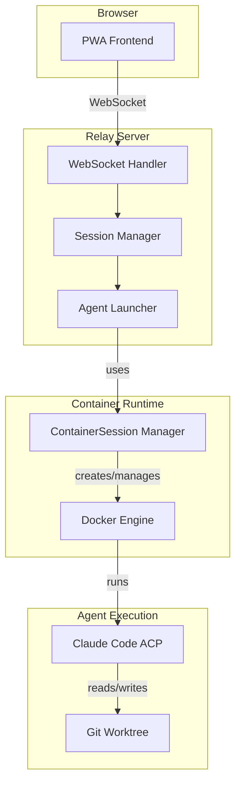
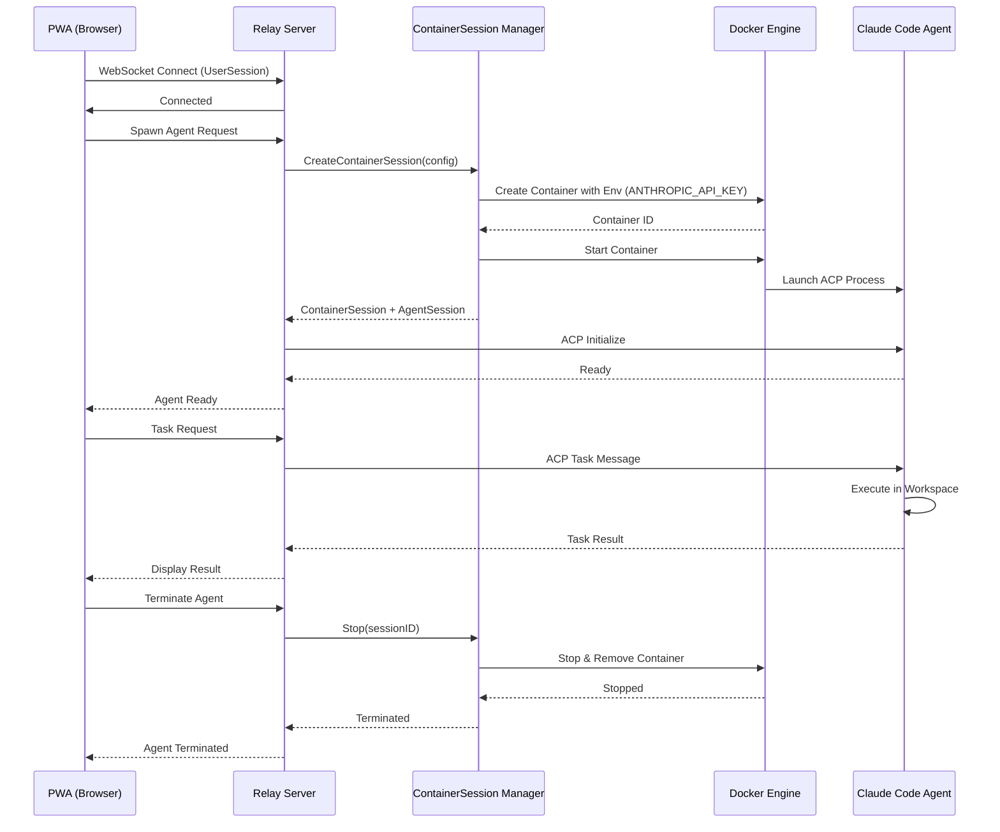

# Milestone 2 Completion - Design Document

**Date:** 2025-01-07
**Milestone:** Milestone 2 - Container Runtime Integration
**Issues:** #49, #110
**Approach:** Single PR, MVP documentation depth

## Overview

This design completes Milestone 2 by documenting the remaining two open issues:
- **Issue #49:** Static file serving scalability discussion
- **Issue #110:** Container runtime architecture documentation

**Goal:** Provide internal developers with clear documentation of the agent runtime architecture and current static file serving approach, enabling them to understand the system and make informed decisions about future scaling.

## Approach: Single PR with MVP Depth

**Why this approach:**
- Fastest path to milestone closure (~1 day)
- Establishes foundational documentation
- Allows for follow-up PRs to deepen content based on real usage patterns
- Clean review boundary with single PR

**Trade-offs accepted:**
- Will need follow-up issues for deeper ops troubleshooting
- Lifecycle state diagram deferred
- Comprehensive K8s migration guide deferred
- Extended troubleshooting scenarios deferred

## Deliverables

### 1. New File: `docs/STATIC_FILE_SERVING.md`

Documents current http.FileServer approach with future scalability options.

**Content:**
- Current implementation (http.FileServer in cmd/relay/main.go)
- When current approach is sufficient (<100 users, single instance)
- Future options: CDN (recommended), separate static server, object storage
- Decision timeline: now (current is fine) → M3-4 (evaluate) → production (CDN)

**Closes:** Issue #49

### 2. New File: `docs/AGENT_RUNTIME.md`

Comprehensive agent runtime architecture documentation (MVP scope).

**Content Sections:**

#### Session Type Definitions (Authoritative)
- **UserSession**: WebSocket connection from PWA to Relay
  - Single user's connection
  - Contains 0-N AgentSessions
  - Lifecycle: WS connect → disconnect

- **AgentSession**: Individual AI agent process
  - One per agent spawned
  - Has dedicated workspace directory
  - Communicates via ACP protocol

- **ContainerSession**: Docker container runtime
  - Managed by pkg/containersession
  - **Lifecycle policy:** One per AgentSession
  - Provides isolation and resource management

#### Component Architecture Diagram (Mermaid)


#### Execution Flow Sequence Diagram (Mermaid)


#### Configuration & Credentials

**Environment Variables:**

| Variable | Required | Purpose | Example |
|----------|----------|---------|---------|
| `ANTHROPIC_API_KEY` | Yes | API key for Claude Code agents | `sk-ant-...` |
| `OUROCODUS_ACP_BINARY` | No | Custom ACP binary path (testing) | `/path/to/echo-agent` |
| `DOCKER_HOST` | No | Docker daemon connection | `unix:///var/run/docker.sock` |

**Credential Injection Flow:**
1. Relay reads `ANTHROPIC_API_KEY` from host environment
2. ContainerSession Manager receives config with `Env` field
3. Container created with environment variables
4. Agent process accesses credentials via environment

**Current Limitations (explicitly documented):**
- Single credential per relay instance (global scope)
- No per-user or per-project credential scoping
- No credential rotation support
- Future: mount credential files via `CustomMounts` for multi-provider support

**Container Configuration:**
- Image: Configurable via `CreateConfig.ImageName`
- Workspace: Bind-mounted from host via `CustomMounts`
- Network: Default Docker bridge network
- Resource limits: **Not enforced yet** (future: CPU/memory limits)

#### Troubleshooting

**1. Missing API Key**
```
Error: ANTHROPIC_API_KEY environment variable not set
```
**Solution:**
```bash
export ANTHROPIC_API_KEY="sk-ant-..."
./relay
```

**2. Docker Connection Failed**
```
Error: Cannot connect to Docker daemon
```
**Solution:**
- Verify Docker: `docker ps`
- Check `DOCKER_HOST` variable
- macOS/Colima: `colima status`
- Linux: Ensure user in `docker` group

**3. Container Image Pull Failure**
```
Error: Failed to pull image
```
**Solution:**
- Check internet connectivity
- Verify image name/tag
- Check Docker Hub rate limits
- Test manually: `docker pull <image>`

#### Future Scalability: Kubernetes Path

**Current:** Single Docker host, direct daemon connection

**Migration Path:**
- **Near-term:** Multi-container on one host (current architecture scales)
- **Long-term (K8s):**
  - ContainerSession → K8s Jobs/Pods
  - Credentials → K8s Secrets
  - Workspace → PersistentVolumeClaims
  - Network → NetworkPolicy for isolation

**Closes:** Issue #110 (MVP)

### 3. Update: `docs/ARCHITECTURE.md`

Add new section referencing the agent runtime layer.

**New Section (insert after existing architecture overview):**

```markdown
## Agent Runtime Layer

The agent runtime layer manages the lifecycle and execution environment for AI coding agents. This layer provides isolation, resource management, and workspace coordination.

**Key Components:**
- **Session Manager:** Tracks UserSessions (WebSocket connections) and spawns AgentSessions
- **ContainerSession Manager:** Creates and manages Docker containers for agent execution
- **Agent Launcher:** Coordinates agent spawning and ACP protocol initialization

**Architecture Details:** See [Agent Runtime Architecture](./AGENT_RUNTIME.md) for:
- Session type definitions (UserSession, AgentSession, ContainerSession)
- Component and sequence diagrams
- Configuration and credential management
- Troubleshooting common issues
- Future Kubernetes migration path

**Session Lifecycle:**
- One ContainerSession per AgentSession
- AgentSessions live within a UserSession
- Containers automatically cleaned up on agent termination
```

## Implementation Plan

### PR Structure
- **Branch:** `docs/milestone-2-completion`
- **Title:** `docs: Complete Milestone 2 - Agent Runtime and Static Serving`
- **Description:** Closes #49 and #110 with MVP documentation

### File Changes
1. **Create** `docs/STATIC_FILE_SERVING.md`
2. **Create** `docs/AGENT_RUNTIME.md`
3. **Update** `docs/ARCHITECTURE.md` (add Agent Runtime Layer section)

### Success Criteria
- [ ] Both issues (#49, #110) can be closed
- [ ] Internal developers can understand session types and lifecycle
- [ ] Credential injection is clearly documented
- [ ] Diagrams render correctly in GitHub
- [ ] Common troubleshooting scenarios documented
- [ ] Future scalability path noted for both topics

### Timeline
- **Day 1:**
  - Create all three documentation files
  - Verify Mermaid diagrams render in GitHub
  - Create PR and request review
  - Close issues after merge

### Follow-up Issues (Create After Merge)
1. **Extended Troubleshooting:** Add 5+ more scenarios with real-world examples
2. **Lifecycle State Diagram:** Add ContainerSession state machine diagram
3. **K8s Migration Guide:** Detailed Kubernetes deployment architecture
4. **Operational Runbook:** Log locations, metrics, debugging procedures
5. **Multi-provider Credentials:** Design for multiple API providers

## Testing & Validation

**Documentation Quality:**
- Mermaid diagrams render in GitHub preview
- All links resolve correctly
- Code examples are accurate
- Terminology is consistent

**Technical Accuracy:**
- Session definitions match implementation in code
- Credential flow matches pkg/relay/session/client_factory.go
- Environment variables match actual usage
- Docker configuration matches pkg/containersession

**Audience Validation:**
- New internal developer can understand architecture
- Can troubleshoot common Docker issues
- Understands when to scale static serving
- Knows where to look for detailed implementation

## Dependencies

**None** - This is purely documentation work.

**References:**
- pkg/containersession (ContainerSession Manager implementation)
- pkg/relay/session (Session management)
- pkg/acp (Agent Client Protocol)
- cmd/relay/main.go (Static file serving)

## Risks & Mitigations

| Risk | Impact | Mitigation |
|------|--------|-----------|
| Mermaid syntax errors | Diagrams don't render | Test in GitHub preview before PR |
| Documentation drift | Docs become outdated | Link to code where possible; note "as of M2" |
| Incomplete troubleshooting | Developers get stuck | Create follow-up issue for extended guide |
| Missing operational details | Can't deploy/debug | Explicitly note MVP scope and follow-ups |

## Rollback Plan

Documentation-only changes are safe to revert if needed. No functional impact.

## Future Work

After this MVP documentation lands:
1. Gather feedback from team on missing content
2. Add real troubleshooting examples as issues arise
3. Expand K8s migration guide when implementation begins
4. Add operational metrics and observability documentation
5. Document container resource limits when implemented
