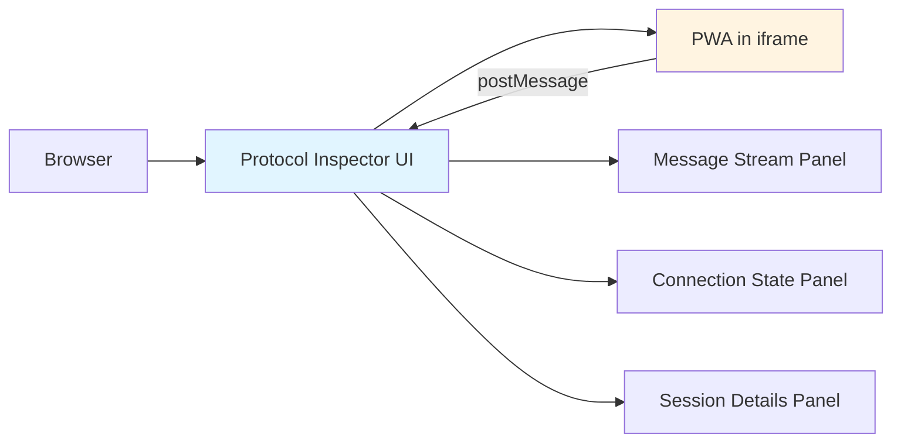
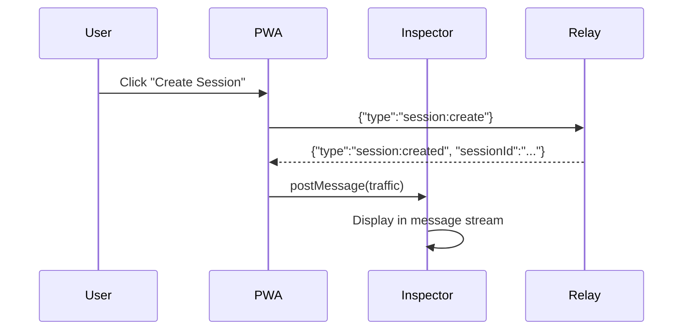
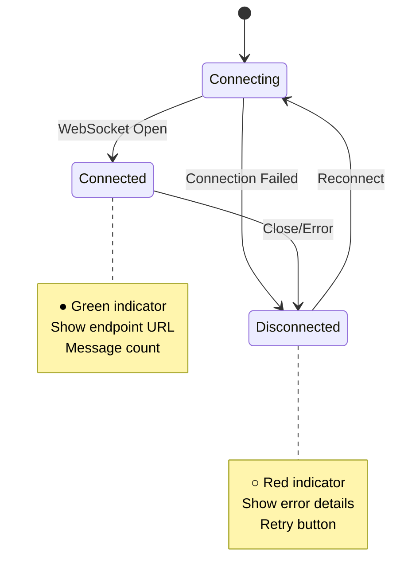
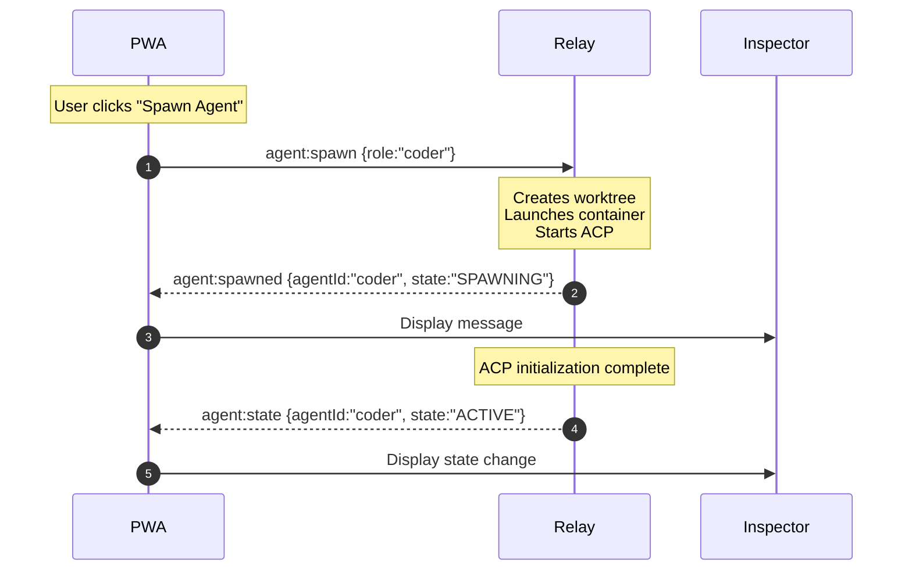
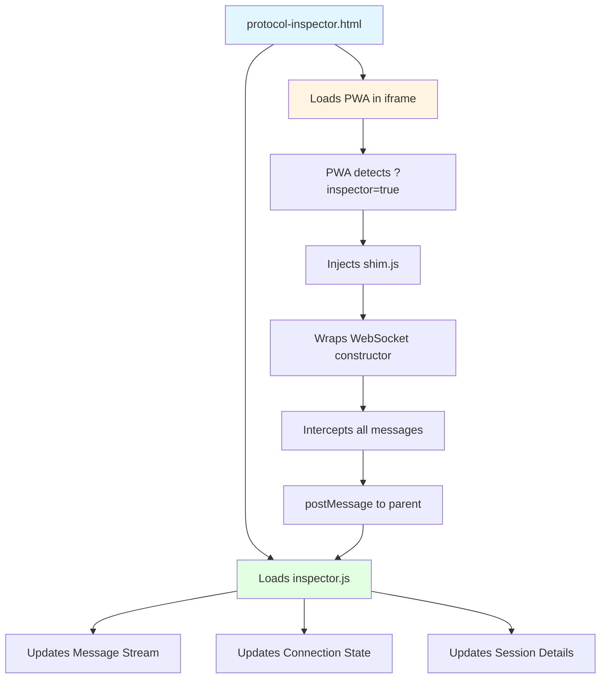
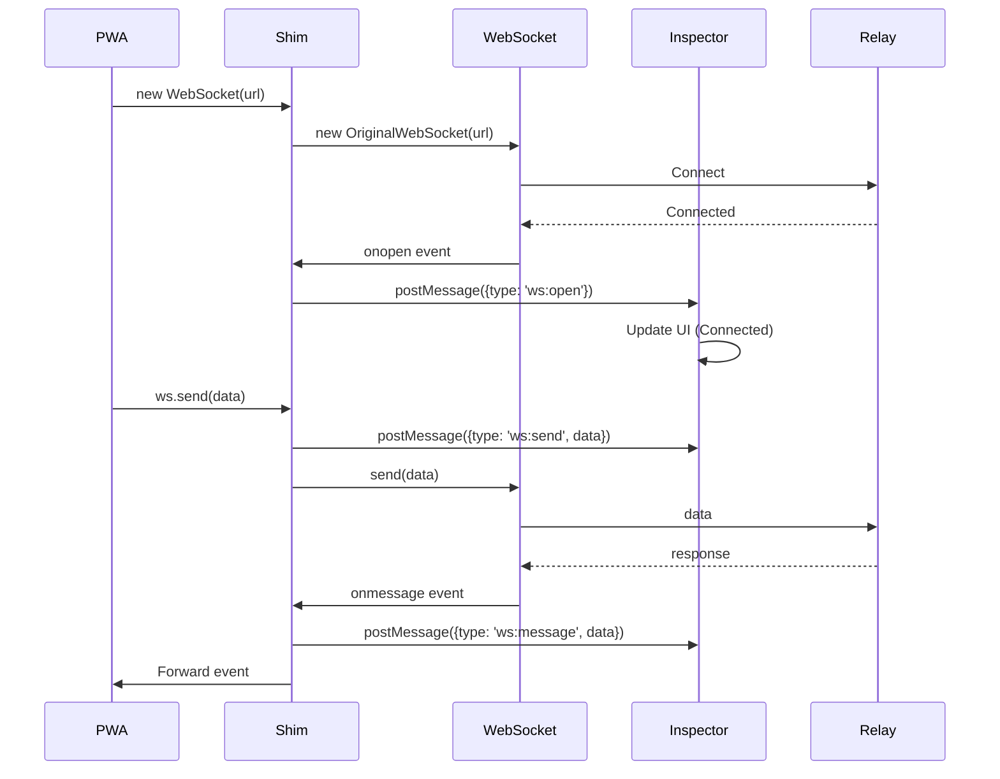
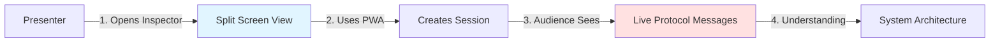

# Protocol Inspector

Real-time WebSocket protocol debugging tool for visualizing PWA ↔ Relay communication.

## Overview

The Protocol Inspector provides a split-screen view showing your PWA interface alongside live WebSocket traffic. Perfect for understanding the protocol, debugging issues, and demonstrating the system to stakeholders.



## Quick Start

### 1. Start the Relay Server

```bash
make build
./bin/relay
```

### 2. Open the Inspector

Navigate to: **http://localhost:8080/protocol-inspector.html**

You'll see:
- **Left**: Interactive PWA (50% width)
- **Right**: Real-time protocol viewer (50% width)

### 3. Interact and Observe

Create a session in the PWA and watch the WebSocket messages flow in real-time:



## Interface Layout

```
┌─────────────────────────┬─────────────────────────┐
│                         │                         │
│   PWA (iframe)          │   Message Stream        │
│                         │   ┌─────────────────┐   │
│   • Create Session      │   │ ▼ SENT         │   │
│   • Spawn Agent         │   │ session:create │   │
│   • Send Messages       │   │                 │   │
│                         │   │ ▲ RECEIVED     │   │
│                         │   │ session:created│   │
│                         │   └─────────────────┘   │
│                         ├─────────────────────────┤
│                         │   Connection State      │
│                         │   ● Connected           │
│                         │   ws://localhost:8080/ws│
│                         ├─────────────────────────┤
│                         │   Session Inspector     │
│                         │   Session: 4ad2f420     │
│                         │   Agents: coder, helper │
│                         │                         │
└─────────────────────────┴─────────────────────────┘
```

## Features

### Real-Time Message Capture

All WebSocket traffic is intercepted and displayed without modifying the PWA:

```javascript
// The inspector injects a WebSocket wrapper
window.WebSocket = function(url, protocols) {
    const ws = new OriginalWebSocket(url, protocols);

    // Broadcast all traffic to inspector
    ws.addEventListener('message', e => {
        window.parent.postMessage({
            type: 'ws:message',
            direction: 'received',
            data: e.data,
            timestamp: new Date().toISOString()
        }, '*');
    });

    return ws;
};
```

### Message Stream Panel

Shows chronological list of all messages with:
- **Direction indicators**: ▼ (sent) and ▲ (received)
- **Message type**: Color-coded by category
- **Timestamps**: Precise timing for debugging
- **Expandable content**: Click to see full JSON payload

**Color Coding:**
- 🟦 Blue: Session operations (create, terminate)
- 🟩 Green: Agent lifecycle (spawn, terminate)
- 🟨 Yellow: Agent messages (send, receive)
- 🟥 Red: Errors

### Connection State Panel

Real-time WebSocket connection monitoring:



### Session Inspector Panel

Displays current session state:

```yaml
Session ID: 4ad2f420-73d5-4b98-9517-f7e78ebd7e11
Created: 2025-11-12T14:32:01Z
State: ACTIVE

Agents:
  - coder-1 [ACTIVE]
  - analyzer [SPAWNING]
  - task-bot [TERMINATED]

Statistics:
  Messages Sent: 42
  Messages Received: 38
  Uptime: 5m 32s
```

## Usage Examples

### Example 1: Debug Session Creation

**User Action:** Click "Create Session" in PWA

**Inspector Shows:**

```
▼ SENT 14:32:01.234
{
  "type": "session:create"
}

▲ RECEIVED 14:32:01.245 (11ms latency)
{
  "type": "session:created",
  "sessionId": "4ad2f420-73d5-4b98-9517-f7e78ebd7e11",
  "state": "ACTIVE",
  "createdAt": "2025-11-12T14:32:01Z"
}
```

### Example 2: Watch Agent Spawn Flow



**Inspector Shows:**

```
▼ SENT 14:33:15.100
{
  "type": "agent:spawn",
  "role": "coder",
  "workspace": "./workspaces/coder"
}

▲ RECEIVED 14:33:15.250 (150ms)
{
  "type": "agent:spawned",
  "agentId": "coder",
  "state": "SPAWNING",
  "workspace": "/workspaces/coder"
}

▲ RECEIVED 14:33:18.420 (3.17s later)
{
  "type": "agent:state",
  "agentId": "coder",
  "state": "ACTIVE"
}
```

### Example 3: Track Message Exchange

```
▼ SENT 14:35:22.100
{
  "type": "agent:message",
  "agentId": "coder",
  "content": "Write a function to parse JSON"
}

▲ RECEIVED 14:35:22.150 (50ms)
{
  "type": "message:queued",
  "agentId": "coder",
  "messageId": "msg-123"
}

▲ RECEIVED 14:35:25.800 (3.70s later)
{
  "type": "agent:response",
  "agentId": "coder",
  "messageId": "msg-123",
  "content": "Here's a JSON parsing function:\n\nfunc ParseJSON..."
}
```

## Advanced Features

### Filter Messages

Filter by message type:

```javascript
// In browser console
inspector.filter('agent:*')     // Show only agent messages
inspector.filter('session:*')   // Show only session messages
inspector.filter('error')       // Show only errors
inspector.clearFilter()         // Show all
```

### Export Session Log

Download complete message log for analysis:

```javascript
inspector.exportLog('session-4ad2f420.json')
```

Output format:

```json
{
  "sessionId": "4ad2f420-73d5-4b98-9517-f7e78ebd7e11",
  "startTime": "2025-11-12T14:32:01Z",
  "endTime": "2025-11-12T14:45:32Z",
  "messages": [
    {
      "timestamp": "2025-11-12T14:32:01.234Z",
      "direction": "sent",
      "type": "session:create",
      "payload": {...}
    },
    ...
  ]
}
```

### Performance Metrics

Track message latency and throughput:

```
Average Latency: 85ms
Min: 12ms | Max: 3.2s | p95: 250ms

Messages/sec: 2.4 (send) | 2.1 (receive)

Bandwidth:
  Sent: 1.2 KB/s
  Received: 3.8 KB/s
```

## Troubleshooting

### Inspector Not Loading

**Symptom:** Blank right panel

**Solution:**
```bash
# Check relay is running
curl http://localhost:8080/protocol-inspector.html

# Check browser console for errors
# Open DevTools → Console tab
```

### Messages Not Appearing

**Symptom:** PWA works but no messages shown

**Solution:**
```javascript
// Check if shim is loaded (in PWA iframe console)
console.log(window.WebSocket.name)
// Should show: "function WebSocket() { [wrapped] }"

// Check postMessage events
window.addEventListener('message', e => console.log('Message:', e.data))
```

### Connection State Stuck

**Symptom:** Shows "Connecting..." indefinitely

**Solution:**
```bash
# Verify relay WebSocket endpoint
wscat -c ws://localhost:8080/ws

# Check relay logs
tail -f /var/log/relay.log
```

## Architecture

### How It Works



### Implementation Files

```
internal/webapp/web/
├── protocol-inspector.html    # Main inspector UI
├── protocol-inspector.js      # Inspector logic
├── inspector.css              # Styling
└── shim.js                    # WebSocket wrapper (injected)
```

### Shim Injection

The inspector injects the shim without modifying PWA source:

```javascript
// protocol-inspector.js
const iframe = document.getElementById('pwa-frame');
iframe.src = '/index.html?inspector=true';

iframe.onload = () => {
    const shimScript = iframe.contentDocument.createElement('script');
    shimScript.src = '/shim.js';
    iframe.contentDocument.head.appendChild(shimScript);
};
```

### Message Flow



## Use Cases

### 1. Development Debugging

Track exact message timing and payloads during development:

```bash
# Run relay with verbose logging
./bin/relay --log-level=debug

# Open inspector
open http://localhost:8080/protocol-inspector.html

# Reproduce issue and export log
inspector.exportLog('debug-session.json')
```

### 2. Protocol Validation

Verify message schemas match specification:

```javascript
// Check all messages have required fields
inspector.messages.forEach(msg => {
    if (!msg.type) console.error('Missing type:', msg);
    if (!msg.timestamp) console.error('Missing timestamp:', msg);
});
```

### 3. Performance Analysis

Identify slow operations:

```javascript
// Find slow messages (>1s latency)
inspector.messages
    .filter(m => m.latency > 1000)
    .forEach(m => console.log(`Slow: ${m.type} (${m.latency}ms)`));
```

### 4. Demo/Presentation

Show live protocol flow to stakeholders:



## Security Considerations

⚠️ **The inspector is for development/demo only. Do not enable in production.**

**Why:**
- Exposes all WebSocket traffic (including sensitive data)
- No authentication on inspector endpoint
- Performance overhead from message capture

**Production Alternative:**
- Use server-side logging with proper rotation
- Implement request ID tracing
- Use APM tools (Prometheus, Grafana)

## Related Documentation

- [WebSocket API Reference](../architecture/WEBSOCKET_API.md) - Complete message schemas
- [Message Flow](../architecture/MESSAGE_FLOW.md) - End-to-end sequence diagrams
- [PWA Architecture](../architecture/PWA.md) - Progressive Web App design
- [Testing Guide](../development/TESTING.md) - Integration test examples
