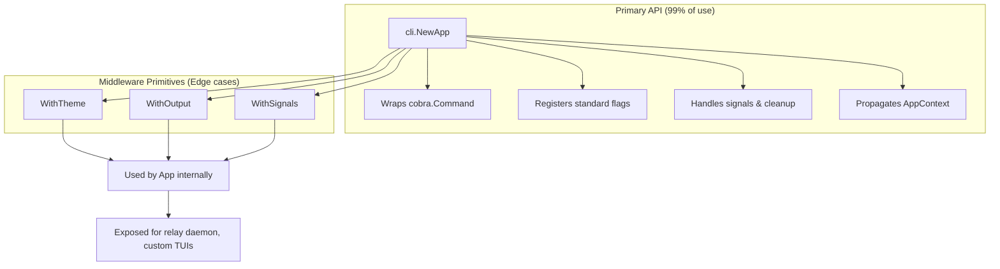
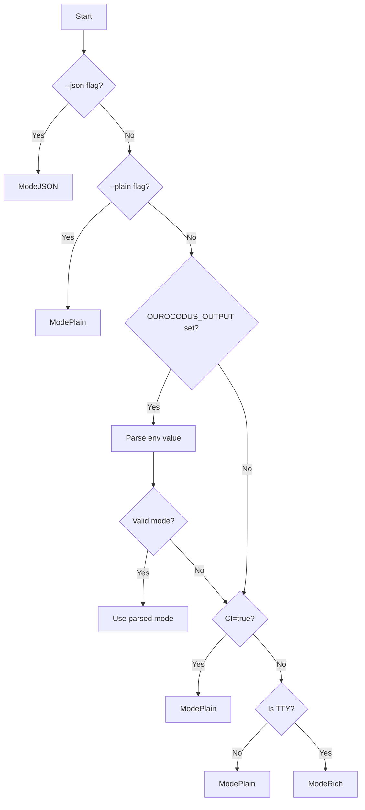

# CLI/TUI Standards Framework Design

**Date:** 2025-12-01
**Status:** Accepted
**Author:** Claude + Human collaboration

> **Related Documentation**: See the [CLI/TUI Framework Implementation Guide](../development/CLI_TUI_FRAMEWORK.md) for code patterns and usage examples.

## Summary

This document defines the standard CLI/TUI framework for all ourocodus tools. The framework ensures consistent behavior, flags, and user experience across agentd, relay, and future tools.

## Goals

1. **Consistency**: Every tool behaves the same way
2. **Smart defaults**: Rich TUI when interactive, plain text in CI/pipes, JSON when requested
3. **Zero boilerplate**: Adding new commands requires minimal setup
4. **Escape hatches**: Edge cases can bypass defaults without forking the framework

## Architecture

### Hybrid App Wrapper + Middleware

The framework uses two layers:



### Package Structure

```
pkg/cli/
├── app.go           # App struct, NewApp(), Execute()
├── context.go       # AppContext, FromContext()
├── config.go        # Config resolution
├── flags.go         # Standard flag definitions
├── mode.go          # Mode enum (Rich/Plain/JSON)
├── errors.go        # Exit codes, error mapping
├── output/
│   ├── output.go    # Output interface
│   ├── rich.go      # TUI output (uses pkg/tui)
│   ├── plain.go     # Plain text output
│   └── json.go      # JSON output
├── middleware/
│   ├── theme.go     # WithTheme()
│   ├── output.go    # WithOutput()
│   └── signals.go   # WithSignals()
└── detect/
    └── detect.go    # TTY, CI, unicode detection
```

## Standard Flags

Every tool supports these flags on the root command:

| Flag | Short | Description |
|------|-------|-------------|
| `--json` | | Output JSON only (machine-readable) |
| `--plain` | | Plain text output (no TUI, no colors) |
| `--theme` | | Theme: `cga`, `amber`, `green`, `c64` |
| `--no-color` | | Disable ANSI colors |
| `--quiet` | `-q` | Suppress informational output |
| `--verbose` | `-v` | Increase verbosity |

## Environment Variables

| Variable | Description |
|----------|-------------|
| `NO_COLOR` | Disable colors (standard) |
| `OUROCODUS_THEME` | Default theme |
| `OUROCODUS_OUTPUT` | Default mode: `rich`, `plain`, `json` |
| `CI` | Auto-detect CI environment |

## Mode Detection

The framework detects output mode in this order:

1. **Explicit flags**: `--json` > `--plain`
2. **Environment**: `OUROCODUS_OUTPUT`
3. **CI detection**: `CI=true` forces plain mode
4. **TTY detection**: Non-TTY (pipes) forces plain mode
5. **Default**: Rich TUI mode



```go
func resolveMode(flags Flags, env Environment) Mode {
    if flags.JSON {
        return ModeJSON
    }
    if flags.Plain {
        return ModePlain
    }
    if env.Output != "" {
        return ParseMode(env.Output)
    }
    if env.CI || !detect.IsTTY() {
        return ModePlain
    }
    return ModeRich
}
```

## Exit Codes

Exit codes follow [BSD sysexits](https://man.freebsd.org/cgi/man.cgi?query=sysexits) conventions where applicable:

| Code | Meaning | Typed Error |
|------|---------|-------------|
| 0 | Success | (none) |
| 1 | General error | `errors.New(...)` |
| 2 | Usage/argument error | `cli.UsageError(msg)` |
| 4 | Network/IO error | `cli.IOError(msg)` |
| 70 | Internal software error | `cli.ContextError()` |
| 78 | Configuration error | `cli.ConfigError(msg)` |
| 130 | Interrupted (SIGINT) | (signal handler) |

> **Note**: Codes 70 and 78 match BSD sysexits (`EX_SOFTWARE` and `EX_CONFIG`). This provides meaningful exit codes for scripting while maintaining compatibility with Unix conventions.

## Usage Examples

### Standard Command (99% of cases)

```go
// cmd/agentd/main.go
func main() {
    app := cli.NewApp(rootCmd)
    os.Exit(app.Execute())
}

// cmd/agentd/cmd_spawn.go
var spawnCmd = &cobra.Command{
    Use:   "spawn <agent-id>",
    Short: "Spawn an agent",
    RunE: func(cmd *cobra.Command, args []string) error {
        ctx := cli.FromContext(cmd.Context())

        // ctx.Mode tells you Rich/Plain/JSON
        // ctx.Output provides mode-aware output
        // ctx.Theme provides the selected theme

        if ctx.Mode.IsRich() {
            return runSpawnTUI(ctx, args[0])
        }
        return runSpawnPlain(ctx, args[0])
    },
}
```

### Edge Case: Custom TUI (relay daemon)

```go
// cmd/relay/main.go
func main() {
    // Relay doesn't use cobra - it's a daemon with custom TUI
    // Use middleware primitives directly if needed
    cfg := cli.ResolveConfig(os.Args, os.Environ())

    if cfg.Mode.IsRich() {
        runRelayTUI(cfg)
    } else {
        runRelayPlain(cfg)
    }
}
```

## AppContext

Commands access configuration through `AppContext`:

```go
type AppContext struct {
    Mode       Mode           // Rich, Plain, or JSON
    Theme      *theme.Theme   // Selected theme (nil in JSON mode)
    Output     Output         // Mode-aware output interface
    Quiet      bool           // Suppress info output
    Verbose    bool           // Increase verbosity
    Cancel     context.CancelFunc // For graceful shutdown
}

// Access from any command
ctx := cli.FromContext(cmd.Context())
ctx.Output.Success("Operation completed")
ctx.Output.JSON(result) // Only outputs in JSON mode
```

## Output Interface

The `Output` interface adapts to the current mode:

```go
type Output interface {
    // Structured output
    Success(msg string)
    Info(msg string)
    Warning(msg string)
    Error(err error)

    // JSON output (only in JSON mode)
    JSON(v any) error

    // Progress (spinner in Rich, text in Plain, silent in JSON)
    Progress(label string) Progress

    // Raw writers for libraries
    Stdout() io.Writer
    Stderr() io.Writer
}
```

## Theme Selection

Users select themes via `--theme` flag or `OUROCODUS_THEME` environment variable:

| Theme | Description |
|-------|-------------|
| `cga` | Classic CGA colors (default) |
| `amber` | Amber monochrome terminal |
| `green` | Green phosphor terminal |
| `c64` | Commodore 64 palette |

Themes apply to Rich and Plain modes. JSON mode ignores themes.

## Migration Plan

### Phase 1: Create pkg/cli
1. Create `pkg/cli/mode.go` - Mode enum
2. Create `pkg/cli/detect/` - Migrate from `cmd/agentd/internal/detect`
3. Create `pkg/cli/flags.go` - Standard flag definitions
4. Create `pkg/cli/config.go` - Config resolution

### Phase 2: Create Output Layer
1. Create `pkg/cli/output/output.go` - Interface
2. Create `pkg/cli/output/plain.go` - Plain implementation
3. Create `pkg/cli/output/json.go` - JSON implementation
4. Create `pkg/cli/output/rich.go` - Rich implementation (wraps pkg/tui)

### Phase 3: Create App Wrapper
1. Create `pkg/cli/app.go` - App struct
2. Create `pkg/cli/context.go` - AppContext
3. Create `pkg/cli/errors.go` - Exit codes

### Phase 4: Migrate agentd
1. Wrap root command with `cli.NewApp()`
2. Convert commands to use `cli.FromContext()`
3. Remove duplicate flag definitions
4. Remove internal/detect, internal/output (deprecated)

### Phase 5: Verify relay
1. Relay already has full TUI - verify compatibility
2. Use `cli.ResolveConfig()` for flag/env parsing if needed

## Testing Strategy

1. **Golden tests**: Verify output across modes (Rich smoke, Plain exact, JSON strict)
2. **Mode detection tests**: Inject fake TTY/env to test detection logic
3. **Signal tests**: Verify SIGINT produces exit code 130
4. **Theme tests**: Verify `NO_COLOR` and `--no-color` disable ANSI

## Open Questions

1. Should we add `--format` as an alias for `--json`/`--plain`?
2. Should verbose/quiet affect JSON output structure?
3. Do we need a `--tui` flag to force Rich mode in CI?

## References

- [Charm CLI tools](https://github.com/charmbracelet) - Bubble Tea, Lipgloss patterns
- [GitHub CLI](https://github.com/cli/cli) - App wrapper pattern
- [NO_COLOR standard](https://no-color.org/)
